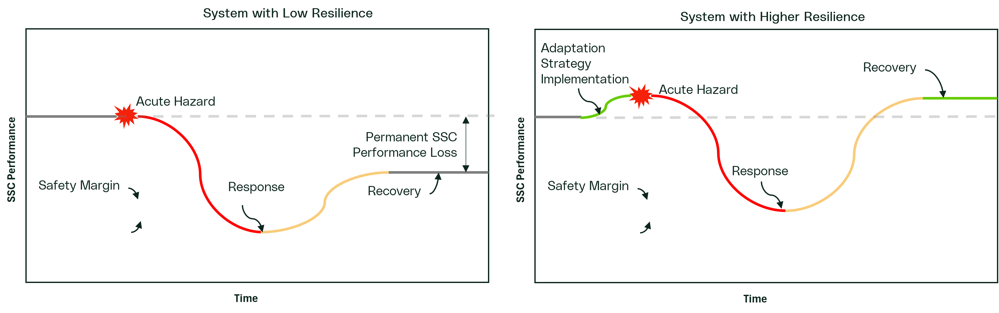
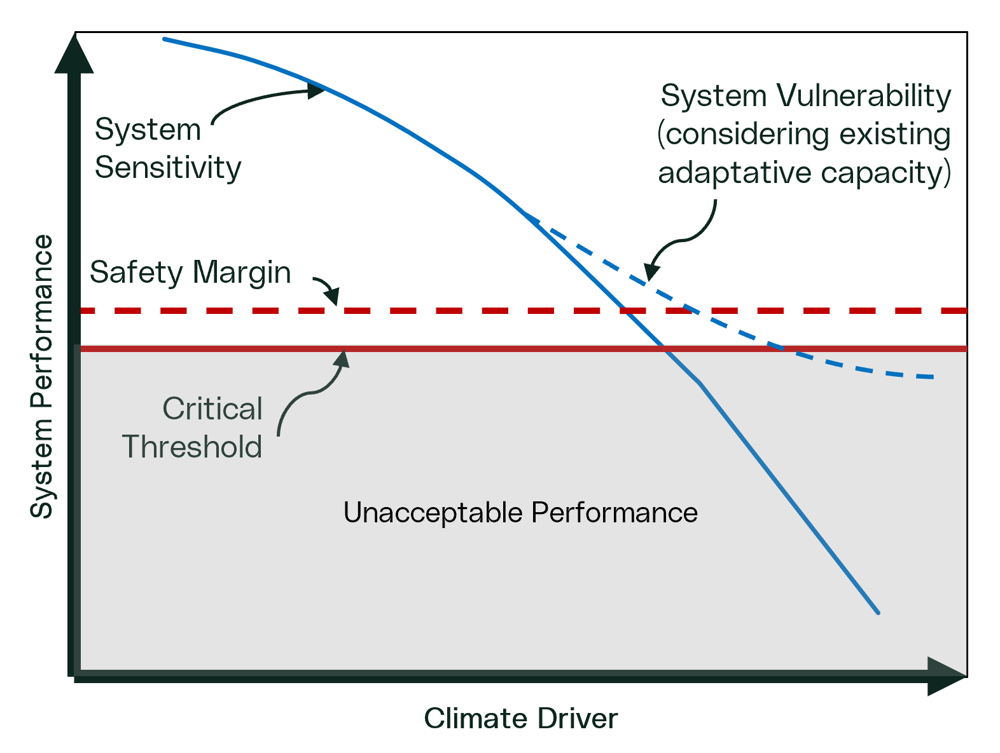
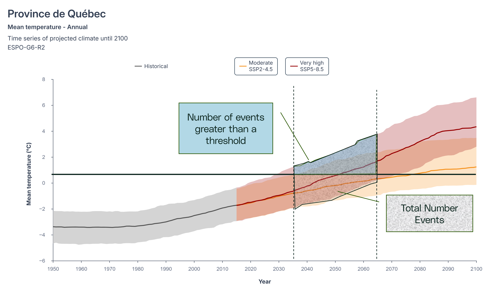

A clear understanding of fundamental definitions is critical to successfully conducting effective climate vulnerability and risk assessments. Terms such as "risk" and "vulnerability" often have multiple meanings, depending on which context they are applied. Inconsistent or incorrect use of these terms -- such as merging, reinventing, or misapplying definitions -- can lead to confusion and misinterpretation in assessments.

To ensure clarity and consistency, this guide aligns with definitions established by ISO and the Intergovernmental Panel on Climate Change ([IPCC](https://www.ipcc.ch/)). By adhering to standardized terminology, we can ensure that assessments are accurate, comparable, and aligned with industry best practices.

## Adaptation

Adaptation refers to the actions taken to reduce the impacts of climate change, ensuring that normal operations can be maintained in a changing climate. Adaptation means implementing measures -- both technical and organizational -- that allow organizations to continue consistently meet their performance objectives despite evolving climate conditions. Adaptation can take on multiple forms but usually involves increasing either the reliability of the system or the resilience of the system. These terms are often loosely defined or used interchangeably in some forms of literature although they do have specific technical meanings.

### Reliability

Reliability is the quality of performing consistently well. In the climate change context, reliability is the ability of the system to continue to perform well in the face of increasing climate stress. This means that the vulnerability does not enter or cross a critical threshold under the conditions to which it is exposed.

### Resilience

Resilience is the capacity to recover to performance targets from a disturbance. The capacity of systems to cope with a hazardous events, trends or disturbances, and responding or reorganizing in ways that maintain their essential function and structure, while also maintaining the capacity for adaptation. In the figure below, we see where an acute hazard interrupts the performance of the system. A resilient system is less impacted and is able to recover quickly. For example, it may be acceptable for a generating unit to not be fully reliable under extreme heat, but a derate could be acceptable as long as the occurrence is infrequent or below a certain magnitude.

## Top-Down and Bottom-Up Approaches to Climate Vulnerability and Risk

Within climate assessments, there are two primary philosophical approaches: top-down and bottom-up. In the context of climate vulnerability and risk assessments, these approaches have a very specific meaning, that may differ from typical understanding in traditional engineering applications. At a high level, the process flow figure presented in Figure 10 provides the basic steps for each approach.

[![Adapted from: Adapting Infrastructure and Civil Engineering Practice to a Changing Climate - Scientific Figure on ResearchGate. Available from: https://www.researchgate.net/figure/A-comparison-of-top-down-and-bottom-up-approaches-to-climate-change-adaptation_fig3_284672926 \[accessed 22 Apr 2026\]](images/topdownbottomup.png)](https://www.researchgate.net/figure/A-comparison-of-top-down-and-bottom-up-approaches-to-climate-change-adaptation_fig3_284672926/actions#reference)

**Bottom-Up Approach:** This approach begins by building a thorough understanding of the asset, operation, or service being assessed and how it behaves across a broad range of conditions. This includes identifying performance requirements, operating limits, dependencies, and failure modes, and then determining which climate-related drivers could realistically challenge those requirements. Typical inputs for a bottom-up approach include system design and operating information, performance criteria, historical disruption and incident information, dependency mapping and any existing risk assessments. Typical outputs include a documented system description, a list of climate-sensitive functions and thresholds, and a prioritized set of climate drivers to analyze.

**Top-Down Approach:** In contrast, this approach starts by identifying potentially relevant climate hazards first, then assessing how they could affect the asset or system. Typical inputs for a top-down approach include hazard lists, climate projections and scenarios, location-specific hazard indicators, and existing hazard screening results. Typical outputs include a screened and prioritized hazard set, hazard characterization assumptions (time horizons, scenarios, metrics), and an impact mapping that links hazard to system consequences.

There are drawbacks associated with both approaches. For a top-down approach, the largest concern is narrow risk space (i.e. only re-determined climate scenarios) that are explored. For a bottom-up approach, the largest drawback is the approach relies on a greater and more holistic understanding of performance under a broad range of scenarios which requires greater time and resources.

## Non-stationarity and Engineering Design

A core part of engineering design is assessing how future conditions might impact a project, so that potential risks and consequences can be properly evaluated. Traditionally, engineering approaches have assumed that future weather and climate conditions will mirror those of the past -- meaning that averages, variances, and extremes will remain unchanged or are stationary. However, climate change challenges this assumption, introducing the concept of non-stationarity.

Non-stationarity occurs when the conditions influencing a system -- such as climate, operations, social expectations, infrastructure, or markets -- change over time. In a non-stationary environment, past observations are no longer reliable predictors of future conditions. Specifically, for climate, non-stationarity means that the averages, variability, persistence, and distribution (skewness) of historical data can all shift. For example, the average temperature in Canada has already increased by approximately 1.7°C, and future extremes are likely to surpass historical records.

This shift poses significant challenges for optimizing engineering design and evaluating the expected benefits of projects, especially for long-lived assets. While modeling and forecasting techniques continue to improve, there will always be some degree of uncertainty about future conditions. However, designing to the worst possible conditions under climate change may not be a prudent or cost-effective approach either.

Given this uncertainty, the focus of climate assessments is not trying to perfectly predict the future. Instead, it emphasizes the integration of design principles that ensure systems remain robust and effective even as conditions change in unpredictable ways.

Traditional statistical techniques often make the implicit assumption that data is stationary. For example, taking the mean or median value or fitting a normal distribution assumes there is no long-term trend in the dataset. Some distributions have been developed that can be fitted to non-stationary data (i.e. non-stationary GEV distribution).

## Climate Vulnerability

Climate vulnerability is the propensity or predisposition to be adversely affected by a climate event. It encompasses a variety of concepts including sensitivity or susceptibility to harm and lack of capacity to cope and adapt. The IPCC and ISO 10491 express vulnerability in a mathematical way as:

$$
V = f(S,AC)
$$

where $V$ is the the vulnerability expressed as a function $f()$ of sensitivity ($S$) and adaptive capacity ($AC$).

Fundamentally, vulnerability is the measure of the sensitivity of the system to a particular climate driver, where the sensitivity is determined by the performance of the system. The adaptative capacity of the system is the ability of systems, institutions, humans, and other organisms to adjust to potential damage, to take advantage of opportunities, or to respond to climate indicator stress. For the purposes of this guide, adaptive capacity refers to the existing temporary modifications or operational procedures system state that would increase the system ability to manage or cope with the climate driver or indicator. These would be temporary modifications or operational procedures that already exist for the system.

Industry standards and guidance documents approach how climate vulnerability is estimated in different ways. In addition, in many cases these standards and guidance documents present vulnerability at a high level, which can result in confusion on how to measure and accurately capture sensitivity and adaptive capacity to determine vulnerability level.

### Sensitivity

Sensitivity is a measure of how the system responds to changes in climate drivers or climate hazards. It is independent of when in the future or under which climate scenarios it occurs. This is often a mistake made, where vulnerability is confused with risk. The sensitivity is only about system response to conditions.

### Adaptive Capacity

There is not yet a clearly established definition of adaptive capacity but numerous concepts which are coming into alignment of the concept. Adaptive capacity are actions that are taken to reduce the overall vulnerability of sensitivity of the system. For the purposes of this guide, we consider adaptive capacity to be interventions that are beyond the inherent design of the system. These could be things like emergency management plans, operational procedures, or temporary measures that are pre-established to be called upon if there is a need. This could be measures like plans for sand-bagging if there is flooding, additional but temporary cooling of a system, de-rating of a system, etc. In this way, adaptive capacity may be linked to the concept of \[resilience\](#Resilience) more than it is \[reliability\](#Reliability).

{.lightbox width=500}

The figure above explains this concept. As the climate driver (i.e. temperature) increases, the system performance (i.e. operating efficiency) begins to drop. As the climate continues to worsen the the performance begins to drop into the range of safety margins and then fails to perform. In this case, the overall vulnerability is mitigated by the adaptive capacity which is a measure that allows the system to function under higher levels of climate stress.

## Climate Risk

Climate-related risks generally fall into two categories:

Physical Risks: These are risks resulting directly from changes in climate or weather, such as rising temperatures, heatwaves flooding, and wildfires.

Transitional Risks: These are risks of events that may negatively affect business operations or development projects and arise from the socioeconomic changes in policy, legal, market and technology that occur as part of the transition to a low-carbon economy.

Climate opportunities (physical and transitional) may exist and relate to an advantageous condition related to a changing climate. However, the primary purpose of this standard is assessing and managing physical risks. Future guidance will be provided on how to assess and manage climate opportunities.

Risk results from the interaction of vulnerability, exposure and hazard, which ISO 14091 expresses as:

$$
R = f(H,E,V)
$$

where $R$ is the risk, which is a function $f$ of the hazard $H$ or climate driver, the exposure $E$ and the vulnerability $V$.

The IPCC conceptualizes risk as

[![Illustrative storyline of the chapter highlighting the central questions addressed in the various sections, from realised risks (observed impacts) to future risks (key risks and reasons for concern), informed by adaptation-related responses and the limits to adaptation. The arrows illustrate actions to reduce hazard, exposure and vulnerability, which shape risks over time. Accordingly, the green areas at the centre of the propeller diagrams indicate the ability for such solutions to reduce risk, up to certain adaptation limits, leaving the white residual risk (or observed impacts) in the centre. The shading of the right-hand-side propeller diagram compared with the non-shaded one on the left reflects some degree of uncertainty about future risks. The figure builds on the conceptual framework of risk--adaptation relationships used in SROCC (Garschagen et al., 2019).](images/SRL-image-0.png)](https://www.ipcc.ch/report/ar6/wg2/figures/chapter-16/figure-16-001)

This figure shows the concept of risk as a function of vulnerability, hazard and exposure. A change in any of these elements alters the magnitude and change in the future risk to the system and is a very useful concept for understanding how these variables impact risk. To make use of this concept in this guide we map it to the traditional definition of risk:

$$
R = L*C
$$

where risk is the product of likelihood $L$ and the consequence \$C\$. To merge the concepts likelihood is related to the climate hazard $L = f(H)$ and the consequence comes from the exposure and the hazard $C = f(E,V)$. The likelihood is only based on the probability of a climatic event occurring, whereas the consequence to the system could change with an alteration in the exposure (i.e. retreating from the floodplain) or reducing the vulnerability (i.e. system hardening).

### Risk Quantification: Considering Climate Variation

Traditionally risk assessments produce a single value for each risk event, assuming a fixed probability and a definitive impact. As noted above, due to the inherent uncertainty and variability in climate data, this approach may be inadequate for accurately assessing climate-related risks in some case. In other cases, a conservative future value could be used as a single value and uncertainty dealt with separately when identifying the level of concern.

A climate risk assessment may use multiple data points to represent a range of probabilities and impacts, reflecting the uncertainty and the results of each scenario analysis. This will be true for both simple risk assessments and complex risk assessments. In some cases, the consideration of uncertainty can be left until the Level of Concern analysis is considered. Below provides more detail on how the future range of climate possibilities can be considered in both the likelihood and consequence analyses to estimate risk.

### Likelihood

Likelihood aims to assess the probability of a future climate event occurring. The degree in which climate variation or uncertainty can be considered in the likelihood analysis will be dependent on the climate data available. That is, if climate projections data is available for multiple climate scenarios, time horizons and projection models (i.e., multi-ensemble modelling). Limitations in climate data will limit the degree in which future climate variation or uncertainty can be considered.

Likelihood is determined through statistical analysis to calculate the probability of the future value or range exceeding the selected threshold (performance criteria). The probability should be calculated following the classical formula, or other established statistical methods, for determine the probability of event X occurring: 

$$
L(X) = \frac{\text{Number of times X occurs}}{\text{Total Number of Events}}
$$

This formula is applied with respect to a pre-defined threshold. In a simple climate risk analysis scenario, where a critical threshold has been identified, this should be the number of times the climate data in a 30+ year window exceeds the critical threshold divided by the total number of data points.

**Note:** The classic probability formula assumes data are stationary, which means there is no long-term trend. This assumption is false, but may be useful. Climate data should be compared in 30-40 year windows where stationarity assumptions are more valid and not used for long periods of time. Alternatively, probabilities may be estimated from fitted probability distributions, some of which may be applied to non-stationary data. For screening and other high-level assessments, the probability may be able to be reasonable estimated visually. 

**Note:** When calculating probability of return period events, specific consideration is required. Return periods are used for expressing certain design events. The return period T is expressed as T = 1/P which is a direct function of probability. Care must be taken to use and interpret these values properly. The likelihood should be calculated as the probability of an event occurring in the analysis window or within the life of the asset. If using a 1:100 year return period event for design, the likelihood of that event occurring, assuming data is stationary and each year is independent of other years, is only 1/100 for a single year. However, for a 30 year asset window it is (1/100 + 1/100 + ...) = 30/100 because any year has a 1/100 chance of the event occurring. Additionally, a 1:100 year event is likely to change with climate change, so the evaluation criteria may be established relative to a baseline. For example, what is the likelihood of exceeding the value of the historic 1:100 year event, or what is the likelihood of the existing design meeting requirements for a future 1:100 year event?

### Consequence

The consequence is what occurs if the event is realized. Climate variation or uncertainty can also be considered in the consequence analysis, since the impact and/or level of severity of different possible climate futures may vary. The consequence is taken directly from the [vulnerability](#Climate Vulnerability) assessment and is therefore directly tied to the system being considered. The degree of climate change or the climate driver should come from the selected likelihood.

### Impact

The terms consequence and impact are sometimes used interchangeably and there does not seem to be a consistent definition. The terms should be well defined and used consistently in your work. For the purposes of this guide, the consequence $C$ is directly related to the vulnerability and used for determining a risk event. It is tied directly to vulnerability $V$. The term impact is reserved for what happens as a result of a risk event being realized. For example, if a risk is realized and the degree of vulnerability show us that a system will fail, the impact of that failure could be a financial loss, reputational loss, etc.

## References
::: {#refs}
:::

