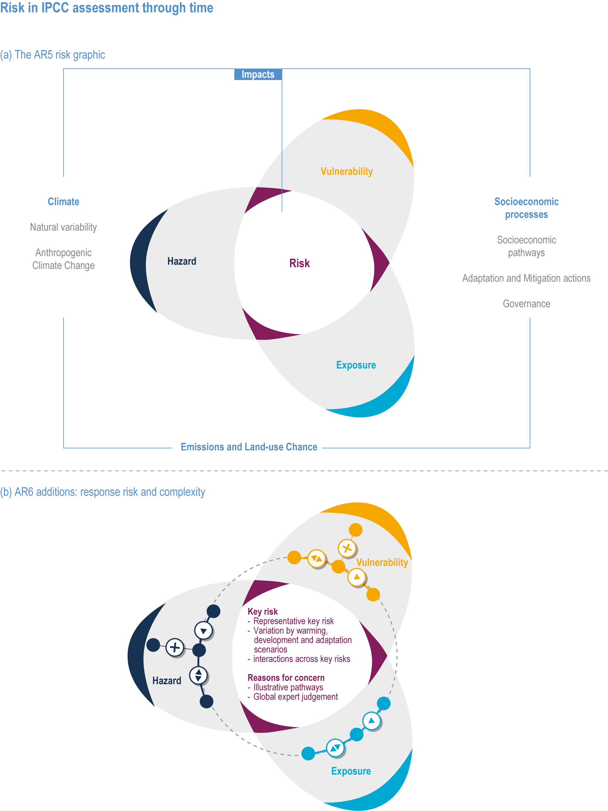

The IPCC defines adaptation as "*the process of adjustment to actual or expected climate and its effects, in order to moderate harm or exploit beneficial opportunities*" (@IPCC_2022_WGII). Adaptation is an active process, in which climatic data and information is incorporated decision making and analysis to inform the actual adjustments being made. Adaptation could come in the form of analysis, changed operating practices, modification to assets or maintenance practices, risk transfer processes or retreat and relocation.

This section of the guide discusses the integration of climate data from a climate change adaptation perspective approaches into the use of climate data to address the implicit uncertainty associated with such data. It is important to realize that adaptation science is far more encompassing than is in scope for this guide. It includes modelling and analysis, governance, decision science, planning and more. 

Climate hazards can affect the electricity system in many ways some of which are highlighed in (@Braun2016). These can be the result of acute climate hazards brought on by extreme events or slow degradations in performance or increased maintenance costs caused by gradual changes in climate. The cost benefit analysis of adaptation strategies that are well informed are almost always cost-effective often resulting in an expectation to save many dollars for every dollar spent on adaptation (@EPRI2022). An important caveat is that adaptation must be well informed otherwise it leads to the potential for mal-adaptation to occur.

## The Adaptation Process
There are many codes, standards and guidance documents for adaptation processes which already apply to the electricity sector, which take various forms. Practitioners in adaptation should be aware of any codes, standards, regulations or guidance which may apply to their particular activities in the sector. In some cases these form mandatory requirements and in others they may provide guidance. There are currently many of these documents currently available and knowledge of multiple processes is important to understand the strengths and weaknesses of each approach. Since climate change will have regionally specific impacts, it is important that locally relevant climate data be used to inform the adaptation process.

Some guidance documents are explicit about the use of climate data. For example, [CSA W231:25 Developing and Interpreting Intensity-Duration-Frequency (IDF) Information Under a Changing Climate](https://scc-ccn.ca/standards/notices-of-intent/csa-group/developing-and-interpreting-intensity-duration-frequency-idf) is explicit about the use of climate data to inform the development of IDF curves, which is an important design parameter.

There are a larger number of guidance documents that develop a broader approach to adaptation, following processes similar to [ISO 14091 - Adaptation to climate change](https://www.iso.org/standard/68508.html). A generic process is shown here.

```{mermaid}
%%| fig-align: center
%%| fig-cap: "Generic Process for Adaptation"

flowchart TD
    A[Develop Scope] -->|Assemble Team| B[Understand System]
    B --> C[Identify Climate Hazards]
    C --> |Collect Climate Data| D[Vulnerability Assessment]
    D --> |No Vulnerability| G[End]
    D --> E[Risk Assessment]
    E --> |Risk Not Acceptable| F[Adaptation Plan]
    E --> |Risk Acceptable| H[End]
```


:::{#id1 .callout collapse="true"}
## The Role of Codes and Standards
These various codes and standards are produced by standards organizations such as the International Standards Organization (ISO) or the Canadian Standards Assocation (CSA), government agencies such as Environment and Climate Change Canada (ECCC) or the Canadian Nuclear Safety Commissions (CNSC) as well as industry groups such as the Electric Power Research Institute (EPRI) or the Canadian Dam Association (CDA). In some cases climate data is explicitly included in the standard, which has already been extracted by climate experts. In other cases they outline a process which must be followed to understand climate risks and vulnerabilities. 

In almost all cases the available documents are about the process of climate risk and vulnerability assessments and few provide concrete guidance on the use of climate data in that process, unless they have been explicitly included in data tables for calculation. 

:::


## Model Chains

### Baseline Selection
Consideration from Ouranos report on Asset Valuation


## Uncertainty
See Uncertainty Section


## Data Confidence

Confidence in the data may distinguish between the confidence in the Signal obtained from data and the confidence in use of data themselves. For details see the [Core Concepts: Climate](../climate_data_fundamentals/Uncertainty_Confidence.html#confidence-in-the-analysis) section.


## Risk and Vulnerability

Provide the IPCC and ISO definitions of risk and vulnerability... recognize that different framework may express these concepts different


Risk in IPCC assessment through time. (a) An explicit risk framing emerged in the IPCC Special Report on Managing the Risks of Extreme Events and Disasters to Advance Climate Change Adaptation (SREX) and WGII AR5 (IPCC, 2014a, b). (b) In the current assessment, the role of responses in modulating the determinants of risk is a new emphasis (the ‘wings’ of the hazard, vulnerability, and exposure ‘propellers’ represents the ways in which responses modulate each of these risk determinants). (c) As the risk assessment spans Working Groups, the differential role of risk determinants for risk related to impacts, adaptation, and vulnerability versus risk related to mitigation becomes an increasingly important feature of climate risk assessment as well as management.

Figure 1.5 in Ara Begum, R., R. Lempert, E. Ali, T.A. Benjaminsen, T. Bernauer, W. Cramer, X.   Cui, K. Mach, G. Nagy, N.C. Stenseth, R. Sukumar, and P. Wester, 2022: Point of Departure and Key Concepts. In: Climate Change 2022: Impacts, Adaptation, and Vulnerability. Contribution of Working Group II to the Sixth Assessment Report of the Intergovernmental Panel on Climate Change [H.-O. Pörtner, D.C. Roberts, M. Tignor, E.S. Poloczanska, K. Mintenbeck, A. Alegría, M. Craig, S. Langsdorf, S. Löschke, V. Möller, A. Okem, B. Rama (eds.)]. Cambridge University Press, Cambridge, UK and New York, NY, USA, pp. 121-196, doi:10.1017/9781009325844.003.

## Evaluating Vulnerability

### Top down versus bottom up?

### Stress Testing

## Evaluating Risk

## Decision Making Under Deep Uncertainty
We focus previously on stress testing, but where there are multiple dimensions of uncertainty or decision making we run into deeper uncertainty. DMDU may not be required for simple system or component replacements.
Do we include the recent Ouranos work?

## References
::: {#refs}
:::
