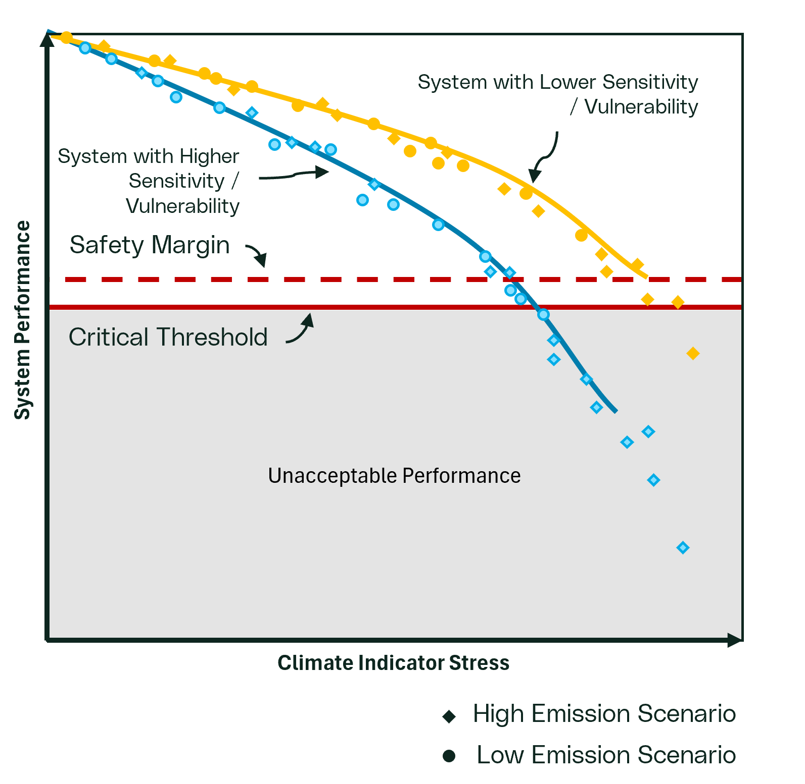

# Step 4: Climate Vulnerability Assessment

This step identifies how vulnerable the critical aspects of the system
are to the climate hazards and indicators identified in [Step 3 Hazard
and Exposure Assessment](##Hazard%20and%20Exposure%20Assessment). In
some climate assessments, the term vulnerability is sometimes
erroneously used interchangeably with exposure or risk, but the concepts
are different ([see Core Concepts - Understanding
Adaptation](./core_concepts_adapt.qmd)) . Exposure describes whether the
system interacts with a climate driver (directly or indirectly).
Vulnerability describes how the system performs when exposed, based on
its sensitivity (how strongly it responds to a stress) and its adaptive
capacity (how well it can cope using measures that already exist). Risk
adds likelihood or probability and is addressed later. The core question
is "how sensitive is the system to the relevant climate drivers and how
much existing capacity does it have to cope under those drivers"?

The intergovernmental Panel on Climate Change (IPCC) adopts the
following definition of vulnerability:

$$
V = f (S, AC)
$$

where vulnerability $V$; Sensitivity $S$; and Adaptive Capacity $AC$

Vulnerability assessments should be as quantitative as practical, given
available information and the decision context. This step uses outputs
from the [Step 3 Hazard and Exposure
Assessment](./risk_step3_hazard.qmd/##Hazard%20and%20Exposure%20Assessment) to estimate
vulnerability for each critical system aspect and exposure interaction,
and to identify what follow-up actions or decisions are needed. The
following sections provide detail on how these concepts are completed
and used to estimate climate vulnerability.

```{mermaid}
%%| fig-align: center
%%| fig-cap: "Generic Workflow for Adaptation"
---
config:
    flowchart:
        curve: linear
---
flowchart-elk TD
    A[Step 1: Develop Scope]:::basic --> B[Step 2: Understand System]:::basic
    B --> C[Step 3: Hazard & Exposure Assessment]:::basic
    C --> D[Step 4: Vulnerability Assessment]:::focus
    H[Step 7: Institutionalize Decision]:::basic
    D --> |No Vulnerability| H
    D --> |Vulnerable| E[Step 5: Risk Assessment]:::basic
    F[Step 6: Adaptation Plan]:::basic
    D & E --- J1[ ]:::join
    J1 --> |Unacceptable Vulnerability or Risk| F
    E --> |Risk Acceptable| H
    F --> H

    classDef basic fill:#052946
    classDef focus fill:#CE153D
    classDef join height:0px
```

::: {.callout collapse="true" title="Outcomes"}
Expected outcomes of this step may include: 
- Estimation of climate sensitivities of the system's critical aspects across relevant climate hazards (and indicators) interactions 
- Estimation of existing adaptive capacity of the system that may reduce sensitivity to relevant climate hazards and indicators 
- Estimation of climate vulnerabilities of the system's critical aspects across relevant hazards (and indicator) interactions 
- Clear and documented decision-making in response to each vulnerability identified 
- Documented vulnerability assessment process, including findings, methodologies used and how sensitivity and adaptive capacity were incorporated
:::

## Sensitivity Assessment

Sensitivity should be evaluated by comparing projected climate
conditions (for each selected indicator, scenario and time horizon)
against the system performance criteria established in [Performance
Criteria](###%20Performance%20Criteria). A sensitivity assessment
analyzes how susceptible the critical aspects of the system are to a
particular climatic driver.

Sensitivity may be estimated using different industry methods depending
on data availability, complexity, and purpose. Common approaches may
include:

-   Simple design margin-based screening (sometimes described as
    "bounding" analysis). This approach simply determines if the design
    is within the range of potential climate data and assumes
    sensitivity is not an issue if it designed to handle those
    requirements;

-   Manufacturer or design data where available can be used to relate
    system performance and climate drivers.

-   Fragility-style relationships are sometimes developed that link
    stress levels to probability of failure either through empirical
    data or laboratory testing

-   Stress testing methods that use modelling or expert judgement
    approaches to evaluate system response under increasing stress from
    climate drivers.

## Conducting a Stress Test A stress test systematically alters
climate variables or other external drivers to assess how an system
responds under increasingly stressful conditions. The goal is to
determine where performance criteria are no longer met. Stress testing
can be performed at various levels of complexity, depending on available
data, models, and the confidence required in the results.

**Types of Stress Tests**

Stress testing is an industry recognized method that can be used to
perform quantitative and semi-quantitative sensitivity analyses. Stress
testing can also be used to estimate system vulnerability, accounting
for existing adaptative capacity measures, as well as used in adaptation
measure analysis and selection. The type of stress test performed will
vary depending on the available data. Different types of stress test
methods are presented below depending on if quantitative or
semi-quantitative data is available.

::: {.callout collapse="true" title="Expert-Driven Stress Test"}
A semi-quantitative method for assessing an system when no formal model
exists or interactions are difficult to model. It relies on
knowledgeable systems experts who understand both general system
behavior under climate hazards and the specific system being evaluated.
Experts review technical documents, operational reports, and prior
system reviews, then use available climate data to assess expected
performance across multiple hazard scenarios. Comparing scenario
outcomes helps identify vulnerabilities, and results should include some
quantitative expressions, often a categorical ranking of performance.

::: {callout-tip}
Because expert judgment can be influenced by bias or incomplete system
knowledge, the process should include multiple experts, independent
review, and thorough documentation of assumptions and decisions to
ensure transparency and repeatability.
:::

This approach is best suited to simple systems or as an initial
screening tool, and it can be useful where complex interactions make
modeling difficult. If high vulnerability or uncertainty is found, more
detailed model-based analysis should follow. The assessment should also
consider lifecycle effects by documenting how vulnerability changes as
the system ages, degrades, and is maintained until rehabilitation or
renewal.


::: {.callout collapse="true" title="Simple Stress Test"}
A simple quantitative stress test evaluates an system by
applying empirically derived equations or existing/new simple
models that represent system behavior, but only after the model
is developed, calibrated, and validated to ensure it is fit for
simulating responses to climate drivers. Practitioners
then systematically vary input variables or run the model multiple
times to explore sensitivity and analyze/plot outputs and performance
metrics to show how performance changes with inputs. Extra caution is
needed when using climatic inputs outside the calibration range, since
models may be unreliable for extrapolation and results may not be valid.
Where appropriate, several simple models can be applied to individual
components, with their interactions then integrated via an expert-driven
approach to infer overall system performance.
:::

::: {.callout collapse="true" title="Detailed Quantitative Stress Test"}
A complex quantitative modelling approach assesses an system using more
sophisticated models than simple methods, such as higher-dimensional,
numerically complex, or coupled impact models. As with any modelling,
these models must be calibrated, validated, and confirmed
fit-for-purpose. Practitioners then systematically vary climatic and
other key inputs to evaluate sensitivity to different climate drivers
and produce performance response curves or surfaces. Because complex
models often demand greater computational resources and longer run
times, these constraints are managed by using larger stress increments
(fewer runs), adding computing capacity, or simplifying model structure.
In some cases, multiple models are applied to individual components, and
their interactions are integrated using expert judgment to understand
overall system performance.
:::

**Stress Test Example**

The figure below illustrates a hypothetical single-metric stress
test where a climate driver is systematically increased -- here using
an ensemble of climate model data -- to evaluate system response,
showing progressive performance degradation until a threshold beyond
which the system no longer performs acceptably. In some cases,
equivalent stress-test information (e.g., performance or fragility
curves) may already exist from manufacturers or other sources, provided
it spans a sufficient range of conditions.

{fig-align="center"}

::: {callout-note}
The guidance describes three stress-test levels mainly for clear
communication and suggests applying them sequentially (increasing
complexity) until confidence is adequate, though analysts can also
select any level upfront based on available, trusted models or data. In
practice, hybrid/continuous levels of complexity are common. The central
requirement is having enough evidence to confidently assess system
sensitivity or vulnerability, while exercising caution when
extrapolating beyond the conditions for which the model or data were
developed.
:::

The stress test shown above could be completed with a multiple climate
hazards or multiple performance measures so long as there was a model or
method to map those drivers to performance. For multiple climate
hazards, this would be done by varying combinations of two inputs to
determine the system response. For example, an external powerline could
be subject to loading from both wind and ice accretion. Combinations of
both climate hazards could be tested in a loading model to see how they
interact to affect line loading. :::

This guide describes two approaches for sensitivity assessment: a
preferred quantitative approach which uses data to link system response
to a climate driver and a semi-quantitative approach where data is
limited, and expert judgement needs to be considered.

::: {.callout-note collapse="true" title="Adaptive capacity"}
Modifications to the sensitivity of the system due to operational
procedures or temporary modifications are considered adaptative capacity
and reflected in the overall sensitivity of the system following the
consideration of adaptive capacity.
:::

**Option 1: Quantitative Data Approaches**

The quantitative approach allows for the visualization of the system
sensitivity using lines or other functions that map system performance
against climate indicators under one or more climate scenarios. This is
done using quantitative data (measured or modelled system performance)
to map system performance under a specific climate driver or indicator.

The type of quantitative data (simple or complex modeling) used for this
approach will depend on the data available at the time of the
assessment, the level of analysis required to satisfy the purpose of the
assessment, and the level of complexity of the climate interaction with
the system. However, the outputs should include some quantification
expression of sensitivity, and calibrated/validated to ensure the
approach is fit for simulating the system response to the climate
condition. This validation may require multiple experts, particularly in
situations where no formal model exists or it is difficult to capture
system performance when exposed to the climate driver.

::: {.callout-caution collapse="true" title="Relationships"}
These relationships may be linear, non-linear, or exhibit step changes
(e.g., systems with automatic shutdowns when thresholds are exceeded).
While simple examples are one-dimensional, real-world cases may require
multi-dimensional analysis with multiple climate hazards, climate
scenarios and performance criteria.
:::

This approach should use performance data provided by a manufacturer or
another credible entity, information from laboratory testing or the
results from empirical or numerical stress testing to establish how the
system will respond to climate drivers.

::: {.callout-note collpase="true" title="Range of Conditions"}
The range of conditions in both the quantitative and semi-quantitative
sensitivity approaches should be plausible (i.e. encompass all historic
and potential future conditions for all scenarios). The only goal for
vulnerability is to understand the system response under various
circumstances and under what circumstances the system fails to perform.
It is therefore likely that the vulnerability assessment will show the
breaking point of the system, even if it is unlikely to occur in
reality. Likelihood/probability of the event occurring is assessed in
[Step 5: Climate Risk Assessment](./risk_step5_risk.qmd).
:::

::: {.callout collapse="true" title="Quantitative Example"}
An example presented in the figure above, illustrates how system
sensitivity can be mapped against a climate indicator. In the example,
the performance criteria (safety margin and critical thresholds) have
been defined for an system. Two specific system types/units are being
compared to the same projected climate indicator stress or driver (e.g.,
35℃).

In the example, the systems are more sensitive as the climate driver
increases in intensity which is represented by decreasing system
performance. The key concept is that the systems are systematically
evaluated against changes in the plausible range of the climate
projection data and does not consider the likelihood or timing of the
scenario. The climate driver being considered is sampled broadly enough
to capture any plausible conditions. The system represented by the blue
line has greater sensitivity to the climate condition than the system
represented by the yellow line. That is, we see the system performance
represented by the blue line reaching unacceptable levels faster than
the yellow line. This may be due to a variety of reasons such as the age
of the systems, model/type of the systems, physical location of the
systems, etc.

**Outcome:** As the climate hazard increases in intensity the system
performance crosses the critical threshold (unacceptable performance) at
a range that is beyond historic conditions but within the range of the
climate projections (e.g., as temperature increases beyond 35℃).
:::

**Option 2: Semi-Quantitative Approach** There are situations in which
the quantitative Option 1 approach is not possible due to a lack of data
or modelling, limitations in climate projection models (i.e. hazards
such as tornados not captured by models), or complex interactions in the
system that make modelling impractical. In these situations, a
semi-qualitative approach to sensitivity can be used. This approach aims
to achieve the same objective of Option 1, where the performance of the
system is described (qualitatively) or mapped in a similar way to the
quantitative approach, but the performance is determined through OPEX
and expert judgement to develop representative proxies.

::: {.callout-caution collapse="true" title="Uncertainty"}
It is important to note that since this approach requires qualitative
inputs, higher uncertainty is likely to exist in the estimation of
sensitivity. As a result, this approach may be best implemented as an
initial screening approach or higher-level assessments (e.g., portfolio
assessments) and should be refined once more data is available.
:::

This approach involves identifying proxy for the system that can be
categorically mapped to the relevant climate indicators. Proxy selection
relies on knowledgeable system SMEs who understand general system
behavior under the relevant climate hazards being assessed. Proxies are
often thought of as variables that increase system sensitivity when
exposed to a climate indicator (e.g., age of the system). To identify
relevant sensitivity indicators, system SMEs will review technical
documents, operational reports, and prior system reviews. One or
multiple proxies may be selected and assessed for each relevant climate
indicator, depending on the [Exposure Assessment](./risk_step3_hazard.qmd) results.

Next, climate data that has been collected is used to assess system
sensitivity across the proxies for each climate indicator. Similar to
the Option 1 approach, the climate driver being considered is sampled
broadly enough to capture any plausible conditions. The results of this
analysis should include some expression or level of sensitivity for each
proxy. This is often represented with a categorical ranking of system
performance. The categorical ranking process often involves developing a
tiered scale.

::: {.callout collapse="true" title="Semi-Quantitative Example"}
An example of how this semi-quantitative approach may be implemented is
presented in the Table below. In this example tornados and thunderstorms
are being evaluated as hazards, where two climate indicator stressors
were selected to represent the hazards.

Based on the review of the system, SMEs determine that infrastructure
age, and system response time to react to the climate indicators have
been selected as relevant proxies that would make the system more
susceptible to the climate indicator. A five tiered scale was developed
to categorize sensitivity to the climate indicators; very low
sensitivity (1), low sensitivity (2), moderate sensitivity (3), high
sensitivity (4), or very high sensitivity (5), where a moderate
sensitivity (3) would represent the potential for a critical threshold
exceedance event, based on the SMEs knowledge of the system.

+----------------+----------------+----------------+----------------+
| Climate Hazard | Climate        | Proxy          | Proxy          |
|                | Indicator      | Indicator 1 -  | Indicator 2 -  |
|                | Stress         | Age of System  | System         |
|                |                |                | Response Time  |
+================+================+================+================+
|                | D e scription  | Very Low \<10  | Very Low \<2   |
|                |                | years          | hours          |
|                |                |                |                |
|                |                | Low 10-15      | Low 2-3 hours  |
|                |                | years          |                |
|                |                |                | Moderate 3-5   |
|                |                | Moderate 15-25 | hours          |
|                |                | years          |                |
|                |                |                | High 5-7 hours |
|                |                | High 25-30     |                |
|                |                | years          | Very High \>7  |
|                |                |                | hours          |
|                |                | Very High \>30 |                |
|                |                | years          |                |
+----------------+----------------+----------------+----------------+
| Tornados       | Fujita Scale   | High (4)       | High (4)       |
+----------------+----------------+----------------+----------------+
| T h u n        | Number of      | Moderate (3)   | Low (2)        |
| derstorms      | Lightning      |                |                |
|                | Strikes        |                |                |
+----------------+----------------+----------------+----------------+

: Example of Scale Approach to Sensitivity or Vulnerability


**Outcome:** the system has been estimated to have high sensitivity when
exposed to tornado events. Based on the established performance criteria
of a medium sensitivity level or higher representing potential
unacceptable performance, these results would result in unacceptable
performance for the system. For thunderstorm events, moderate
sensitivity (unacceptable performance) has only been estimated for the
one sensitivity indicator.
:::

This example highlights how higher uncertainty may exist in this
approach, since there is subjectivity involved in selecting proxies that
would represent the performance criteria of the system, as well as
subjectivity when selecting sensitivity criteria level (low, medium
high). As such, this approach should be used when data limitations exist
and be revisited once further data is available to refine the assessment
findings.

::: {.callout-caution collapse="true" tite="Caution on expert judgement"}
Since expert judgment can be influenced by bias or incomplete system
knowledge, the process should include multiple experts, independent
review, and thorough documentation of assumptions and decisions to
ensure transparency and repeatability.
:::

## Adaptive Capacity

The existing adaptive capacity that describes the system's current
ability to cope with climate stresses using measures that already exist
should be documented. It differs from [Step 6: Adaptation
Plan](##Adaptation), which are new actions implemented in response to
unacceptable vulnerability or risk. Existing adaptive capacity includes
system temporary modifications or operational procedures available that
help maintain acceptable performance during adverse conditions. If/when
new adaptation measures are implemented, they become part of the
system's existing adaptive capacity for future climate assessments.

Identifying existing adaptive capacity of an system will involve
technical expertise and an overall operational understanding of the
system. Some systems have existing temporary modifications or
operational procedures that allow systems to adapt more readily than
others, depending on factors such as financial resources, regulatory
environments, and organizational flexibility. Adaptive capacity can
offset the primary sensitivity to an system by ensuring there are
existing options to increase resilience and reliability, and the
institutional capacity to execute those options.

::: {.callout collapse="true" title="Key Considerations"}
In order to assess how existing temporary modifications or operational
procedures may reduce the system climate sensitivity, key adaptive
capacity considerations (presented below) should be identified and
assessed against the climate interaction.

**Financial Capacity:** The financial resources available to maintain
systems, purchase supplies, flexible budget allocation, fund repairs,
and support emergency actions.

**Technical Capacity:** The condition and reliability of equipment and
infrastructure, including maintenance practices, early warning signs,
testing frequency, and system performance during disruptions.

**Human Capacity:** The skills, training, and knowledge required for
staff to operate systems and make effective decisions during times where
adaptive measures are in place.

**Regulatory Capacity:** The ability to meet legal, safety, and
environmental regulatory requirements, execute mandated emergency
procedures, and maintain compliance during climate events.

**Emergency Preparedness:** The plans, drills, communication protocols,
awareness, training programs, and coordination mechanisms that guide
operational response during disruptions.
:::

### Estimating Adaptive Capacity

Adaptative capacity should be estimated by critically assessing what key
considerations (presented above) are applicable and currently exist for
the system being assessed, in the context of their overall ability to
reduce sensitivity.

::: {.callout collapse="true" title="Adaptive Capacity Example"}
When evaluating adaptive capacity of an system when exposed to extreme
temperatures, the system may have:

Technical adaptive capacity -- the technical ability to alter or modify
maintenance, operations or system performance when exposed to extreme
heat.

Financial adaptive capacity -- financial resources to maintain systems,
complete repairs and implement emergency response actions when exposed
to extreme heat.

Human adaptive capacity -- onsite staff with the expertise to operate
the system when exposed to extreme heat.

Regulatory adaptive capacity -- flexibility in the regulatory boundaries
in which the system operates within.

Emergency preparedness adaptive capacity -- existing system protocols
have the capabilities to support the resilience of the system when
exposed to the relevant hazards or indicators.
:::

Other considerations may be to understand the sensitivity of the
temporary modification or operational procedure being assessed to
understand its reliability or performance when exposed to the same
climate interaction.

Once key adaptive capacity considerations are identified for the system,
the influence of these adaptive capacity considerations can be estimated
to understand how they may reduce sensitivity when exposed to climate
hazards and indicators. This process can be subjective and difficult to
estimate, where biases can overestimate the perceived adaptive capacity
of an system to reduce sensitivity. For these reasons, it is important
to be objective and challenge findings to ensure adaptive capacity is
not being overly credited for reducing a climate vulnerability.

This may involve weighing each of the key considerations available in
terms of importance or relevance to reducing the system sensitivity. At
the end of this evaluation, an expression of reduction to the system
sensitivity should be established for the temporary modification or
operational procedure assessed. This may be informed by quantitative
inputs when measured or modelled data exists for the adaptive capacity,
as well as semi-quantitative data, based on knowledgeable system SMEs
who understand general system behavior and the efficacy of the temporary
modification or operational procedure assessed.

::: {.callout collapse="true" title="Adaptive Capacity Example Continued"}
The objective of adaptive capacity estimations is to utilize all
quantitative (e.g., measured or modelled) and semi-quantitative (e.g.,
system experts, lived experience or observations) data to estimate the
ability for the temporary modification or operational procedure to
reduce the system sensitivity.

Using the extreme heat example above, the assessment of adaptive
capacity using quantitative data could be as follows:

Technical adaptive capacity -- cooling fans or system has been
identified within the vicinity of the system. These cooling systems
performance criteria indicate that they will remain operational when
exposed to the projected extreme heat conditions. When the cooling fans
or system is turned on, it has been observed through logged measurements
that system operating temperatures drop between 3-5℃.

Financial adaptive capacity -- financial resources allocated in current
O&M budget to operate these cooling systems for a limited number of
hours for a given year.

Human adaptive capacity -- staff are onsite and able to turn on cooling
fans/system when extreme temperatures are experienced.

Additional insights from the system SMEs may be collected to accompany
the above information. This may include understanding how much budget is
currently allocated to running cooling fans or system and comparing this
information to anticipated run times under the projected future
conditions. Similarly, how much response time is there from when staff
turn on cooling systems to when the system experiences cooling? If a
clear understanding of how adaptive capacity will influence system
sensitivity, this information can then be integrated into the
sensitivity analysis to determine vulnerability.
:::

If further refinement is needed to understand how the temporary
modification or operational procedure will reduce system sensitivity,
key considerations can be mapped or categorically evaluated to help
refine understanding. Criteria definitions for each key consideration
can be developed to understand how each key consideration will influence
sensitivity, as well as the relevance or importance of each key
consideration identified. For example, the technical adaptive capacity
of the cooling fans or system, a low adaptive capacity may represent a
temperature reduction to the system of 0-2 ℃, where a high adaptive
capacity would represent a temperature reduction to the system of 8-10
℃.

It is also important to consider the calculation method in which
adaptive capacity estimation is completed. Some key considerations
identified may be more critical to reducing the overall system
sensitivity, and as such weighing the key considerations may be
completed to reflect that importance. For example, it may be determined
that the cooling fans or system have a high adaptive capacity (e.g.,
ability to reduce system temperatures to acceptable levels) but a low
adaptive capacity for the cooling fans or system to respond to the
climate event (e.g., long response time). This would mean the ability to
cool the system is there, however the system sensitivity may remain the
same since the adaptive capacity can not cool the system within an
acceptable amount of time to avoid performance entering unacceptable
levels.

The outcomes of the adaptive capacity estimations can be integrated with
the sensitivity analysis results to estimate climate vulnerability.

::: {.callout-note collapse="true" title="Note on definitions}
Definitions of adaptive capacity vary across guidance documents, with
each source framing the concept differently based on its purpose and
context. For more information on adaptive capacity or for comparing an
assessment with notable external industry standards and guidance on this
topic.
:::

## Assess Vulnerability

The overall climate vulnerability should be estimated where sensitivity
and adaptive capacity results can be combined to establish
vulnerability. How this is completed can vary depending on the
approaches taken to estimate system sensitivity. The approach for
estimating vulnerability should fit the need of the overall purpose or
objective of the assessment.

At the conclusion of the vulnerability assessment, there should be a
clear and well-documented understanding of how sensitive the system is
to relevant climate hazards and indicators. This information should be
institutionalized -- formally recorded -- along with a determination of
whether the identified vulnerability is acceptable (i.e., not expected
to compromise performance) or if further action is required. If the
vulnerability is low, then there may be justification to accept the
situation and not proceed further or implement a monitoring plan to
determine if the situation is changing.

Vulnerability analysis does not assess the likelihood of conditions but
focuses on system response should those conditions occur.

## Next Steps for Unacceptable Vulnerability

If the assessment identifies unacceptable performance under certain
climate conditions, several pathways are available. The choice of next
steps should be guided by the specific context and informed discretion:

Proceed to [Step 5: Climate Risk
Assessment](./risk_step5_risk.qmd): Many guidance documents,
including those used for regulatory purposes (such as SACC CCR during an
Impact Assessment), recommend moving from vulnerability assessment to a
risk assessment. This next step adds complexity by estimating the
probability that climate hazards will reach levels that could impact
performance and helps prioritize adaptation actions. Note that risk
assessment may require specialized climate expertise and can be resource
intensive.

Proceed to [Step 6: Adaptation Plan](./risk_step6_adapt.qmd): In some cases, it
may be more practical to address the identified vulnerability with
adaptation measures, rather than conducting a full risk assessment. The
CSA S910.1 allows for the direct evaluation of adaptation options when
the cost or complexity of a risk assessment is not justified by the
potential impact.

::: {.callout collapse="true" title="Example"}
For example, if a water control structure is found to be vulnerable to
icing, installing heaters or bubbler systems may be a straightforward
solution that is less costly than a risk assessment---especially if a
risk assessment would likely lead to the same recommendation.
:::

**Document and Institutionalize Findings:** Regardless of the chosen
pathway, it is essential to document the assessment results, the
acceptability of the vulnerability, and the rationale for any further
actions. This ensures transparency, repeatability, and accountability in
decision-making.

::: {callout-note}
Not all vulnerabilities require a risk assessment; the decision should
be based on the potential impact, cost, and complexity of the issue.
Adaptation options can often be implemented directly if they are clearly
justified by the vulnerability assessment. For high-impact or complex
vulnerabilities, a more detailed risk assessment may be warranted to
guide effective prioritization and resource allocation.
:::

Following these steps ensures that climate vulnerability assessments
lead to informed, practical, and cost-effective decisions that enhance
the resilience of the agencies assets and operations.

# References

::: {#refs}
:::
