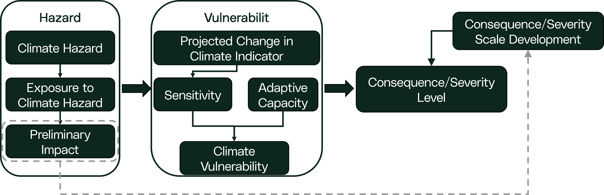
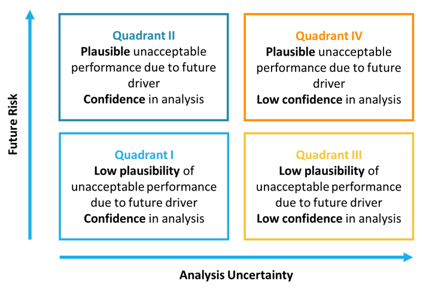
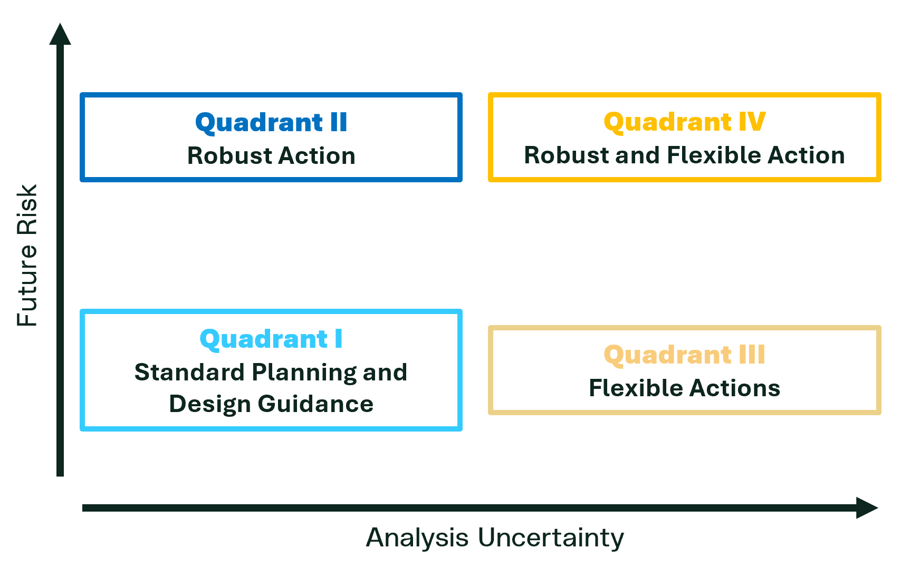

This step may be completed which estimates climate risk for each
relevant climate interaction with the system by combining: the climate
[hazard](./risk_step3_hazard.qmd##%20Hazard%20and%20Climate%20Driver%20Identification) *(what
could occur)*, [exposure](./risk_step3_hazard.qmd##%20Exposure%20Assessment) *(what parts of
the system are in direct/indirect contact with the hazard)*, and
[vulnerability](./risk_step4_vulnerability.qmd) *(how the
system responds, based on sensitivity and existing capacity to cope)*.
Risk can be described using the IPCC framing and formula:

$$
R = f(H,E,V)
$$

where Risk ($R$); Hazard ($H$); Exposure ($E$); and Vulnerability ($V$).

This risk concept is beneficial for understanding how different key
factors influence the overall risk of an system and how modification of
one of these factors can reduce the overall risk. See [Core Concepts:
Understanding Adaptation](./core_concepts_adapt.qmd) for more details.
It can also be directly mapped to the traditional definition of risk:

$$
R = L × C 
$$ where Risk ($R$); Likelihood ($L$); and Consequence ($C$),

In this framing, likelihood is driven by the hazard (for selected
scenarios, time horizons, and indicator values), while consequence is
driven by the exposure and vulnerability (how the system performs if the
event occurs). The relationship between the IPCC concept of risk and
traditional risk definitions are discussed in [Core Concepts:
Understanding Adaptation](./core_concepts_adapt.qmd). The relationship
between likelihood and consequence to estimate risk is typically
visually represented with a risk matrix or heat map and can vary
depending on the type of risk assessment that is completed.

```{mermaid}
%%| fig-align: center
%%| fig-cap: "Generic Workflow for Adaptation"
---
config:
    flowchart:
        curve: linear
---
flowchart-elk TD
    A[Step 1: Develop Scope]:::basic --> B[Step 2: Understand System]:::basic
    B --> C[Step 3: Hazard & Exposure Assessment]:::basic
    C --> D[Step 4: Vulnerability Assessment]:::basic
    H[Step 7: Institutionalize Decision]:::basic
    D --> |No Vulnerability| H
    D --> |Vulnerable| E[Step 5: Risk Assessment]:::focus
    F[Step 6: Adaptation Plan]:::basic
    E --- J1
    D --- J1(( )):::join
    J1 --> |Unacceptable Vulnerability or Risk| F
    E --> |Risk Acceptable| H
    F --> H

    classDef basic fill:#CAD4D6
    classDef focus fill:#CAD4D6, stroke:#CE153D, color:#CE153D
    classDef join height:0px
```

::: {.callout-note collapse="true" title="The Challenge of Uncertainty"}
Climate risk assessment is often challenging because both likelihood and
consequence are uncertain, and uncertainty generally increases further
into the future. For that reason, risk may be better represented as a
range of results across scenarios and time horizons rather than a single
value, and it may be impractical to represent climate risk as a single
point on a traditional probability-consequence matrix. The objective of
the assessment should be to evaluate multiple climate scenarios to
understand a range of possible risks for any given climate interaction
with an system. Accurately assessing climate risk may require a nuanced
understanding of the climate data and specialized climate science
expertise to complement engineering teams.
:::

This step supports forward-looking decisions by documenting how
likelihood and consequence are estimated, showing how results change
across scenarios, and clearly describing confidence and uncertainty so
decision-makers can understand what is known, what is uncertain, and
what could change the outcome.

::: {.callout collapse="true" title="Simple Climate Risk Assessment"}
In a simple risk assessment, a critical threshold (a performance-based
criteria) should be clearly identified in [Performance
Criteria](###%20Performance%20Criteria). This may be a failure
criterion, a limit at which a factor of safety is exceeded or any other
pre-defined value. This is considered a simple risk assessment because
single consequence is defined based on exceeding this threshold makes
the climate risk assessment a function of likelihood, since crossing the
critical threshold will always result in the same outcome. The risk is
effectively univariate. This is the type of risk assessment primarily
documented in the body of this section in the following sub-steps.
:::

::: {.callout collapse="true" title="Complex Climate Risk Assessment"}
A complex climate risk assessment occurs where a critical threshold is
poorly defined or does not exist (a risk-informed criteria) requiring a
decision maker to determine their risk tolerance in order to take
further action. It is considered complex because the risk matrix will
require consideration of distinct likelihood-consequence points, making
the risk bi-variate. For example, climate change may impact the
production of a generating station. As the projected climate indicator
increases, production will decrease and a decision maker will need to
decide how much loss is acceptable in order to make an adaptation
decision.
:::


::: {.callout collapse="true" title="Outcomes"}
Expected outcomes of this step may include:
- Mapping of the consequence values from the vulnerability assessment
- Development of likelihood values including method and approach, as
well as key assumptions that were made when completing the likelihood
analysis
- Calculation of the risk, including all climate scenarios and
time horizons evaluated 
- Development of the level of concern matrix for each risk, documenting the level of uncertainty associated with each
estimated climate risk
- Documentation of risk prioritization and rationales (if applicable)
:::

## Assess Consequence

This sub-step estimates consequence (severity) for each relevant climate
interaction using the exposure and vulnerability results. Consequence
describes what would happen if the climate condition occurred; it does
not consider probability.

The consequence is the result of a risk event being realized and should
be directly derived from the vulnerability.

{fig-align="center"}

If preliminary impacts were developed as part of the [exposure assessment](./risk_step3_hazard.qmd##%20Exposure Assessment), they should be reviewed as part
of this step and considered in the consequence/severity scale. For each
climate interaction, a consequence/severity level(s) should be
determined, and applicable impacts (financial, environmental,
reputational, etc.) associated with the consequence should be
documented. Consequence scores will then be carried forward and combined
with the likelihood of the interaction to estimate risk.

::: {.callout collapse="true" title="Simple Risk Assessment"}
For a simple climate risk assessment, the critical threshold used in
[Step 4: Climate Vulnerability Assessment](./risk_step4_vulnerability.qmd) should be
evaluated to determine the magnitude of the consequence, making the
consequence the result of system performance only. The figure below
provides a flow diagram for determining consequence.

For example, if passing beyond a critical threshold resulted in the
consequence of a unit tripping off, there would be an impact financially
to revenue, there may be a reputational impact, environmental impact or
safety impact which are defined in the consequence/severity scale.

For most simple risk assessments, the same impact will apply to the
consequence regardless of the scenario (i.e. a dam failure will have the
same impact to human life regardless of the warming scenario). In some
instances, differences in impacts may be expected across scenarios being
assessed. For example, the value of money may change between the near
term and long-term or the local population may be expected to change
resulting in a greater impact from an system failure in the later future
scenarios.
:::

::: {.callout collapse="true" title="Complex Risk Assessment"}
A complex risk assessment is when a well-defined threshold does not
exist, and more reliance is placed on a decision maker to determine risk
tolerance. For example, if assessing how much production is expected
under future climate scenarios, there is not likely to be a well-defined
threshold for what an acceptable amount would be. Instead, a decision
maker may need to look at changing conditions and determine if profits
or risk of decreased performance is acceptable.

In a complex risk assessment, the likelihood and consequence must be
co-evaluated as a paired value and derived together. The likelihood, by
definition, must be the probability of an event. Without a threshold
based on the system a new value shall be selected. This may be the
baseline performance (i.e. using a historic expected value) or it could
be variable, (i.e. the likelihood of exceeding a series of values).
Other appropriate values may also be used.

The likelihood and consequence are determined together choosing first a
climate indicator value, scenario or consequence from the vulnerability
assessment and then the likelihood of that scenario occurring. The risk
is then calculated or placed on the matrix to show how likelihood and
consequence change in relationship to each other.

For example, hydroelectric production is expected to change as a
function changing precipitation, but a clear threshold below which
production is unacceptable cannot be easily defined. A model can be used
in a stress test to simulate the production from various scenarios using
total annual precipitation as an indicator to develop a vulnerability
curve. The 50th percentile of historic annual production of 100GWh may
be selected as a baseline. For SSP2-4.5 and SSP5-8.5 the likelihood of
exceeding 90GWh, 100GWh, 110GWh, etc. can be calculated for the 2050's
and 2080's and compared by a decision maker to the baseline value to
make an informed decision about the significance of the risk and any
adaptation options they wish to pursue.
:::

## Assess Likelihood

This sub-step estimates the likelihood that a climate indicator will
reach levels that matter for system performance, within the selected
scenario(s) and time horizon(s). Likelihood methods depend on the type
and quality of climate data available. Where modelled projections are
available for the indicator, likelihood may be estimated quantitatively.

**Select Climate Scenarios:** Before quantifying risk, determine which
climate scenarios to analyze. This includes deciding how to represent
time (e.g., based on the design life of the system) and which climate
scenarios to use (e.g., different emissions pathways or global warming
levels). For long-lived assets, multiple scenarios may be needed; for
shorter-lived assets, a single scenario may suffice. Rationale for
choices should be clearly documented.

::: {.callout collapse="true" title="Example Scenarios"}
- Probability of an event under different global warming levels (e.g., 2°C, 2.5°C, 3°C).
Refer to ["Time Horizons and Global Warming Levels"](../climate_data_fundamentals/Time_Horizons_GWL.qmd) for more details on global warming
levels.
- Probability of an event under specific climate scenarios (e.g. SSP2-4.5, SSP5-8.5) for different future time windows (e.g., 2050s, 2080s).
:::

::: {.callout-note collapse="true" title="Note on time"}
The more climate scenarios and time horizons needed for the assessment,
the more likelihood values will need to be calculated for each climate
indicator. For example, if SSP2-4.5 and SSP5-8.5 climate scenarios are
selected for the 2°C global warming level, under two future time
horizons (2050s and 2080s time periods), then four distinct likelihood
values will need to be calculated and compared in the analysis. The time
window selected should include 30 years to capture climate variability,
but does not need to exceed system design life beyond that.
:::

**Select the Future Value or Range Criteria:** For each scenario,
determine the historic and future value or range in which likelihood
will be calculated. That is, the future value or range of possibilities
within the climate scenario ensembles in which statistical analysis will
be calculated against. Percentiles could also be used to add some
conservatism, at the cost of sample size. For example, the number of
75th percentile or greater events that exceed the critical threshold
could be compared to the total number of events that exceed the 75th
percentile of the climate projection data.

**Assess Probability:** For each scenario, determine the probability of
relevant hazards and indicators. This is completed through statistical
analysis to calculate the probability of the future value or range
exceeding the selected threshold (performance criteria) established
previously. For simple risk assessments, the probability should be
calculated following the classical formula, or other established
statistical methods, for determine the probability of event $X$
occurring:

$$
L(X) = \frac{\text{Number of times X occurs}}{\text{Total Number of Events}}
$$

This formula is applied with respect to a pre-defined threshold. In the
simple climate risk analysis scenario, where a critical threshold has
been identified, this should be the number of times the climate data in
a 30+ year window exceeds the critical threshold divided by the total
number of data points. For complex risk assessments, this probability
calculation may vary.

{fig-align="center"}

::: {.callout-note collapse="true" title="Stationarity Assumptions"}
The classic probability formula assumes data are stationary, which means
there is no long-term trend. This assumption is false, but may be
useful. Climate data should be compared in 30-40 year windows where
stationarity assumptions are more valid and not used for long periods of
time. Alternatively, probabilities may be estimated from fitted
probability distributions, some of which may be applied to
non-stationary data. For screening and other high-level assessments, the
probability may be able to be reasonable estimated visually.
:::

**Mapping Probability:** Once the probabilities of a climate indicator
exceeding the performance criteria is calculated, map each of the
scenario probabilities to a likelihood scale or criteria. This is done
so that risk can be estimated by combining the likelihood level with the
consequence level. This will result in a likelihood value for each
scenario and time horizon evaluated for a given climate indicator.

::: {.callout collapse="true" title="Semi-Quantitative Likelihood Analysis"}
For climate hazards and indicators where limitations exist in the
climate data and quantitative analysis of likelihood is not possible
(e.g., non-modelled hazards), likelihood can be estimated
semi-quantitatively. In these situations, likelihood level is informed
by relevant and available literature or studies associated with the
climate hazard or indicator and compared against the performance
criteria established for the climate interaction. Some examples of
climate hazards that would require semi-quantitative likelihood scoring
would be hailstorms, lightning strikes or tornados.

Like the quantitative method, expected future likelihood level needs to
be mapped to a likelihood scale or criteria in order to estimate risk.
Depending on the nature of the climate risk assessment and the relevant
hazards, the assessment may need to estimate likelihood using both
quantitative and semi-quantitative approaches. This may be unavoidable.
In these situations, it is best practice to map likelihood level to the
same likelihood scale, so risk can be estimated in a similar manner.

Semi-quantitative likelihood scoring contains a higher level of
uncertainty, as the process involves more subjectivity in the scoring
process, and relies on relevant literature being available and relevant
for the hazard or climate indicator.
:::

## Risk Quantification

The final risk (risk level) is determined quantitatively as the product
of the likelihood and the consequence (impact) or may be qualitatively
evaluated using likelihood and consequence results. This is commonly
mapped to a risk matrix. Risks should be calculated for each climate
interaction, scenario, and time horizon that have been included in the
assessment. This may result in multiple risk values for a given
interaction, if multiple climate scenarios and time horizons are
considered in the assessment.

::: {.callout.caution collapse="true" title="Central Tendency"}
When risk, likelihood and consequence are determined
semi-quantitatively, care should be taken to ensure the resulting
analysis is meaningful. Often categorical values have a tendency to
select middle values and are selected very subjectively. In these
situations, ensure values are non-biased, founded on information and
granular enough to suit the needs of the assessment.
:::

::: {.callout collapse="true" title="Risk of Extreme Events"}
Extreme events serve as an important design basis for critical
infrastructure, particularly in nuclear and hydroelectric. These design
events are very rare, often being expressed as an event which has a
return period of $10^{-5}$ to $10^{-7}$ of occurring in any given year.
This makes the likelihood in the risk equation extremely small and the
overall risk consistently low despite large and unacceptable
consequences. These events should be handled as special cases if
compared to other forms of asset risk.

The risk may be better reflected by increasing the consequence scale of
the event to increase the risk, as it does not need to be commensurate
with the likelihood scale. Another option may be in properly defining
the risk event itself. The criteria may be established as a system
failure with an extremely low probability (i.e. 1:10,000 year event), or
it may be framed as not meeting a regulatory requirement or risk
tolerance of being able to operate an system up to a 1:10,000 year
event, which could scale the problem to be commensurate with other
risks.
:::

## Level of Concern

Recognizing uncertainty and understanding the confidence in the analysis
is an important part of a climate risk assessment. There is natural
variability in the climate system and human actions will determine the
emissions pathway altering climate outcomes in the future. In addition,
not all climate model parameters or vulnerability and risk assessment
methods offer the same degree of confidence. As a result, it is
important to integrate both the level of risk, the uncertainty and
confidence in the analysis when finalizing the assessment. Identifying
the level of concern allows for the consideration of both risk and
uncertainty.

### Key Steps for Determining Level of Concern

**Risk:** Using the risk from the risk assessment to plot the position
on the vertical axis of a Level of Concern diagram for each climate
interaction assessed. The vertical axis represents the amount of risk,
as determined by the risk assessment.

::: {.callout-tip collapse="true" title="Simplification"}
Where multiple climate risks exist for a single climate interaction
(e.g., multiple climate scenarios and time horizons assessed), it is
often best practice to select one conservative future risk level, to
simplify the analysis depending on the objective of the assessment. The
analytical uncertainty will guard against overly conservative and costly
adaptation actions. The future risk level mapped for the climate
interaction should be documented and justified to fit the purpose of the
assessment.
:::

**Analytical Uncertainty:** Assign the analytical uncertainty on the
horizontal axis. This value reflects the uncertainty in climate
projections, the confidence in the ability of climate models to
represent relevant hazards, and the confidence in the vulnerability
assessment process. This step is inherently subjective unless there is
detailed knowledge of the uncertainties involved. Information on
uncertainty and confidence can be found [here](../climate_data_fundamentals/core_concepts_data.qmd)

Involve climate science and engineering experts to help assess
uncertainty and avoid bias -- whether it be overconfidence or under
confidence in the data and models.

By combining risk magnitude with analytical uncertainty, it is possible
to identify the overall level of concern for each risk. This approach
will help prioritize adaptation actions and ensure decision-makers
understand both the risks and the confidence in the underlying analysis.

{fig-align="center"}

## Adaptation Strategy Quadrants

Building on the level of concern diagram, adaptation strategies for
associated climate risks can be categorized based on the risk level and
the confidence in the analysis can be identified. A four-quadrant
approach is presented, and are aimed to support adaptation strategy
development in the next step of this assessment process. Adaptation
quadrant descriptions include:

::: {.callout collapse="true" title="Quadrant I -- Standard Planning and Design Guidance"}
Projects in this category are well-suited to standard evaluation
processes. The assumption of stationary (unchanging) past design
conditions is generally valid, and uncertainty is well understood.
Standard safety margins may be sufficient, but engineers should remain
cautious and consider whether additional analysis is warranted,
especially for system where there is low tolerance for risk of failure.
:::

::: {.callout collapse="true" title="Quadrant II -- Robust Actions"}
Here, there is confidence that future conditions will be stressful for
the system. Adaptation actions should prioritize robust options that can
withstand these challenging conditions. Where multiple options exist,
incremental cost analysis (ICA) may be used to determine the most
cost-effective and effective solution. If a clear winner emerges, it
should be prioritized.
:::

::: {.callout collapse="true" title="Quadrant III -- Flexible Actions"}
This quadrant presents the challenge of low risk combined with higher
uncertainty. In these cases, it may not be justifiable to conduct
detailed design analyses. Instead, develop a limited set of flexible
adaptation pathways, and select scenarios that are relevant or
appropriately conservative. Focus on options that can be adjusted as new
information becomes available and institutionalize a monitoring plan to
track changing conditions.
:::

::: {.callout collapse="true" title="Quadrant IV -- Robust and Flexible Actions"}
Projects in this quadrant are the most challenging, as they involve both
high risk and high uncertainty. Strategies should combine robust,
immediate actions (possibly identified through incremental cost
analysis) with flexible adaptation pathways. Implement robust measures
where risk tolerance is lowest or impacts are most imminent and
establish a monitoring plan to support ongoing adaptation as more
information becomes available.
:::

{fig-align="center"}

Following this structured approach ensures that adaptation strategies
are well-matched to both the level of risk and the confidence in the
analysis, supporting resilient and cost-effective decision-making.

## Risk Prioritization

If the risk assessment is being done for a larger facility or multiple
system, an additional step may be required to prioritize the risks that
will be treated. The risk and the level of concern can be used to
prioritize risks to be addressed. Adaptations plans for each risk can
then be institutionalized or an organizational risk tolerance threshold
can be applied to determine which risks needs to be addressed and in
which order.


