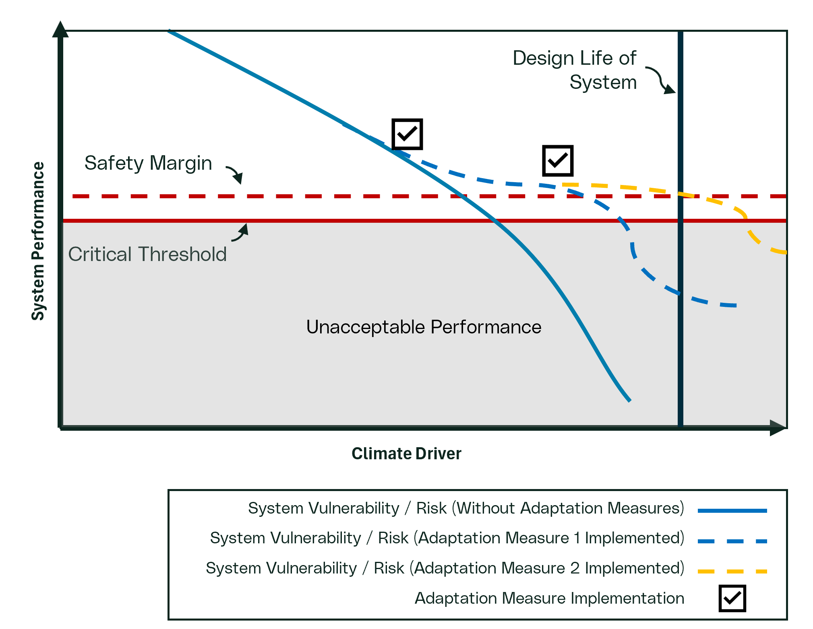
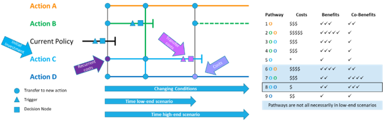

```{mermaid}
%%| fig-align: center
%%| fig-cap: "Generic Workflow for Adaptation"
---
config:
    flowchart:
        curve: linear
---
flowchart-elk TD
    A[Step 1: Develop Scope]:::basic --> B[Step 2: Understand System]:::basic
    B --> C[Step 3: Hazard & Exposure Assessment]:::basic
    C --> D[Step 4: Vulnerability Assessment]:::basic
    H[Step 7: Institutionalize Decision]:::basic
    D --> |No Vulnerability| H
    D --> |Vulnerable| E[Step 5: Risk Assessment]:::basic
    F[Step 6: Adaptation Plan]:::focus
    E --- J1
    D --- J1(( )):::join
    J1 --> |Unacceptable Vulnerability or Risk| F
    E --> |Risk Acceptable| H
    F --> H

    classDef basic fill:#CAD4D6
    classDef focus fill:#CAD4D6, stroke:#CE153D, color:#CE153D
    classDef join height:0px
```

Adaptation strategies should be developed to address risks or
vulnerabilities that have been identified as unacceptable. It involves
taking actions to reduce the impacts of climate change on systems.
Adaptation can take many forms: 

- **Reducing Exposure**:</br>
Some actions lower exposure to hazards, such as
relocating an system away from areas at risk of flooding.

- **Reducing Vulnerability**:</br>
Most adaptation measures focus on decreasing the
system's vulnerability to climate hazards. This can be achieved by
strengthening the system or modifying its operation to better withstand
adverse conditions. 

- **Enhancing Reliability and Resilience**:</br>
Certain adaptation actions
improve the reliability of the system, ensuring it continues to perform
even as climate conditions worsen. Others enhance resilience by
minimizing the impact of an event or enabling faster recovery after
disruption. 

- **Transferring Risk:**</br>
Some elements of risk can be transferred through
contractual obligations, rate regulation or insurance. 

:::{.callout collapse="true" title="Types of Adaptation"}

**Structural Adaptation:**</br>
This involves modifying or replacing physical
assets or components. These changes are typically implemented through
maintenance activities or capital projects. Examples include upgrading
equipment, increasing the capacity of turbines, or reinforcing
infrastructure.

**Operational Adaptation:**</br>
This focuses on changing how assets are
operated rather than altering the assets themselves. Examples include
adjusting operating schedules, increasing inspection frequencies, or
updating maintenance programs. These changes are usually introduced
through revised procedures or work instructions. Where feasible,
operational adaptations should be considered before structural
adaptations, as they may offer effective, lower-cost solutions.

Both structural and operational adaptation depends on informational
adaptation -- the provision of climate data, expertise, and monitoring
technology to support informed decision-making. 
:::

The figure illustrates how system adaptation measures can be implemented
over time to achieve resilience. The solid blue line represents system
climate vulnerability/risk to a climate indicator without the
implementation of adaptation measures. In this situation, we see the
system entering unacceptable performance criteria well before its
expected design life. The dash blue line represented system climate
vulnerability after an adaptation measure has been implemented. In this
situation, the adaption strategy reduces vulnerability for a period, but
as climate hazards intensify, and the system enters unacceptable
performance criteria before its expected design life. As such, a second
adaptation becomes necessary to maintain acceptable performance through
the system design life. This example highlights the importance of
flexible adaptation pathways and planning as well as the timing and
institutionalizing when implementing adaptation strategies. 

{fig-align="center" width=700}

::: {.callout-note collapse="true"}
While most climate vulnerability and risk guidance documents emphasize
the importance of managing climate risks and implementing adaptation
actions, they often lack detailed instructions on how to evaluate and
select the best adaptation options. When choosing adaptation measures to
address climate risks or vulnerabilities the model or method used (i.e.
stress test), can also be used to assess potential adaptation actions.
This ensures that each option is measured against the same performance
criteria and under comparable scenarios. 
:::

::: {.callout-note collapse="true" title="Adaptation Timing"}
Not all adaptation actions are urgent. The urgency of adaptation should
be determined through a risk evaluation process. Often, adaptation can
be incorporated into regular asset life-cycle management. For example,
if a valve is scheduled for replacement every ten years, it may be
cost-effective to wait until the next scheduled replacement to install a
climate-resilient model -- unless inspections show accelerated
deterioration that would require earlier action.
:::

::: {.callout collapse="true" title="Expected Outcomes"}
-   Clear documentation of the key adaptation measures considered and
    why. 
-   The preferred adaptation measure(s) to be implemented and the
    rationale as to why. 
:::

Following these steps systematically identifies, evaluates, and
implements adaptation measures that effectively reduce climate-related
risks and enhance the long-term performance and resilience of assets.

## Identifying Adaptation Options 

Effective adaptation strategies should be tailored to the level of risk
or *vulnerability* identified and the *confidence* placed in the
analysis. The goal is to select actions or a range of actions that can
reduce the likelihood or consequence of reaching critical performance
thresholds. The scope and complexity of these actions should reflect the
nature and cost of the problem or system being addressed.  

Use the results from [Level of Concern](./risk_step5_risk.qmd#level-of-concern) in the
risk assessment will guide the selection of adaptation actions. Unless
there is an option that is a clear winner, first identify multiple
possible actions to ensure flexibility and resilience. Options should
also be considered to minimize regret, meaning options that would
minimize future opportunities or were fragile (i.e. not effective) under
certain future conditions. 

Where the risk assessment results select Quadrant 1, standard methods
can be used to address the risk. If findings are in Quadrant 2, the
various adaptation options considered should be evaluated and the best
option selected. 

Where the risk assessment results in Quadrants 3 or 4, robust or robust
and flexible actions are to be considered. [Adaptation
pathways](#adaptation-pathways) are a valuable tool for
developing a long-term, flexible plan. These pathways identify a
sequence of adaptation measures, some of which may not need to be
implemented immediately, allowing the organization to respond as
conditions evolve.

## Adaptation Pathways 

An adaptation pathway (@hasnoot2013) is a strategic tool for evaluating
a sequence of adaptation options, along with their associated costs and
benefits over time to manage uncertainty. This approach is particularly
valuable for situations characterized by higher uncertainty or risk
(Quadrants 3 and 4) but may be used in multiple scenarios. By mapping
out a series of potential actions, adaptation pathways help
organizations develop flexible, long-term plans to address climate risks
as conditions evolve. Adaptation pathways consider not a single but
multiple pathways. Decisions or actions at some point in time may remove
one pathway for consideration or justify the shift to a different path
than originally envisioned. 

::: {.callout collapse="true" title="Key Elements of Adaptation Pathways"}
-   **Sequential Options**: A pathway consists of multiple adaptation
    actions that can be implemented in sequence. Each action is linked
    to a specific trigger a threshold or indicator showing that current
    measures are no longer sufficient. 

-   **Triggers and Decision Points**: Triggers are identified early
    through a robust monitoring plan. When a trigger is reached, it
    signals the need for a decision, such as initiating a new investment
    or changing operational procedures. Triggers must provide enough
    lead time for planning and implementation before the system's
    performance becomes unacceptable. 

-   **Monitoring Plans**: Effective adaptation pathways rely on ongoing
    monitoring. In OPG, this could involve integration with risk
    monitoring, equipment reliability, asset health programs, or safety
    analyses. Monitoring ensures that triggers are detected promptly and
    that actions can be taken when needed. 

-   **Pre-Planning and Flexibility**: Pre-planning the entire adaptation
    pathway helps avoid "buyer's remorse" in the future or unnecessary
    overspending now to address uncertain future risks. While the full
    pathway should be considered, immediate actions and near-term
    decisions should be the focus of rigorous analysis. Actions planned
    for the distant future can be explored with less detail, as
    conditions may change. 

-   **No-Regrets and Flexible Solutions**: When analytical uncertainty
    is high, prioritize "no-regrets" actions -- measures that are
    beneficial under a wide range of scenarios -- combined with a strong
    monitoring plan. Consider the costs of delayed action, such as
    increased future expenses or missed opportunities for efficiency
    (e.g., combining projects to save on excavation costs). 

-   **Institutional Capacity**: Choose pathways that align with OPG's
    existing processes and resources. Monitoring programs that are easy
    to implement and manage will increase the likelihood of successful
    adaptation. 
:::

## Developing an Adaptation Pathway
The figure below shows the current state and four different possible
actions. Various adaptation options are linked in a pathway and
considered in terms of their benefits and co-benefits. The primary
driver on the x-axis is the climate driver which is the sole determinant
of the need to change the system. A secondary and tertiary axis are
added to show the relative high-end and low-end time projections for the
increase of the given climatic driver or hazard (i.e. when will that
intensity of the climate change be reached under high and low emissions
scenarios). This figure can be interpreted similar to a subway map
starting at the left and moving through actions or decisions on
different pathways. Some pathways such as Action B (green) will only be
effective up to a certain climate value. When this end is reached there
will need to be a transition to a different action pathway (going up to
A or down to C or D). The terminology of pathway is used because
individual actions can be used sequentially creating paths AB or BCD,
etc.

{fig-align="center"}

In this example, the conditions have changed such that the current
policy (black) will soon be stressed beyond the desired threshold. At a
trigger point (triangle) an initial investment is initiated and work is
executed (i.e. a project represented by rectangle) is required to
implement an adaptation measure and switch to Action C, representing a
robust immediate action. A monitoring program will then be
institutionalized to monitor for the conditions that indicate Action C
may no longer be effective, representing a flexible action. If the
trigger level of the climate driver (pink triangle) is reached a new
adaptation (i.e. project, operational change, etc.), represented by the
pink square, will be required to transition from Action C and Action D.
This C-D pathway (Pathway 8 in right sub-figure) has modest benefits
compared to other pathways but is the lowest cost option. Also, in a low
climate change scenario, there may not be a requirement to deviate from
Action C to a more expensive option.

Developing an adaptation pathway could be done qualitatively or
quantitatively. For example, using expert knowledge a simple qualitative
analysis could be conducted as shown above to identify relative costs
(i.e. number of money symbols) and benefits/co-benefits. Alternatively,
a detailed model could be setup and run for each pathway with an
included financial analysis to quantify the costs and value of each
identified benefit.


Learn more about adaptation pathways:


## Evaluating Adaptation Pathways

-   Compare pathways based on costs, benefits, and co-benefits,
    including avoided losses. 
-   Use qualitative methods (e.g., expert judgment, simple scoring) or
    quantitative models (e.g., detailed financial analyses) as
    appropriate. 
-   Consider the time horizons for each action, and how quickly triggers
    might be reached under different climate scenarios. 

Developing adaptation pathways can create resilient, phased strategies
that adapt to changing climate risks over time -- balancing immediate
needs with long-term flexibility and cost-effectiveness.


# References

::: {#refs}
:::
