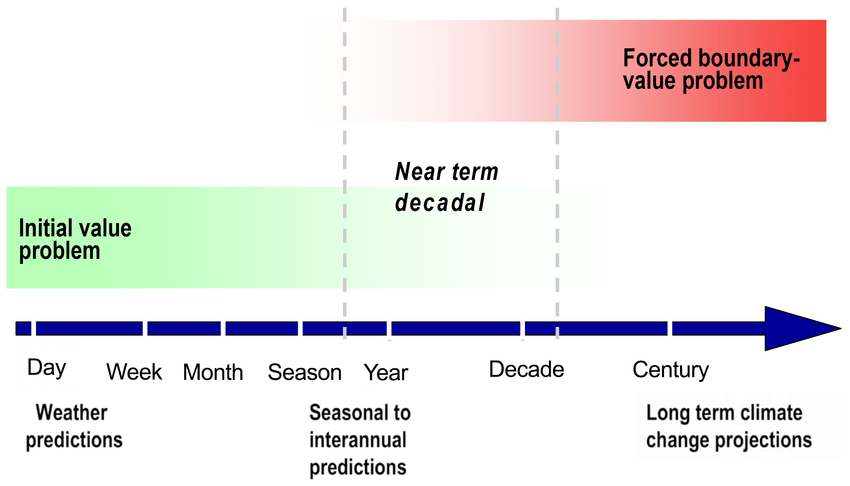

<!--- This is just a comment in the markup --->
<!--- This section is quarto yml with a list of all refernces to be included on this page --->

---
title: Forecasts, Projections and Predictability

---

Climate data can be broadly divided into two distinct categories: historical data and future data. Historical data include any dataset aimed at providing information of the past as it actually occurred. They include in-situ observations (e.g. stations), remote sensing observations (satellite or radar-based measurements), or reconstructions, which combine multiple sources of information into a single gridded product. These reconstructions can be done by combining and interpolating observations directly, or by assimilating observations with a model of the atmosphere in a so-called reanalysis. Each type of product comes with advantages and limitations, and additional information on these products is provided in the various sections.

Future data are all based on model simulations (we don’t have observations of the future yet!). These models are mathematical representations of the different Earth's components (e.g. atmosphere, ocean, land, sea ice) and are constructed using the known physical, chemical and biological processes governing these components (e.g. hot air near the surface is less dense than cold air and therefore will tend to rise up). These dataset are typically divided in the climate community according to the time horizon (target) of the predictions. They are:

- Weather forecasts (1-14 days)
- Sub-seasonal forecasts (2-6 weeks)
- Seasonal forecasts (1-12 months)
- Decadal forecasts (1-10 years)
- Climate projections (+10 years; typically up to end of the century)

There are many differences between these simulations, ranging from how they are produced to the type of information that they provide to how they should be evaluated. The first difference worth mentioning is the difference in the source of predictability: the longer the simulation, the less important the initial state of the system is for the simulation. For weather forecasts, the prediction is entirely dependent on the state of the atmosphere at the beginning of the simulation (what is referred to as an initial value problem). The predictability of sub-seasonal forecasts will originate from land conditions (soil moisture, snow cover) and stratospheric temperature, whereas the predictability of seasonal forecasts will originate from various atmospheric and oceanic oscillations such as El Nino Southern Oscillation. For decadal forecasts, the predictability originates from the slowly changing ocean conditions. It is important to note that, as we increase the horizon of the forecast, the initial conditions of the system become less important while the composition (and changes therein) of the atmosphere and its impact on the amount of solar radiation reaching the Earth’s surface becomes more important (what is referred to as a forced boundary-value problem; see figure below). For the longest simulations (climate projections), the initial state becomes completely irrelevant and what is important is the composition (and changes therein) of the atmosphere and its impact on the amount of solar radiation reaching the Earth’s surface. 

Another important distinction is the type of information provided: only weather forecasts provide deterministic information (e.g. max/min temperature for each day of the forecast). For the other types of simulations, the information is typically aggregated over a specific time period and the statistics of that time period, and how it compares to a period of reference, are provided (e.g. +3 $^{\circ}$C on average compared to the pre-industrial era; 70% chance that winter will be warmer than normal). 

Along with historical data, this document only provides information on climate projections. For the interested user, ressources for the other types of forecasts are listed below.

### Sub-seasonal Forecasts:

- [(SubC (IRI)](https://iridl.ldeo.columbia.edu/maproom/Global/ForecastsS2S/index.html)
- [ECMWF](https://www.ecmwf.int/en/research/projects/s2s)

### Seasonal forecasts:

- [Copernicus Climate Change Service](https://climate.copernicus.eu/seasonal-forecasts)
- [[climatedata.ca]()]{.mark-red} (upcoming)

### Decadal forecasts:

- [[climatedata.ca]()]{.mark-red} (upcoming)

