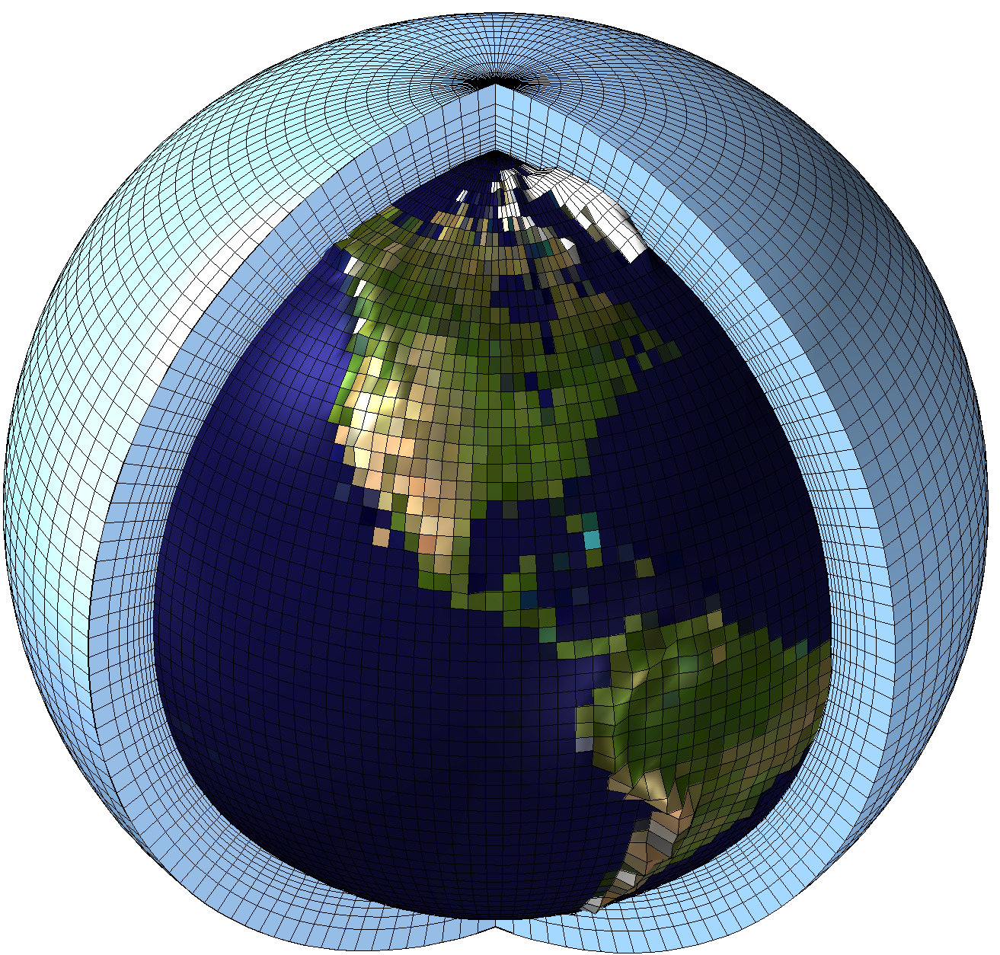
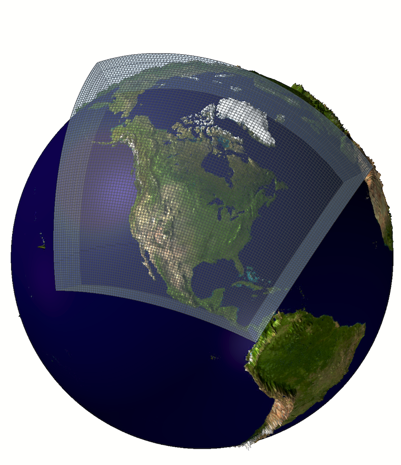

## Summary Description

Climate projection datasets are collections of outputs from climate models that simulate the climate of the past as well as future climate conditions. Future simulations are based on [future greenhouse gas emissions scenarios](#emissions-scenarios). These datasets are used to assess potential impacts of climate change on various sectors, including agriculture, water resources, energy systems or ecosystems. Most climate projection datasets presented in this guide have been [bias-adjusted](#bias-adjustment) to account for systematic deviations of the simulations from observed climatology. The strengths and limitations discussed on this page refer to these bias-adjusted datasets. See [CMIP6](CMIP6.ipynb) and [CORDEX](CORDEX.ipynb) for strengths and limitations of the raw datasets that serve as input for bias-adjusted datasets.

## Global Climate Models

Climate models represent the natural processes of the Earth based on physical principles of fluid dynamics and thermodynamics, broken down onto three-dimensional grids to represent interactions of terrain, atmosphere, ice, water, and vegetation (lithosphere, atmosphere, cryosphere, hydrosphere,
biosphere). Global climate models (GCMs) or Earth system models (ESMs) can be interpreted as numerical replicas of planet Earth built to generate sequences of global atmospheric circulation and weather events. The resulting time series do not and are not meant to reproduce historical weather sequences or events. They are distinct from the observed record of weather events of the real world but reproduce well long-term climate and its evolution on Earth. Climate models are often used to simulate the response of climate to variations in external forcing, i.e. processes external to the climate that drive changes in the Earth’s energy balance. Exploring the Earth system’s response to changes in external forcing due to increasing greenhouse gas (GHG) concentrations in the atmosphere is the most prominent application of GCMs.

::: {layout-ncol=2}
{.lightbox .caption width=400}

{.lightbox .caption width=330}
:::

## Regional Climate Models

Any region’s climate is inevitably linked to the global atmospheric circulation, therefore any simulation with a Regional climate model (RCMs) requires information about atmospheric conditions at its boundaries. Within a regional domain, RCMs operate on the same principles as GCMs; however, they are limited to smaller geographical regions. The conditions at the regions boundaries are taken from GCM simulations or global reanalysis of observational data to drive a regional model. With their smaller spatial coverage, RCM simulations can be run at higher spatial resolution than GCM simulations, thus providing added value where small-scale features impact local climate, such as mountains or coastlines. The process of running an RCM with the input from a driving GCM is often referred to as “dynamical downscaling,” since the higher spatial resolution output from the RCM is intrinsically tied to the coarser driving data. Generations of ensembles of RCM simulations become available later than the GCM simulations, as they depend on the latter as their driving data. Hence, a CMIP generations data from GCMs are published first, followed by those from RCMs. Usually, RCMs will be driven by a relatively small subset of available GCM simulations, which modifies RCM ensemble characteristics compared to GCM ensembles. A regions RCM ensemble will be defined by a combination of RCMs and GCMs which can be represented as a matrix. The [North America CORDEX-CMIP5 simulation matrix](https://na-cordex.org/simulation-matrix.html) provides an example of such an ensemble based on the GCMs modeling centers selected to drive their RCM(s). 

## Strengths and Limitations

### Key Strengths of bias-adjusted datasets

|Strength|Description|
|-|---|
| **High spatial resolution** | Resolves effects of regional topography and local climate patterns better than GCMs. |
| **Supports impact studies** | Designed to be used for vulnerability, impact, and adaptation (VIA) studies. |
| **Adjustement of biases**   | Some of GCM's biases are sustantially reduced. |
: {.tbl .striped .light .sm tbl-colwidths="[25,75]"}

### Key Limitations of bias-adjusted datasets

|Limitation|Description|
|-|---|
| **Reference bias** |Biases present in the reference dataset will also appear in bias-adjusted datasets.|
| **Biases remain** | Bias-adjustment cannot completely remove all biases. Different methods will target different characteristics of a dataset. |
| **No-physics at the small scale** | The fine resolution information only come from the reference and not a physical simulation of the future. |
| **Bias stationnarity** | Bias-adjustment assumes that the bias are constant over time. |
: {.tbl .striped .light .sm tbl-colwidths="[25,75]"}

## Expert Guidance {#expert-guidance}

::: {#id .callout collapse="true"}
### Click to toggle section collapse

### Emissions Scenarios {#emissions-scenarios}

To understand possible future climate conditions, climate models are driven with assumptions about how atmospheric greenhouse gas (GHG) concentrations may evolve. These assumptions are expressed as future emissions scenarios, emphasizing that they are structured representations of plausible futures rather than predictions. Such scenarios are carfully developed using information about how societies may grow and develop, and they incorporate factors such as global GHG emissions, political commitment to mitigation of GHG emissions, and technological progress. The frameworks used to construct these scenarios account for elements including population, education, energy demand and types, land use, and related drivers to outline coherent pathways of emissions from different sources, their accumulation in the atmosphere, how these patterns could evolve over the coming century, and the degree of effort directed toward limiting climate change. By definition, these assumptions about future emissions and atmospheric greenhouse gas concentrations are inherently uncertain. Although they are grounded in careful assessments of possible socio-economic developments worldwide, uncertainty regarding the range of plausible futures remains. As the emissions scenarios explore a wide range of possible futures they also represent the largest uncertainty in future climate projections.

Two families of emissions scenarios were developed to drive CMIP5 and [CMIP6](./CMIP6.ipynb) simulations. Representative Concentration Pathways (RCPs) were developed and used in CMIP5 and Shared Socioeconomic Pathways (SSPs) were used in CMIP6. The emissions scenarios are central to climate model experiments aimed at understanding the response of the Earth's System to anthropogenic alterations of the atmosphere. Each family is comprised of several plausible pathways of future atmospheric GHG concentrations. For instance, SSP2-4.5 describes a “middle-of-the-road” future in which current social, economic, and technological trends broadly continue worldwide, yet emissions are increasingly controlled, leading to an additional radiative forcing of 4.5 W/m² by the end of the century. The amount of GHGs associated with a given RCP or SSP drives the degree of warming in the simulated climate. It is important to recognize that different models respond differently to the same forcing, a characteristic known as climate sensitivity. When available, generations of climate model simulations driven by most recent emissions scenarios should be preferred over earlier generations. ClimateData.ca provides more detailed explanations of [RCPs](https://climatedata.ca/interactive/emissions-scenarios-rcps) and [SSPs](https://climatedata.ca/resource/understanding-shared-socio-economic-pathways-ssps). The emissions scenarios proposed for the upcoming CMIP7 [ScenariodMIP](https://wcrp-cmip.org/mips/scenariomip/) simulations are outlined in @VanVuuren2026.

Climate simulation ensembles like [CMIP6](./CMIP6.ipynb) are built by participating modeling centers by driving their models with different emissions scenarios to provide multiple sets of future climate projections. This allows the practitioner to explore a range of possible futures that encompass possible outcomes of anthropogenic impacts on climate. When assessing future climate, rather than making a choice of a specific emissions scenario, possible future outcomes should be explored to understand their consequences in the context of a respective impact. The temporal horizon of an assessment is an important factor when considering emissions scenarios. Since all emissions scenarios start out at the GHG level at end of a historical period, the spread between different SSPs (or RCPs) over the next two to three decades is small. Nevertheless it is good practice to consider at least two scenarios, one with low to moderate and one with high GHG emissions. 

Only beyond mid-century, the scenarios begin to diverge, and the resulting changes and impacts under a low-emissions pathway may differ substantially from those under a high-emissions pathway. In the latter case, and depending on the level of risk associated with potential impacts, the precautionary principle may warrant consideration of higher or more extreme emissions scenarios and the corresponding climate model results. 

### Multi-Model Ensembles {#ensembles}

Over 50 major research institutions around the world run global climate models to generate simulations of past climate and projections of future climate conditions. In the context of [Model Intercomparison Projects](https://wcrp-cmip.org/mips/) such as [CMIP6](./CMIP6.ipynb), a model may be run under different greenhouse gas [emissions scenarios](#emissions-scenarios) and even multiple times with different initial conditions. This generates a large number of distinct, yet comparable simulations of climate evolution. Instead of determining one of these outcomes to be a best result or estimate, each is considered one plausible possibility, scattered around the actual but uncertain future yet to develop. The uncertainties involved in this process include the emissions scenario uncertainty, structural model uncertainty and natural internal climate variability. They are best represented by employing ensembles of these simulations.

Emissions scenario uncertainty is related to the assumptions made for future GHG emissions from human activity and is discussed in the respective [section below](#emissions-scenarios).

Structural model uncertainty arises from the limitations and approximations made in climate models to represent processes. Climate models, while based on physical principles of fluid dynamics and thermodynamics, parameterize many processes at scales smaller than their spatial resolution, such as cloud formation or thunderstorms. This means that these small-scale processes are represented by simplified approximations rather than resolved explicitly by the physics of the model. Different climate modelling groups use different parameterizations and model structures, leading to different responses to the same external forcings, such as greenhouse gas concentrations. The diversity among models adds to the uncertainty in climate ensembles but is beneficial for capturing the range of possible outcomes.

The third important source of uncertainty, natural climate variability, refers to the chaotic nature of the climate system, and leads to different sequences of weather events even under the same external forcings. Natural climate variability can be studied either by running a model over very long timescales or by running multiple member simulations of the same model. Such member simulations consist of the exact same experiment setup, exept for a small perturbation of the intial conditions. A perturbation may be a different starting date or the exchange of an input layer, such as using the slightly different soil moisture from an earlier time step. The resulting simulations will be constrained by the same boundary conditions, including the GHG scenario, but due to the perturbations the simulations will quickly diverge, leading to different sequences of events in the members. Single model initial-condition large ensembles (SMILEs) are ensembles of many member simulations used for the study of climate variability and extreme events (see the [CanLEAD dataset](./CanLEAD.ipynb)).

It may be tempting to determine a "best performing model" for a climate assessment. However, such attempts are considered bad practice, primarily because a single model or simulation will not cover any of the inherent climate simulation uncertainty. Furthermore, a model performing well with respect to a selected metric, may be outperformed on another metric by a different model. Good practice for climate assessment uses ensembles of climate simulations to enhance robustness and reliability through the combination of outputs of multiple climate models. This allows to factor in uncertainty from model structure and to account for the climate system's natural variability in climate analysis for the electricity sector. [Emissions scenarios](#emissions-scenarios) uncertainty must also be considered when building an ensemble for climate impact assessment.

ClimateData.ca has an [illustrated explanation of the rationale of using multi-model ensembles](https://climatedata.ca/resource/multi-model-ensembles/) and Ouranos provides an [overview of different types of climate simulation ensembles](https://www.ouranos.ca/en/understanding-climate-concepts/climate-simulations).

### Ensemble Size Reduction

[Climate simulation ensembles](#ensembles) composed from different models, emissions scenarios and members consist of many, and often over 100 simulations. This exceeds the capacities of evaluation for many users, often related to running impact models driven by climate simulation data. Several techniques have been developed to reduce the number of ensemble members while largely preserving the full ensemble characteristics. @Lutz2016 propose a systematic approach to an envelope-based model selection. @Casajus2016 apply k-means cluster analysis to identify a representative subset of simulations from an ensemble based on multiple user-defined criteria. @Cannon2015, in contrast, propose a method to construct ordered sub-samples of simulations that systematically span the ensemble spread using multi-criteria selection. Using multiple hydroclimatological indicators, @Braun2021 compare the uncertainty captured by a reduced ensemble when compared to the initial ensemble. The [xclim library](https://xclim.readthedocs.io/en/stable/index.html)'s section on [ensemble reduction](https://xclim.readthedocs.io/en/stable/api.html#ensemble-reduction) povides Python code for the k-means clustering approach (@Casajus2016) and the KKZ method (@Cannon2015)

### Temporal Horizons {#temporal-horizon}

In climate research and adaptation planning, temporal horizons are time windows used to analyze and communicate projected climate conditions over meaningful periods. They are typically defined as multi-decadal intervals — such as the 2030s (2021–2050), 2050s (2041–2070), and 2080s (2071–2100) — to align with the World Meteorological Organization's (WMO) [suggestion to use 30 year periods](https://wmo.int/topics/climate) for the determination of average climate parameters. These horizons are used because climate evolves gradually, and planning decisions (e.g., infrastructure design, policy, resource management) often have lifespans spanning decades. By comparing climate statistics over these periods to a historical reference baseline (e.g., 1981–2010), researchers and practitioners can assess how conditions may evolve over time. Temporal horizons therefore provide a practical framework for linking climate projections to decision-making timelines in adaptation and risk management. More information on the rationale behind using 30 year averages, also called climate normals can be found on ClimateData.ca with an interactive tutorial on "[The Importance of Using 30 Years of Data](https://climatedata.ca/resource/30-years-data/)".

### Global Warming Levels

Traditionally, climate projections have been presented as the change of a future 20-year or 30-year period (e.g. 2071-2100) with respect to present climate conditions. However, during the last IPCC cycle, the WG1 introduced the concept of Warming Levels (WLs), wherein climate change projections are presented relative to the change in Global Mean Temperature (GMT) with respect to preindustrial conditions (e.g. 2◦C above preindustrial level), rather than tied to a designated future period (or [Temporal Horizon](#temporal-horizon)). In this framework, a WL is first selected (e.g. 2◦C) and then, for each GCM of an ensemble, the 20-year or 30-year period centered on the predetermined change in GMT is selected for comparison. Because the GCMs warm at different rates, the GCMs will reach the selected level of warming at different times. Consequently, different future time periods will usually be selected for each GCMs. 

Since simulations will reach a warming level regardless of the model properties or the emissions scenario, WL-based assessment can include multiple emissions scenarios and even "hot models" (@Hausfather2022) with a very strong response to increased GHG concentrations. An ensemble of simulations at a given WL will still describe the climate of a world at that global average temperature. When using WL, the ensemble spread is usually reduced, however the time of emergence of the conditions remain not well defined. Another advantage of using WL lies in the connection to climate change mitigation policy which is oriented to limiting warming to certainn levels defined by a temperature increase, such as the 1.5˚C target.

### Downscaling and Bias Adjustement {#bias-adjustment}

Applications in electricity system planning and operations are typically sensitive to fine-scale variations of climate parameters. Thus, it is essential that climate inputs reflect the regional or local meteorological conditions with sufficient detail. GCMs operate at relatively coarse spatial resolutions (typically 100-250 km) and therefore their outputs are often inadequate for regional or local scale assessment. To address this, two categories of downscaling techniques are applied: statistical downscaling and dynamical downscaling.

Statistical downscaling establishes empirical relationships between large-scale GCM variables and local climate observations, using historical data as a training base. Available methods are computationally efficient and have been widely used. In contrast, dynamical downscaling refers to the higher-resolution [Regional Climate Models (RCMs)](#regional-climate-models) which are driven by GCM output at their boundaries to explicitly simulate regional climate processes. 

Climate model output tends to deviate systematically from observed climatology. The biases may relate to the number of rainfall days or precipitation amount, or a model may be consistently too high or too low. Spatial resolution and process parameterization, among others, are involved in causing these deviations. Next to increasing the spatial resolution of the data, statistical downscaling methods are build to reduce these systematical biases in climate model simulations by pushing the modeled data close to the reference dataset. Such bias adjustment is particularly relevant when climate data are used to derive climate indicators that are threshold based, but are also recommended when impact models are driven with climate model outputs. Since these models are typically calibrated to historical observations, their response will often be unrealistic when driven with unadjusted simulated climate data.

Different approaches to bias adjustment and statistical downscaling have been developed. They include univariate and multivariate approaches. A recent review of available methods can be found in @Menapace2025, an in depth discussion of statistical downscaling and bias adjustment for climate research is available in @MaraunWidmann2018. The currently most widely accepted approach to bias adjustment consists of some variant of quantile mapping. Note that bias adjustment methods make a priori assumptions which include the assumption of stationarity of the bias in order to apply correction factors developed for historical periods on future simulations and the assumption of stability of spatial patterns that will be transposed in the correction process. While the methods will substantially improve some statistical properties of climate model output, the resulting data may still underestimate extreme events and they do not ajust the frequency of extremes.

RCM outputs are subject to similar biases as those from GCMs. Hence, the same methodologies are applied to raw RCM output to ajust for biases. Given their already similar spatial resolution, bias adjustement of RCM data does not significantly change the grid spacing of the data.

Most datasets recommended in this guide have been bias corrected, including [ESPO-G6](./ESPO-G6.ipynb), [CanDCS-M6](./CanDCS-M6.ipynb), [CanLEAD](./CanLEAD.ipynb) and [NEX-GDDP-CMIP6](./NEX-GDDP-CMIP6.ipynb). Open Source Python code to apply different bias correction method is available in the [xsdba library](https://xsdba.readthedocs.io/en/latest/index.html).

### Delta Method

The delta change method is a simple approach used in climate change impact and adaptation studies to translate projected changes from climate models onto observed historical data. It consists of calculating the difference (or ratio) between a future and historical period in a climate model simulation, then applying this “delta” to an observed time series to create a modified dataset representing future conditions. The method preserves the temporal structure and realism of observations while incorporating the modelled climate change signal, making it easy to apply without more complex [bias adjustment](#bias-adjustment). Its advantages include simplicity, transparency, and low data requirements. However, similarly to statistical downscaling, it assumes that model biases are stationary. and that changes in variability or extremes are adequately represented by mean shifts or scaling, which may not hold for all variables. Temperature values are usually adjusted with an additive delta while multiplicative factors are used for precipitation to avoid negative values.

:::

## References

<strong>(click to expand)</strong>

::: {#refs}
:::

