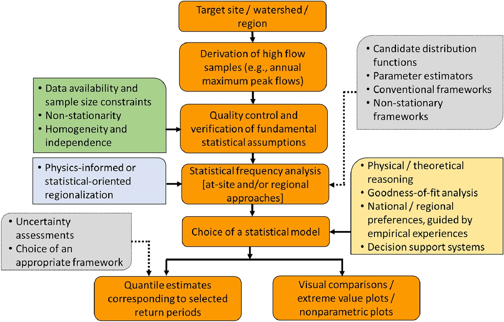
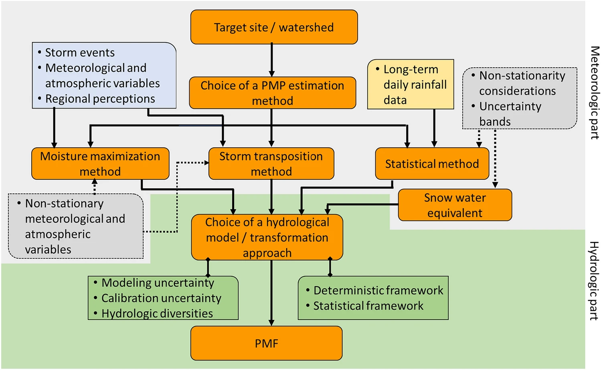

## Summary Description

Over 60% of Canadian electricity is generated by hydropower with hundreds of dams and associated structures. The evaluation and systematic review of this important infrastructure is based on best practices provided through the Dam Safety Guidelines by the [Canadian Dam Association](https://cda.ca/technical/dam-safety) (CDA). The risk-informed approach assesses the likelihood and potential consequences of undesired events, following provincial and territorial [regulations](https://cda.ca/dams-in-canada/regulation) and to inspection of all aspects and involved components of a dam.

Dams are built to withstand climate-related events such as floods, snow and ice or erosion processes. In a changing climate, these vulnerabilities and the related risks are modified. The established Dam Safety Review process is an effective instrument to integrate information and data about future climate to ensure the safety and functionality of dams in light of the changing circumstances brought about by climate change.

Quantifying risks and vulnerabilities linked to climate change is challenging but related to issues already under consideration. For example, extreme floods are projected to increase in frequency and severity in many areas across Canada, which directly affect the inflow flood design. Projected shifts in precipitation pattern and flood mechanisms such as rain-on-snow events or snowmelt-driven floods will affect the estimated design flood as well as operations and maintenance. Dams located in permafrost regions can be affected by instability due to permafrost thawing. Rising temperatures can also create large ice movements. Access to infrastructure may be limited by more frequent forest fires (i.e. Hydro Quebec had an installation evacuated by workers to let firefighters do their work) (@csa_dams2022, @Islam2024). Similarly, freezing rain, ice storms or extreme snowfall may more often limit the ability to access a dam or operate flow control equipment such as pulling logs. Structural stability of concrete dams might also be challenged due to the increase in total horizontal load caused by precipitations and streamflow (@Ozkan2023) or through more frequent freeze-thaw cycle related erosion. 

The following sections describe the role, some method and models, as well as gaps and recommendations in dam safety review.

## Role in the Electricity System
::: {#id1 .callout collapse="true"}
### Additional Information
A dam’s main purpose is to store water or other liquid for various reasons such as energy production and agriculture irrigation. However, dams can pose significant risks to public safety and the environment if they are not maintained and operated properly. Therefore, dam safety review (DSR) is a critical aspect of infrastructure management in the electricity sector as many hazards cause increasing risks on these structures.

*"A Dam Safety Review involves a systematic examination and assessment of the data and information about the design, construction, maintenance, operation, processes, and systems affecting a Dam’s safety, including the Dam safety management system."* (@damsafetybc) Thus, a dam safety review evaluates all aspects of a dam based on current knowledge and standards (@damsafetyontario) which may not be the same as the ones used in the dam construction. The review needs to be carried out by professional engineers.

Dams are often grouped by the Hazard Potential Classification based on the risk to population, environment or infrastructure if the dam failed. Depending on the jurisdiction, the classification determines the level of regulatory oversight, flood design, frequency of inspections, and the stringency of safety requirements, among others. Each province and territory in Canada regulates their own classification systems via regulations and standards, generally aligned with the [Canadian Dam Association (CDA) framework](https://cda.ca/dams-in-canada/regulation). Thus, Dam Safety Review is essential to respect stakeholders safety and regulations, but first and foremost it ensures the reliable and continuous generation of electricity for Canadian consumers.

:::

## Methods and Models
Methods and models for DSR are manifold and can require many inspections following regulations (@damsafetybc, @damsafetyontario) or the practices establised at utilities. Examples include:

- field reviews
- interviews with site staff
- equipment testing
- extensive understanding of the design, construction, operation and maintenance

The Canadian Dam Association provides [links to regional legislation documents](https://cda.ca/dams-in-canada/regulation) for more information.

The following sections highlight some methods and models used in DSR. Among the wide variety of field expertise required for a comprehensive review (e.g. structure, geotechnical, hydrological, hydraulic, seismic, mechanical, electrical, etc.) methods presented here will focus on hydrology which is immediately affected by climate change. Other types of methods and models are briefly discussed.

The figure below summarizes decision-making challenges faced by professionals involved in dam safety review in the electricity sector in Canada. These challenges were shared during the [workshops](../../workshops/intro_workshops.ipynb) held in 2025. [**Q: Miro Board needs editing!!**]{.mark-red} The examples illustrate the links between methods, models, the related data as well as challenges when using the methods and models detailed below.

<iframe width="768" height="640"  data-external="1" src="https://miro.com/app/live-embed/uXjVJqigpIU=/?focusWidget=3458764648311837665&embedMode=view_only_without_ui&embedId=860608574556" frameborder="0" scrolling="no" allow="fullscreen; clipboard-read; clipboard-write" allowfullscreen></iframe>

Please refer to the [climate dataset sections](../../datasets/Climate_Datasets_Overview.ipynb) for guidance and availability on climate variables used in the examples below.

### Flood Frequency Analysis (FFA)
::: {#id1 .callout collapse="true"}
### Click for details
Flood frequency analysis (FFA) (@FFA_USGS_17, @Islam2024) is used to determine the design flood required by regulators. It is described by a return period such as 1/100 or 1/1000 years. The goal of FFA is to link flow values with probabilities of occurrence (@Ouranos2021).

The relationship is described as:

$$
Aep = 1/T = 1-CDF_{high flows}
$$

where  
- $Aep$ is the annual exceedance probability,  
- $T$ is the return period (years),  
- $CDF_{high flows}$ is the cumulative distribution of high flows.

#### Characteristics
:::{#id1 .callout collapse="true"}
#### Click for details
For many rivers, flow records do not date back very far in time, rarely up to 100 years. Therefore, in order to establish floods with return periods longer that the record, a probability density function is fit to either flow annual maxima (AM) or peak-over-threshold (POT). While POT allows more events of high flows per year to be considered, given a well chosen threshold, the events in the record might not always be independent. The U.S. Army Corps of Engineers (USACE) provides a [FAQ for POC issues](https://www.hec.usace.army.mil/confluence/sspdocs/sspum/2.3.1/peaks-over-threshold-frequently-asked-questions). According to the World Meteorological Organisation's (WMO) criteria, FFA requires timeserie of at least 30 years of observed inflows. 

FFA methods can be univariate or multivariate, may assume stationary of data or take into account the non-stationarity due to climate change. A univariate method might focus on peak discharge alone, while a multivariate FFA evaluates the joint probability of correlated flood characteristics such as peak flow, flood volume, and duration. Climate change oriented methods will seek to account for the non-stationarity of current and future hydrology.

The methodologies rely on different methods to determine distribution parameters and different metrics of [goodness of fit](https://en.wikipedia.org/wiki/Goodness_of_fit) can be used to validate fitted distributions.
The @wmo89 presents various kinds of extreme value distributions (e.g. generalized extreme value, generalized Pareto or lognormal) whose goodness-of-fit in turn may be validated using approaches such as [Aikake](https://en.wikipedia.org/wiki/Akaike_information_criterion), [Bayesian Information Criteria](https://en.wikipedia.org/wiki/Bayesian_information_criterion) or [Kolmogorov-Sminov](https://en.wikipedia.org/wiki/Kolmogorov%E2%80%93Smirnov_test). @Islam2024 provide a review of the mentioned methods, distributions and goodness-of-fit tests. The figure below from @Islam2024 illustrates the steps of a uninvariate FFA and various spects to be taken into account.

To account for non-stationarity, a study by @Ouranos2021 proposed two techniques to assess non-stationarity, using a hydrological model fed with an ensemble of [climate projections](../../datasets/climate_projection_data/Climate_Projection_Datasets.ipynb) covering a 20-year period.

More recent studies have looked into non-stationary extreme value distribution, such as integrating linear trends in function of time or climate variables as covariates in distribution parameters (@Faulkner2024, @Islam2024, @Maria2024, @Levin2025). @Faulkner2024 use covariates at 375 gauges in Great Britain and advocate exploring hybrid approaches that combine the best attributes of non-stationary statistical models and simulation models to represent changes in climate and river catchments for estimating flood frequency in future conditions. The review of @Islam2024 proposes a comprehensive framework for integrating climate resilience into design and operational practices to safeguard against future flood risks. @Levin2025 introduce precipitation, annual snowfall, mean annual temperature as covariates in North-central United States to identify the key causal mechanisms for floods and show that differences between stationary and non-stationary FFA can be up to 20%. @Maria2024 use rainfall split into two seasons and time as covariates along with streamflows for a study across Canada. Their non-stationary approach projected higher increases in 2000-year return levels for 451 dams locations than stationary FFA. Other studies have  looked into multivariate FFA that use copulas to create joint distributions, highlighting the interdependence between flooding features and have potential for compound flooding (e.g., high precipitation and snowmelt or sea-level rise) (@Maria2024, @Bizhanimanzar2024). 

:::

#### Key Climate Inputs
- Flows
- Precipitation
- Temperature
- Sea level

#### Non-Climate Inputs
- Watershed descriptions for hydrological models

#### Model Outputs
- Flows (hydrological models)
- Annual Probability of excedeence

#### Temporal Resolution
- Input data need to be at temporal resolution, at least daily or monthly to capture maxima.
- Output of return periods or annual probability of exceedence has no temporal resolution.

#### Spatial Resolution
- Flows at streamgauge level
- Lumped hydrological models operate at the watershed scale. Watershed delineations may be very large or broken down into small, often "hydrologically homogenous" Hydrological Response Units (HRU). 
- Distributed hydrological models may operate at grid resolution of multiple kilometers, but resolution may be below 1 km.

#### Frequency of Analysis
Depends on the dam classification (from 5 to 10 years)

:::

### Probable Maximum Precipitation & Probable Maximum Flood (PMP & PMF)
::: {#id1 .callout collapse="true"}
### Click for details
Dams, and in particular those whose failure would entail extreme consequences, need to be able to evacuate maximum flows of very low probability, depending on their classification. This hypothetical flood, the design flood, is estimated using the Probable Maximum Flood (PMF), which itself is estimated based the Probable Maximum Precipitation (PMP). The WMO's "Manual on estimation of Probable Maximum Precipitation (PMP)" (@wmo2009_manualPMP) defines PMP as being "the greatest depth of precipitation for a given duration meteorologically possible for a design watershed or a given storm area at a particular location at a particular time of the year, with no allowance made for long-term climatic trends". The WMO manual proposes six methods to evaluate the PMP (local, transposition, combination, inferential, generalized and statistical) with the majority of them based on physical meteorology (@Islam2024). The figure below shows the workflow for the determination of PMP and PMF.

PMPs are usually evaluated by meteorologists or hydrologists and are provided with uncertainty bounds as well as seasonal adjustment factors. Values for rainfall, temperature and snow accumulation linked to the storm can be estimated from observations to calibrate the hydrological models. Soil moisture needs to be maximized when PMF is determined in the hydrological model and other factors such as the combination of the spring PMP with the 100-year snowpack (@Ouranos2015). 

A tool to estimate PMP and PMF is the [xHydro](https://xhydro.readthedocs.io/en/latest/readme.html) python package developed by Hydro-Quebec, ETS and Ouranos. 

#### Characteristics
:::{#id1 .callout collapse="true"}
#### Click for details
A common method to evaluate PMP is 'moisture maximization', which is advantageous for his lower data requirements. It is calculated from the maximum observed precipitation, the maximum precipitable water in the atmosphere and the actual precipitable water of an observed storm. Another method, called 'storm transposition' and doesn't require detailed information on watershed specific storms. It is based on the mean maximum annual precipitation for the duration of interest, the associated standard deviation and a frequency factor of precipitation duration and mean value. Both methods are discussed in @Islam2024 and @wmo2009_manualPMP). The latter discusses details of the method's applications in different world regions and terrain. The British Columbia [MetPortal](https://rti-metportal.shinyapps.io/bc_region/) offers PMP calculated with transposition across the province. 

These kind of estimates come with large uncertainties. Professionals are left with the choice to determine the most appropriate methods. Recent studies are looking into improving PMP calculations and provide the uncertainties linked to each estimate (@martin_pmp). PMP uncertainties can be assessed via a Monte Carlo techniques and sensitivity analysis are recommended to evaluate PMFs uncertainty (@King2022.)

To account for non-stationarity, studies have used climate simulations to estimate the PMP. @Ouranos2015 used 50 km-resolution [regional climate models (RCM)](../../datasets/climate_projection_data/Climate_Projection_Datasets.ipynb#regional-climate-models) to project future PMPs in three Quebec watersheds. Results generally showed an increase of 10 to 20% for a mid-21st-century horizon. However, one watershed showed a decrease in PMP.  Alternative methods than those proposed by WMO, have been proposed in literature to account for climate change and uncertainties (@martin_pmp). Recently, practioners at OPG have used [MRCC5-CMIP6](../../datasets/climate_projection_data/Climate_Projection_Datasets.ipynb) data to estimate the PMP. It was reported that SSP 3-7.0 produced lower PMPs values over Ontario than SSP 2-4.5. @Li2024 also observed higher values of PMPs with scenario SSP1-2.6 than SSP3-7.0 over Hong Kong. 

@CLAVETGAUMONT2017 used [RCM](../../datasets/climate_projection_data/Climate_Projection_Datasets.ipynb#regional-climate-models) data to develop a workflow that considers climate change in PMP estimates. The workflow is based on the methodology developed by @rousseau2014 and moisture maximization. The estimates require liquid precipitation, precipitatble water and snow water equivalent (snow on the ground). The RCM data were pre-processed when precipitable water was missing (summation of specific humidty from surface to top level) and mean temperature was used to estimate rainfall from precipitation. The proposed workflow depends on several methodological choices such as the thresholds used to select PMPs or the best fitting statistical distributionsm, which were determined through sensitivity analysis. The analysis was done for rainfall events of 24, 48, 72 and 120 hour duration and for five study basins (@CLAVETGAUMONT2017). 

:::

#### Key Climate Inputs
- **Specific humidity** Observation data for this variable are limited, but it is provided by [reanalysis datasets](../../datasets/reanalysis_data/Reanalysis_Datasets.ipynb). WMO proposes equations to estimate specific humidity from temperature dew point temperature (@wmo2009_manualPMP). Guidance in the literature should be followed if [reanalysis data](../../datasets/reanalysis_data/Reanalysis_Datasets.ipynb) or [climate projection data](../../datasets/climate_projection_data/Climate_Projection_Datasets.ipynb) products are used. 

- **Dew point temperature** Used to estimate specific humidity, since it is often available at [meteorological stations](https://climate.weather.gc.ca/historical_data/search_historic_data_e.html). [Reanalysis](../../datasets/reanalysis_data/Reanalysis_Datasets.ipynb) and [climate projections](../../datasets/) usually also provide this variable. 

- **Extreme precipitation** Extreme events based on past observations (storm events). In practice, past observations, often [Environment and Climate Change Canada](https://climate.weather.gc.ca/historical_data/search_historic_data_e.html) data or internal station data is used. [Reanalysis](../../datasets/reanalysis_data/Reanalysis_Datasets.ipynb) data can also be considered, but a validation againtst station data is recommended.

- **Snow accumulation** Events based on past observations (often corresponding to a high return period such 100 years). In practice, past observations, often [Environment and Climate Change Canada](https://climate.weather.gc.ca/historical_data/search_historic_data_e.html) or internal station is used. [Reanalysis](../../datasets/reanalysis_data/Reanalysis_Datasets.ipynb) data can also be considered, but a validation againtst station data is recommended.

#### Non-Climate Inputs
- Watershed parameters required by hydrological models
- Other inputs linked to runoff and hydrological models

#### Model Outputs
- PMP
- PMF

(used to determine the design flood)

#### Temporal Resolution
- sub-daily or daily

#### Spatial Resolution
- lowest resolution possible
- higher resolution models can be used such as RCM or reanalysis

#### Frequency of Analysis
- Every 5 to 12 years, depending on dam classification. 
:::

### Hydrological models
:::{#id1 .callout collapse="true"}
### Click for details
Hydrological models are computational tools used to simulate the movement, distribution, and even quality of water within a watershed. They integrate rainfall, temperature, terrain, soil characteristics, land use and other features to simulate streamflow, reservoir inflows, and extreme events such as floods or droughts. In the context of dam safety reviews, hydrological models are essential for assessing the potential impacts of extreme weather and climate variability on dam operations. They help engineers evaluate flood risks, design spillways, and develop emergency management strategies, ensuring that dams can safely handle both current and future hydrological conditions. 

#### Characteristics
:::{#id1 .callout collapse="true"}
#### Click for details
@Fournier2020 gives guidance on estimating the value of hydropower assets under climate change. The report also describes how to integrate climate change data into the energy modelling chain and into hydrological models. Below are some of the recommendations from the guide:

* **Climate simulations consideration**:
    * Using 30 years as a baseline period is recommended to account for natural variability and avoid having predominantly dry or wet events. The baseline must represent current conditions. Detrending can be used to represent current conditions. If [bias-adjustment](../../datasets/climate_projection_data/Climate_Projection_Datasets.ipynb) is applied to climate projections, the reference dataset used for the adjustement must be used to calibrate hydrological models. 
    * Consistency is important, variables such as temperature and precipitation must be taken from the same product.
    * Evaluation of the performance of various weather datasets employed to drive a hydrology model is recommended (e.g., weather stations, gridded observations and reanalysis) . 
    * The Quebec Government found that a minimal spatial resolution of 0.44° is required to represent snow processes in the hydrological model (@cehq2022). 
    * @RondeauGenesse2021 found that higher-resolution simulations can perform better using both RCM and GCM simulations. However, while it may seem intuitive that finer-scale meteorological inputs would yield better results for smaller watersheds, it varies significantly depending on the indicator, the time of year, and the hydrological modelling platform.
    * The resolution needs to match the resolution of the hydrological model. Further desaggregation may need to be performed.
    * Multiple climate scenarios shall be used; best practice would use all emissions scenarios available while good practices recommend two. However, for short-term horizons (less than 15 years), only one scenario can be used as the climate change signal is similar between scenarios for the near future. 
    * Multiple climate models shall be used; best practice as many as available and their newest version, while there is no minimum magic number for simulations; good practice would be to use at least 10 to cover uncertainty. There are [methods to optimize the selection of a reduced ensemble](../../datasets/climate_projection_data/Climate_Projection_Datasets.ipynb#simulation-ensembles).
    * Using multiple post-processing methods for climate simulations is considered best practice.
    * Do not average or apply statistics to the climate simulations prior to driving hydrological models. Ensemble statistics make up the last step of the modelling chain.
* **Hydrologic modelling considerations**:
    * The hydrological baseline must be consistent with the climatological baseline and representative of current conditions. Detrending might be considered to better represent recent conditions.  
    * Hydrological models need to be calibrated with the same reference dataset used for [bias-adjustment](../../datasets/climate_projection_data/Climate_Projection_Datasets.ipynb).
    * The validation of hydrological models run with climate solutions can be achieved by calculating hydrological indices. @McMillan2021 provides a review of such indices and their application.
    * A Differential Split-Sample Approach can be used to evaluate robustness and transposition to a period with other climatic conditions. 
    * Hydrological models are complex and influenced by multiple processes. Hence, it is unlikely to correctly predict outcomes such as floods or droughts based on only a few climate simulations (e.g., selected based on percentiles). The relationships between such events and variables like temperature or precipitation are not linear. Therefore, it is recommended to use as many climate simulations as possible to capture the full range of potential flow outcomes.
    * If data volume or the number of hydrological model runs is a limiting factor, prioritize climate simulations selection based on indicators most relevant to the study’s objectives (e.g., simulations with the highest or lowest values of maximum daily rainfall).
    * It is best practice to use multiple hydrological models. If not, appropriate hydrological model selection is recommended. 
    * Consistency across climate simulations is crucial; therefore, each simulation should be run individually in the hydrological models, and ensemble statistics (e.g., 5th, 50th, and 95th percentiles) should be computed only at the final step of the modelling chain.

Each step of the methodology for running hydrological models with climate simulations inputs adds sources of uncertainty. Exploring impacts based on multiple future scenarios provides valuable information of the sensitivity of the system. Sensitivity analysis on elements of the whole modelling chain may also be useful to determine the largest influences on final results. 

A commonly used hydrological model is the [HEC-HMS](https://www.hec.usace.army.mil/software/hec-hms/) watershed model developped and provided by the US Army Corps of Engineers (USACE). It offers different methods to estimate evapotranspiration based on its direct inputs of temperature and precipitation. More complex methods use more climate variables as input (relative humidity, wind speed, short and long wave solar radiation) to estimate potential evapotranspiration. The time series produced through the watershed modelling can then be used to estimate floods at various return levels and develop Intensity Duration Frequency Curves. Another model provided by the USACE is [HEC-RAS](https://www.hec.usace.army.mil/software/hec-ras/), a river analysis system designed to model flows, sediment transport, stormwater pipes and culverts, ice jams, water quality and more. 

Artificial intelligence (AI) has been used to reproduce streamflows and results are compared to distributed hydrological models. @martel2025 used long short-term memory (LSTM) networks to estimate peak streamflow at ungauged catchments and found that the AI-based simulations performed as well as the Hydrotel hydrological model. The study used the Quebec government’s observed precipitation and temperature dataset (1979–2017, daily at 0.1° resolution) and multiple variables from [ERA5 reanalysis](../../datasets/reanalysis_data/ERA5-Land.ipynb), including maximum and minimum temperature, total precipitation, snowfall, snowmelt, snow water equivalent, dew point temperature, wind velocity and speed, evaporation, downward surface solar radiation, and surface pressure as inputs to the neural networks. The artificial neural network was further trained with observed daily average streamflows and catchment descriptors, such as area, slope and land-use.

:::

#### Key Climate Inputs
- Precipitation timeseries. As mentioned above, different type of datasets may be used; observations, reanalysis and climate model simulations. 
- Temperature timeseries. As mentioned above, different type of datasets may be used; observations, reanalysis and climate model simulations. 
- Solar radiation
- Wind speed
- Relative humidity
- Streamflow

#### Non-Climate Inputs
- Land use / land cover
- Digital Elevation Model (DEM) - Topography
- Soil properties
- Hydrographic network

#### Model Outputs
- Flows

#### Temporal Resolution
- Most hydrological models are run on a sub-daily or daily time step, depending on objectives and scale. 

#### Spatial Resolution
- Usually a resolution under 0.44 degrees is recommended.

#### Frequency of Analysis
- Every 10 to 12 years. 

:::

### Other methods and models in practice
:::{#id1 .callout collapse="true"}
### Click for details
This section lists other models used in the context of dam safety reviews at facilities in Canada. The process involves experts from several fields (e.g., hydrology, hydraulic, geotechnical, geology and structural) and multiple stakeholders are involved in review activities, such as ministries, municipalities, consultants, etc. 

#### Characteristics
- **Hydrological models**:
    - CMP
    - Inhouse models, for example Hydro Quebec uses HSAMI & HSAMI+
    - Raven ([R and C++ version](https://raven.uwaterloo.ca/), [Python version](https://github.com/Ouranosinc/raven-hydro))

- **Reservoir models**:
    - [RiverWare](https://riverware.org/)
    - [HEC-ReSim](https://www.hec.usace.army.mil/software/hec-ressim/)

- **Hydraulic models**: 
These models are employed to test dams failure and spillway capacity.

- **Structural models**: 
Ice loading is assessed in structural models and likely to be impacted by climate change. Ice loadings are also an input to design bridges based on the [Canadian Highway Bridge Design Code (CSA S6)](https://www.csagroup.org/canadian-highway-bridge-design-code). Ice accumulations is also relevant for structures such as the pilons supporting the cables of power lines, normed by the [CSA S37](https://www.csagroup.org/store/product/CSA_S37:24/). For buildings, snow and wind loads are required by the [National Building Code of Canada](https://nrc.canada.ca/en/certifications-evaluations-standards/codes-canada/codes-canada-publications/national-building-code-canada-2025). Embankments may also be affected by ice and freeze-thaw cycles which cause degradation riprap. Similarly, freeze-thaw cycles cause degradation of concrete structures.

- **Geotechnical models**: 
These models may be involved in determining ROC levels for the operation of a reservoir or in the assessment of potential frost damage to a clay core. Frost depth may be calculated with air temperature or taken from design charts.

    - [GeoStudio](https://www.seequent.com/products-solutions/geostudio-2d/)
    - [RocScience](https://www.rocscience.com/)

- **Hydrogeological Models**

#### Key Climate Inputs
- Common datasets used these models are internal station data, observations from [Environment and Climate Change Canada](https://climate.weather.gc.ca/historical_data/search_historic_data_e.html), reanalysis ([ERA5-Land](../../datasets/reanalysis_data/ERA5-Land.ipynb), [CaSR](../../datasets/reanalysis_data/CaSR.ipynb)), [interpolated observations](../../datasets/observed_data/Observational_Datasets.ipynb) (Hydat).

- **Frost depth**: Can be calculated with freezing degree days. Critical in the North as it can fracture a dams core.

- **[PMF](##probable-maximum-precipitation-probable-maximum-flood-pmp-pmf)**: calculated for each facility.

- **[PMP](##probable-maximum-precipitation-probable-maximum-flood-pmp-pmf)**: calculated annually, often by a consultant.

- **Precipitation**: used to calibrate hydrological models. Datasets include station observations, reanalysis and seasonal forecasts.

- **Temperature**: used to calibrate hydrological models. Datasets include station observations, reanalysis and seasonal forecasts.

- **Snow level**

- **Thermal conductivity of soil**

#### Non-Climate Inputs
- Required information for each model
<mark>Need to be completed by a champion</mark>

#### Model Outputs
<mark>Need to be completed by a champion</mark>

#### Temporal Resolution 
Data is need historical up to the date safety review happens

- **Daily**: inflows, water levels, degree-days
- **Hourly**: Pressure, PMP

#### Spatial Resolution
Data over the whole province and nearby to cover all watersheds (for example, other provinces or the United States)

#### Frequency of Analysis
10 to 12 years depending on classification 

:::

## Detailed Discussion
:::{#id1 .callout collapse="true"} 
### Additional Information
Some regulators have added considerations of climate change related risks into their legislation for dam safety (@damsafetybc) while others discuss the need to consider extreme events (@damsafetyontario). @Ozkan2023 report impacts of climate change on dams and provide an extensive review of literature and policies to mitigate these impacts to highlight gaps in the adapatatoin of dams to climate change. The report recommends the Can-CRM4 dataset at 0.44° resolution and composed of 50 members to be used for dam safety assessment.

The Canadian Standards Association (CSA) released CSA S910.1:25 - Climate change vulnerability assessment for dams in Canada (@csas910) which documents a flexible, yet standardized process for conducting vulnerability assessments of dams. The standard follows common steps for climate risk and vulnerability analysis, integrating them with guidelines published by the CDA. The standard emphasizes a team approach to understand the dam as interacting systems, components and elements, any of which could be exposed to and influenced by climate hazards. A sensitivity analysis is used to determine how vulnerable a system, component or element may be to a particular climate hazard. 

Section of the CSA standard documents the fundamental components and datas used for a dam safety review, including extreme precipitation, flood hazards, along with hydrological, geotechnical and structural models. Different types of climate data may be needed throughout a DSR based on the physical conditions of the dam itself. This could be as complex as climatic conditions changing the probable maximum flood, or as simple as a button on a control pedestal that could become inaccessible and prevent the operation of spillway gates. As a result, the description of climate variables and data described above are far from exhaustive.

The standard is agnostic on the particular climate data to be used, so long as it can be proven fit for purpose and properly accounts for the uncertainty of climate information. This could include statistically or dynamically downscaled climate models, the use of weather generators or some other form of climatic data. The emphasis is on appropriately qualified personnel to be conducting the assessment and practicing within their scope of knowledge. This may require a dam owner finding access to appropriate climate expertise.

:::

## Gaps and Recommendations
:::{#id1 .callout collapse="true"} 
### Additional Information
Important gaps remain in the dam safety review process. A key issue are the uncertainties associated with the PMP and that the methodologies have not been updated accordingly in the recent years, even with important limitations highlighted in literature such as the objectivity regarding to the storm selection (@martin_pmp). 

Another issue is related to the mismatch between some of the internal stations geodetic levels and the dam’s own level making it challenging to use some of the internally collected data where geodetic transforms would be necessary. Practitioners also face challenges to find data with spatial and temporal resolution that fit their need. Generally, it is hard to find extreme value datasets (e.g., 1/100, 1/1000 year return levels), especially when looking for future projections. There is also a lack of available wind data, historical and future, which is required for rockfill structures or for determining dam freeboard where waves can have significant impacts. 

Challenges exist with clear guidance on how to incorporate a non-stationary climate into dam safety reviews. Practitioners discuss integrating such guidance in CSA standards or developping internal guidance at the organization level and for associated consultants. 

The National Research Council of Canada has published a report "Adaptation of dams to climate change: Gap analysis" with the objective to identify Canadian guidelines shortcomings when addressing climate change in dam safety. The report highlighted technical gaps such integrating non-stationary climate in hydrological modelling, policy gaps (limited climate change aspect in standards or risk assessment), knowledge gaps (uncertainties linked to climate change) and data gaps (many regions are lacking data in the North) (@Ozkan2023).
:::

<strong>References (click to expand)</strong>

::: {#refs}
:::

