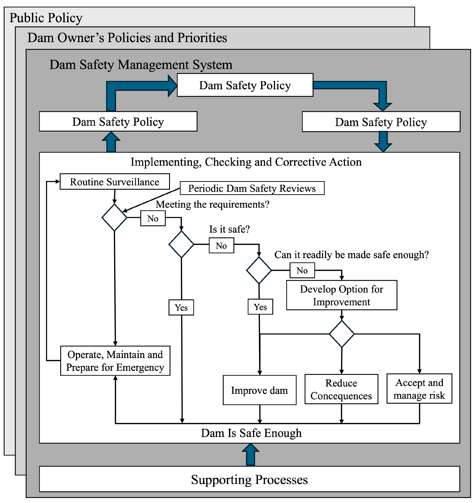
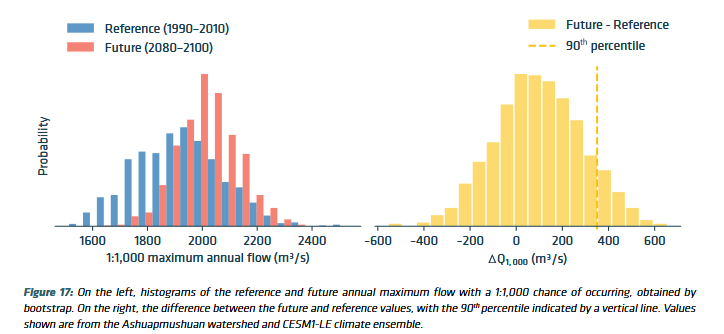

## Summary Description

- standard based on Dam Safety Guidelines - [Canadian Dam Association](https://cda.ca/technical/dam-safety) (CDA)
- risk-informed approach: undesired events in therms of likelihood and potential consequences
- provincial and territorial [regulations](https://cda.ca/dams-in-canada/regulation) 
- evaluation and systematic review of all aspects (including visual inspections of all components)

There are over 16 000 dams in Canada and 38% are managed by Quebec authorities of which 22% are used for hydroelectricity. 87% of dams can be found in five provinces (Ontario, Quebec, British Columbia, Alberta and Saskatchewan) (@Ozkan2023). Additionally, half of Canada dams are older than 50 years old, increasing the risk of climate change impacts due to infrastructure aging making them more vulnerable. 

Dams present many vulnerabilities linked to climate change which are challenging to quantify. Extreme floods are projected to increase in frequency and severity in many areas across Canada, which directly affect the inflow flood design. Furthermore, there is a projected shift in precipitation pattern and flood mechanisms such as rain-on-snow events or snowmelt-driven floods which also affect the estimated design flood as well as operations and maintenance. Dams located in permafrost regions could be affected by instability due to thawing. Rising temperatures could also create large ice movements. Access to infrastructure could also be limited by more common extreme events such as forest fires (i.e. an Hydro Quebec had an installation evacuated by workers to let firefighters do their work) (@csa_dams2022, @Islam2024). Similarly, freezing rain, ice storms or extreme snowfall could limit the ability to access a dam or operate flow control equipment such as pulling logs. Reservoir water quality is likely to be affected by climate change due to the rise in temperature (intense stratification leading to anoxic conditions) and switch in precipitation patterns (influx of nutrients and turbidity during snowmelt), among others (@Ozkan2023). Structural stability of concrete dams might also be challenged due to the increase in total horizontal load caused by precipitations and streamflow (@Ozkan2023). 

The following sections describe the role, some method and models, as well as gaps and recommendations in dam safety review.

## Role in the Electricity System
::: {#id1 .callout collapse="true"}
### Additional Information
Dam’s main purpose is to store water or other liquid for various reasons such as energy production and agriculture irrigation. However, dams can pose significant risks to public safety and the environment if they are not maintained and operated properly. Therefore, dam safety review (DSR) is a critical aspect of infrastructure management in the electricity sector as many hazards cause increasing risks on these structures.

"A Dam Safety Review involves a systematic examination and assessment of the data and information about the design, construction, maintenance, operation, processes, and systems affecting a Dam’s safety, including the Dam safety management system. " (@damsafetybc) Overall, a dam safety review is a systematic evaluation of all aspects of a dam based on current knowledge and standards (@damsafetyontario) which may not be the same as the ones used in the dam construction. The review needs to be carried out by professional engineers. 

Dams are often classified by Hazard Potential Classification based on the risk that could be posed if there was dam failure such as risks to population, environment or infrastructure. Depending on the jurisdiction, the classification could determine the level of regulatory oversight, flood design, frequency of inspections, and the stringency of safety requirements, among others. Each province and territory in Canada regulates their own classification systems via regulations and standards, but are all generally aligned with the Canadian Dam Association (CDA) framework to ensure a consistent approach to dam safety across Canada (see, https://cda.ca/dams-in-canada/regulation). Their review is therefore essential to respect stakeholders safety but to also respect regulations.
:::

## Methods and Models
Many methods and models are used for DSR as they can require many inspections based on dam  regulations (@damsafetybc, @damsafetyontario) or the practices of utility:
- field reviews
- interviews with site staff
- equipment testing
- extensive understanding of the design, construction, operation and maintenance

Among many others. Please refer to local [legislation](https://cda.ca/dams-in-canada/regulation) for more information. The following sections only tackle a few methods and models used in DSR as a wide variety of field (structure, geotechnical, hydrological, hydraulic, seismic, mechanical, electrical, etc.) expertise is required to perform a comprehensive review. Therefore, methods presented will focus on hydrology aspects affected by climate change, with some commentary on other types of models and methods. 

The figure below briefly resumes decision-making challenges faced by professionals in the dam safety sector of the electricity system in Canada. These challenges were shared during the [workshops](../../workshops/intro_workshops.ipynb) held in 2025. These examples linked together the methods and models as well as characteristics presented in the following section such as [PMP](#probable-maximum-precipitation---pmp--probable-maximum-flood-pmf).

<iframe width="768" id="miro" height="640"  data-external="1" src="https://miro.com/app/live-embed/uXjVINO7YDw=/?focusWidget=3458764634985944622&embedMode=view_only_without_ui&embedId=783828694004" frameborder="0" scrolling="no" allow="fullscreen; clipboard-read; clipboard-write" allowfullscreen></iframe>

For all climate variables listed below, please refer to the [climate dataset section](../../datasets/Climate_Datasets_Overview.ipynb) for guidance and availability.

::: {#id1 .callout collapse="true"}
## Flood Frequency Analysis (FFA)
Flood frequency analysis (FFA) (@FFA_USGS_17, @Islam2024) is often used to determine the design flood required by regulations. It is determined by the return period such as 1/100 or 1/1000 years.  Therefore, the goal of FFA is to link flow values with probabilities of occurrence (@ouranos2021flood).

$$
Aep = 1/T = 1-CDF_{high flows}
$$

where  
- $Aep$ is the annual exceedance probability,  
- $T$ is the return period (years),  
- $CDF_{high flows}$ is the cumulative distribution of high flows.

:::{#id1 .callout collapse="true"}
### Characteristics
Flow records rarely go up to 100 years (and, of course, not to 1000). Therefore, a probability density function is fit to either flow annual maxima (AM) or [peak-over-threshold](https://www.hec.usace.army.mil/confluence/sspdocs/sspum/2.3.1/peaks-over-threshold-frequently-asked-questions) (POT). POT allows more events of high flows  to be considered as some years could have multiple events over thresholds and others none. However, it adds issues linked to the independence of events. 

Moreover, such analysis requires long timeserie of observed inflows (at least 30 years based on World Meteorological Organisation criteria) and different methods exists to determine the distribution parameters (such as generalized extreme value, generalized Pareto or lognormal) (@wmo89). Different metrics of [goodness of fit](https://en.wikipedia.org/wiki/Goodness_of_fit) can be used to validate the fitted distributions, such as [Aikake](https://en.wikipedia.org/wiki/Akaike_information_criterion) or [Bayesian Information Criteria](https://en.wikipedia.org/wiki/Bayesian_information_criterion), [Kolmogorov-Sminov](https://en.wikipedia.org/wiki/Kolmogorov%E2%80%93Smirnov_test), etc. (@Islam2024).

Common FFA methods are univariate and stationary, meaning that climate change and impacts of other features than flows are not taken into account when calculating the design flood. To evaluate non-stationarity, @ouranos2021flood proposed two techniques to assess non-stationarity using hydrological model fed with a large ensemble of [climate projections over](../../datasets/climate_projection_data/Climate_Projection_Datasets.ipynb) 20-year period block.

Other, recent studies have looked into non-stationary extreme value distribution, such as integrating linear trends in function of time or climate variables as covariates in distribution parameters (@Islam2024, @Maria2024, @usgs_nonstationary). @usgs_nonstationary used precipitation, annual snowfall, mean annual temperature as covariates in North-central United States, where 45% of streamgages were predicted with precipitation, 14% temperature and less than 1% with snowfall as causal mechanisms (36% had no climate variables as causal mechanisms). Northern part had the biggest differences between stationary and non-stationary FFA (going up to 20%). The study used measured streamflow and climate data from a monthly water balance model which was itself fed by temperature and precipitation data from monthly [NOAA](https://www.ncei.noaa.gov/access/metadata/landing-page/bin/iso?id=gov.noaa.ncdc:C00332) [gridded observations](../../datasets/observed_data/NRCanMET_Gridded_Data.ipynb). 

@Maria2024 used the same covariates (rainfall split in two seasons) for a study across Canada as well as time. Streamflows were acquired from simulations of GEM (1950-2099) which are driven by a member of CanESM2 RCP8.5 ([CMIP5](../../datasets/climate_projection_data/Climate_Projection_Datasets.ipynb)). Non-stationary projected higher increases in 2000-year return levels for 451 dams locations than stationary FFA. 

Furthermore, other recent studies have also looked into multivariate FFA, that use copulas to create joint distributions highlighting the interdependence between flooding features and have potential for compound flooding (e.g., high precipitation and snowmelt or sea-level rise) (@Maria2024, @bizhanimanzar2024joint). 

:::

:::{#id1 .callout collapse="true"}
### Key Climate Inputs
- Flows  
- Precipitation
- Temperature
- Sea level

:::

:::{#id1 .callout collapse="true"}
### Non-Climate Inputs
- Inputs for hydrological models

:::

:::{#id1 .callout collapse="true"}
### Model Outputs
- Flows (hydrological models)
- Annual Probability of excedeence

:::

:::{#id1 .callout collapse="true"}
### Temporal Resolution
Daily or Monthly (as annual maxima is often used)

:::

:::{#id1 .callout collapse="true"}
### Spatial Resolution
- Flows at streamgauge
- Hydrological models can usually have less than 1°,  resolution
:::

:::{#id1 .callout collapse="true"}
### Frequency of Analysis
Depends on the dam classification (from 5 to 10 years)

:::
:::

::: {#id1 .callout collapse="true"}
## Probable Maximum Precipitation - PMP & Probable Maximum Flood PMF
Extreme consequences dams require design flood (classification), the maximum flow that dam must be able to evacuate, to be estimated with the Probable Maximum Flood (PMF), which itself is estimated with the Probable Maximum Precipitation (PMP). The WMO defines PMP as being "the greatest depth of precipitation for a given duration meteorologically possible for a design watershed or a given storm area at a particular location at a particular time of the year, with no allowance made for long-term climatic trends" (@wmo2009_manualPMP). The WMO manual proposes six methods to evaluate the PMP (local, transposition, combination, inferential generalized and statistical) with the majority of them based on physical meteorology (@Islam2024).

PMPs are usually evaluated by meteorologists or hydrologists and are provided with uncertainty bounds as well as seasonal adjustment factors. 
FFA with values for rainfall, temperature and snow accumulation linked to the storm can be estimated from observations to calibrate the hydrological models. Soil moisture needs to be maximized when PMF is determined in the hydrological model and other factors such as the combination of the spring PMP with the 100-year snowpack (@ouranos2015_pmf). 

The [xHydro](https://xhydro.readthedocs.io/en/latest/readme.html) python package developed by Hydro-Quebec, ETS and Ouranos offer codes to estimate PMPs and PMFs. 

:::{#id1 .callout collapse="true"}
### Characteristics
One common method to evaluate PMP is moisture maximization, which is advantageous for his lower data requirements (@Islam2024, @wmo2009_manualPMP).
$$
PMP = P_{obs} * W_{max} / W_{storm}
$$

where  
- $P_{obs}$ is the maximum observed precipitation (mm),  
- $W_{max}$ is the maximum precipitable water (mm),  
- $W_{storm}$ is actual precipitable water of the observed storm (mm).

$W_{max}$ can be estimated with dew point temperature.

Another method, storm transposition doesn't require detailed information on watershed specific storms (@Islam2024, @wmo2009_manualPMP). 

$$
PMP = \overline{X_{n}} + K_{m} * S_{n}
$$

where  
- $\overline{X_{n}}$ is the mean maximum annual precipitation for the duration (n) of interest,  
- $S_{n}$ is the standard deviation,  
- $K_{m}$ is the frequency factor. 

$K_{m}$ is a factor of precipitation duration and mean value. The British Columbia [MetPortal](https://rti-metportal.shinyapps.io/bc_region/) offers PMP calculated with transposition across the province. 

These estimates come with high uncertainties and are left in the choice of professionals to determine the most appropriate methods. Recent studies are looking into improving PMP calculations and more precisely providing the uncertainties linked to each estimate (@martin_pmp). PMP uncertainties can be assessed via a Monte Carlo techniques and sensitivity analysis need to be done for evaluating PMFs uncertainty (@king2022)

To account for non-stationarity, studies have used climate simulations to estimate the PMP. @ouranos2015_pmf used [regional climate models](../../datasets/climate_projection_data/Climate_Projection_Datasets.ipynb) to project future PMPs with higher resolution (50 km) in three Quebec watersheds which generally showed an increase of 10 to 20% for the mid-century. However, one watershed showed a decrease in PMP.  Alternative methods than WMO, have been listed in literature to account for climate change and uncertainties (@martin_pmp). Recently, practioners in OPG have used [MRCC5-CMIP6](../../datasets/climate_projection_data/Climate_Projection_Datasets.ipynb) to estimate the PMP. It was reported that SSP 3-7.0 produced lower PMPs values over Ontario than SSP 2-4.5. @Li2024 also observed higher values of PMPs with scenario SSP1-2.6 than SSP3-7.0 over Hong Kong. 

The figure below highlights the steps taken by @CLAVETGAUMONT2017 for considering climate change in PMP estimates (@ouranos2015_pmf).

The workflow is based on the methodology developed by @rousseau2014 and moisture maximization. The estimates rquire [RCM](../../datasets/climate_projection_data/CORDEX_Dataset.ipynb) liquid precipitation, precipitatble water and snow water equivalent (snow on ground). The RCMs data were pre-processed when precipitable water was missing (used summation of specific humidty from surface to top level) and mean temperature was used to estimate rainfall from precipitation. Many choices were made based sensitivity analysis such as the thresholds used to select PMPs, the best fitted statistical distributions, etc. The storm definition was made using rainfall events of 24, 48, 72 and 120 hours with a moving window. P~event represent 10% of largest storm of the year. Rainfall events are maximized with EQ1 presented in the above figure and PWH~100 the monthly return period value of precipitable water (fitted with a GEV and the maximum likelihood). The maximum of the maximum ratios multiplied by the P~event represents the PMP. 

:::

:::{#id1 .callout collapse="true"}
### Key Climate Inputs
- **Specific humidity** : There is limited observation for this variable, but it is provided by [reanalysis](../../datasets/reanalysis_data/Reanalysis_Datasets.ipynb). WMO proposes equations to estimate specific humidity from temperature dew point (@wmo2009_manualPMP). Guidance must be followed if reanalysis is used or other [projections](../../datasets/climate_projection_data/Climate_Projection_Datasets.ipynb) products. 

- **Dew point temperature**: Used to estimate specific humidity, since it is often available at [meteorological stations](https://climate.weather.gc.ca/historical_data/search_historic_data_e.html). [Reanalysis](../../datasets/reanalysis_data/Reanalysis_Datasets.ipynb) and [climate projections](../../datasets/) also offer this variable. 

- **Extreme precipitation**: events based on past observations (storm events). In practice, past observations, often [Environment and Climate Change Canada](https://climate.weather.gc.ca/historical_data/search_historic_data_e.html) or internal station is used. [Reanalysis](../../datasets/reanalysis_data/Reanalysis_Datasets.ipynb) data can also be considered, but validation is required.

- **Snow accumulation**: events based on past observations (often corresponding to a high return period such 100 years). In practice, past observations, often [Environment and Climate Change Canada](https://climate.weather.gc.ca/historical_data/search_historic_data_e.html) or internal station is used. [Reanalysis](../../datasets/reanalysis_data/Reanalysis_Datasets.ipynb) data can also be considered, but validation is required.

:::

:::{#id1 .callout collapse="true"}
### Non-Climate Inputs
- Other inputs linked to runoff and hydrological models

:::

:::{#id1 .callout collapse="true"}
### Model Outputs
- PMP and PMF are the outputs (used to determine the design flood)

:::

:::{#id1 .callout collapse="true"}
### Temporal Resolution
- sub-daily or daily

:::

:::{#id1 .callout collapse="true"}
### Spatial Resolution
- lowest resolution possible; higher resolution models can be used such as RCM or reanalysis

:::

:::{#id1 .callout collapse="true"}
### Frequency of Analysis
5 to 12 years depending on dam classification. 
:::
:::

:::{#id1 .callout collapse="true"}
## Hydrological models
Hydrological models are computational tools used to simulate the movement, distribution, and quality of water within a watershed. They integrate rainfall, temperature, soil characteristics, and land use to estimate streamflow, reservoir inflows, and extreme events such as floods or droughts. In the context of dam safety reviews, hydrological models are essential for assessing the potential impacts of extreme weather and climate variability on dam operations. They help engineers evaluate flood risks, design spillways, and develop emergency management strategies, ensuring that dams can safely handle both current and future hydrological conditions. 

@Fournier2020 gives guidance on estimating the value of hydropower assets under climate change. This report also describes how to integrate climate change data inside the energy modelling chain and more precisely in a hydrologic model. Below are some of the important recommendations found in the guide:

* Climate simulations consideration:
    * Baseline: 30 years is recommended for the baseline to represent natural variability and avoid having predominant dry or wet events. The baseline must represent current conditions. Detrending can be used to represent current conditions. If [bias-correction](../../datasets/climate_projection_data/Climate_Projection_Datasets.ipynb) is applied to climate projections, the reference product must be the same used to calibrate the hydrological models. 
    * Consistency is important, variables must come from the same product (such as temperature and precipitation). 
    * Evaluate the performance of various weather datasets in the hydrology model (weather stations, gridded observations and reanalysis). 
    * Quebec Goverment have observed that a minimal spatial resolution 0.44° is required to represent snow processes in the hydrological model (@cehq2022). 
    * @RondeauGenesse2021 found that higher-resolution simulations can perform better using both RCM and GCM simulations. However, while it may seem intuitive that finer-scale meteorological inputs would yield better results for smaller watersheds, it varies significantly depending on the indicator, the time of year, and the hydrological modelling platform.
    * The resolution needs to match the one in the hydrological model.
    * Use multiple scenarios; best practice would be to use all emissions scenarios available while good practices recommend two. However, for short-term horizons (less than 15 years), only one scenario can be used as climate change signal is similar between scenarios. 
    * Use multiple climate models; best practice is to use as many as available and their newest version while there is no minimum magic number for simulations a good practice would be to use at least 10 to cover uncertainty. 
    * Multiple post-processing for climate simulations is considered as best practice
    * Do not average or use statistics for the climate simulations (last step of the modelling chain).
* Hydrologic modelling considerations:
    * Hydrologic baseline must be consistent with the climatic baseline and representative of current conditions. Detrending might be considered to better represent recent conditions.  
    * Model needs to be calibrated with the same reference used for [bias-correction](../../datasets/climate_projection_data/Climate_Projection_Datasets.ipynb).
    * Validation of hydrological model run with climate solutions can be done using [hydrologic indices](https://www.uncclearn.org/wp-content/uploads/library/fr.pdf).
    * A Differential Split-Sample Approach can be used to evaluate robustness and transposition to a period with other climatic conditions. 
    * Since hydrological models are complex and influenced by multiple processes, it is difficult to select only a few climate simulations (e.g., based on percentiles) to predict outcomes such as floods or droughts. The relationships between these events and variables like temperature or precipitation are not linear. Therefore, it is recommended to use as many climate simulations as possible to capture the full range of potential flow outcomes.
    * If data volume or the number of hydrological model runs is a limiting factor, prioritize climate simulations selection based on indicators most relevant to the study’s objectives (e.g., simulations with the highest or lowest values of maximum daily rainfall).
    * It is a best practice to use multiple hydrologic models. If not, appropriate hydrological model selection  is required. 
    * Consistency across climate simulations is crucial; therefore, each simulation should be run individually in the hydrological models, and ensemble statistics (e.g., 5th, 50th, and 95th percentiles) should be computed only at the final step of the modelling chain.

Although such methodology provides many sources of uncertainty, exploring impacts steaming from future scenarios provide a valuable sensitivity analysis. Sensitivity analysis, on the whole modelling change can also be useful to determine what influenced most final results. 

In practice, the [HEC-HMS](https://www.hec.usace.army.mil/software/hec-hms/) watershed model is often used. The Hamon method is also selected to estimate evapotranspiration and use direct inputs of temperature and precipitation. The watershed modelling is then used to estimate 100 and 1000-year floods with Intensity Duration Frequency Curves. Combination methods can also be used to estimate potential evapotranspiration which requires more climate variables inputs (relative humidity, wind speed, short and long wave solar radiation). [HEC-RAS](https://www.hec.usace.army.mil/software/hec-ras/), a river analysis system, can be used to model ice jams, loadings or covers. 

Recent studies have assessed the ability of artificial intelligence (AI) to reproduce streamflows and compared results to distributed hydrological models. For example, @martel2025 used long short-term memory (LSTM) networks to estimate peak streamflow at ungauged catchments and found that the AI-based simulations performed as well as the Hydrotel hydrological model. The study used the Quebec government’s observed precipitation and temperature dataset (1979–2017, daily at 0.1° resolution) and multiple variables from [ERA5](../../datasets/reanalysis_data/ERA5-Land.ipynb) reanalysis—including maximum and minimum temperature, total precipitation, snowfall, snowmelt, snow water equivalent, dew point temperature, wind velocity and speed, evaporation, downward surface solar radiation, and surface pressure—as inputs to the neural networks. Observed daily averaged streamflows and cathchement descriptors, such as area, slope and land-use were also considered to built networks. 

:::{#id1 .callout collapse="true"}
### Key Climate Inputs
- Precipitation timeseries. Like mentioned above multiple products can be used; observations, reanalysis and climate model simulations. 
- Temperature timeseries. Like mentioned above multiple products can be used; observations, reanalysis and climate model simulations. 
- Solar radiation
- Wind speed
- Relative humidity
- Streamflow

:::

:::{#id1 .callout collapse="true"}
### Non-Climate Inputs
- Land use / land cover
- Digital Elevation Model (DEM) - Topography
- Soil properties
- Hydrographic network

:::

:::{#id1 .callout collapse="true"}
### Model Outputs
- Flows

:::

:::{#id1 .callout collapse="true"}
### Temporal Resolution
Most hydrological models are run sub-daily or daily. However, it depends on the study analysis and scale. 

:::

:::{#id1 .callout collapse="true"}
### Spatial Resolution
Usually a resolution under 0.44 degrees is recommended.

:::

:::{#id1 .callout collapse="true"}
### Frequency of Analysis
10 to 12 years. 
:::

:::

:::{#id1 .callout collapse="true"}
## Methods and models in practice
The following section describes the models presented in the [Miro Board](#miro) which address dam safety review for a facility, which therefore includes the dikes (embankments) surrounding the dam. Many groups are involved; hydrology, hydraulic, geotechnical, geology and structural. The review needs to demonstrate resistance the facility resistance to earthquakes and floods. Many stakeholders are involved in these reviews; ministry, municipalities, consultants, etc. 

:::{#id1 .callout collapse="true"}
### Characteristics
- **Hydrological models**:
    - CMP
    - Internal models (Hydro Quebec has HSAMI & HSAMI+)
    - Raven ([R and C++](https://raven.uwaterloo.ca/), [Python](https://github.com/Ouranosinc/raven-hydro))

- **Reservoir models**:
    - [RiverWare](https://riverware.org/)
    - [HEC-ReSim](https://www.hec.usace.army.mil/software/hec-ressim/)

- **Hydraulic models**: to test dams failure, spillway capacity 

- **Structural models**: Ice loading is used in practice in structural models and impacted by climate change. Ice loadings are also inputs to design bridges based on the CSA S6 as well as ice accumulations for structures normed by the CSA S37 such as cables. Of course, snow loads and wind loads are required by the National Building Code for structures (roofs, buildings or signs). Embankments are also affected by ice and freeze-thaw which cause degradation of riprap. Degradation caused by freeze-and-thaw cycles can also be observed in concrete structures.

- **Geotechnical models**: Roc level is important (not just water level). Seasonal frost depth can be used to validate if  potential frost damage to a clay core. Frost depth can also be calculated with air temperature or taken from design charts. 
    - [GeoStudio](https://www.seequent.com/products-solutions/geostudio-2d/)
    - [RocScience](https://www.rocscience.com/)

- **Hydrogeological Models**

:::

:::{#id1 .callout collapse="true"}
### Key Climate Inputs
- Some datasets used are; internal station data, observations from [Environment and Climate Change Canada](https://climate.weather.gc.ca/historical_data/search_historic_data_e.html), reanalysis ([ERA5-Land](../../datasets/reanalysis_data/ERA5-Land.ipynb), [CaSR](../../datasets/reanalysis_data/CaSR.ipynb)), [interpolated observations](../../datasets/observed_data/Observational_Datasets.ipynb) (Hydat)

- **Frost depth**: Can be calculated with freezing degree days. Really critical in the North since it can fracture the dam core.

- **[PMF](#probable-maximum-precipitation---pmp--probable-maximum-flood-pmf)**: calculated for each facility

- **[PMP](#probable-maximum-precipitation---pmp--probable-maximum-flood-pmf)**: calculated annually by a consultant

- **Precipitation**: used to calibrate hydrological models. Stations observations, reanalysis and seasonal forecasts are used.

- **Temperature**: used to calibrate hydrological models. Stations observations, reanalysis and seasonal forecasts are used.

- **Snow level**: less looked at

- **Thermal conductivity of soil**
:::

:::{#id1 .callout collapse="true"}
### Non-Climate Inputs
- Required information for each model
<mark>Need to be completed by a champion</mark>

:::

:::{#id1 .callout collapse="true"}
### Model Outputs
<mark>Need to be completed by a champion</mark>

:::

:::{#id1 .callout collapse="true"}
### Temporal Resolution : data is need historical up to the date safety review happens
 - **Daily**: inflows, water levels, degree-days
 - **Hourly**: Pressure, PMP

:::

:::{#id1 .callout collapse="true"}
### Spatial Resolution
Data over the whole province and nearby to cover all watersheds (for example, other provinces or the United States)

:::

:::{#id1 .callout collapse="true"}
### Frequency of Analysis
10 to 12 years depending on classification 
:::
:::

## Detailed Discussion
:::{#id1 .callout collapse="true"} 
### Additional Information
Many regulators have added considerations of climate change related risks inside their legislation for dam safety (@damsafetybc) while others discuss the need to consider extreme events (@damsafetyontario). @Ozkan2023 report details impacts of climate change on dams and has an extensive review of literature and policies around the globe that bridge these impacts. The report also recommends datasets to be used for dam safety the Can-CRM4 that has a 0.44° resolution and 50 members. 

<mark>Marco or Kurt could you add infos about the new CSA standard if it has been accepted</mark> 

:::

## Gaps and Recommendations
:::{#id1 .callout collapse="true"} 
### Additional Information
Practitioners have identified important gaps in the dam safety sector. First of all, uncertainties are associated with the PMP and the methodology used has not been updated in the recent years even with important limitations highlighted in literature such as the objectivity linked to the storm selection (@martin_pmp). 

There is also a mismatch between some of the internal stations geodetic levels and the dam’s own level making it challenging to use some of the internally collected data. Practitioners also face challenges to have data with spatial and temporal resolution that fit their need. Generally, it is hard to find extreme datasets (1/100, 1/1000), especially when looking at future projections. There is also a lack of wind data; historical and future which is required for rockfill structures. 

There is also a lack of clear guidelines on how to incorporate a non-stationary climate into dam safety reviews. Practitioners discussed that these guidelines could be integrated in CSA norms or more internal guidance available at the organization level (and to their consultants). 

The National Research Council of Canada has published a report "Adapatation of dams to climate change: Gap analysis" which objective was to find Canadian guidelines shortcomings when addressing climate change in dam safety. The report highlighted technical gaps such integrating non-stationary climate in hydrological modelling, policy gaps (limited climate change aspect in standards or risk assessment), knowledge gaps (uncertainties linked to climate change) and data gaps (many regions are lacking data in the North). (@Ozkan2023)
:::

<strong>References (click to expand)</strong>

::: {#refs}
:::

