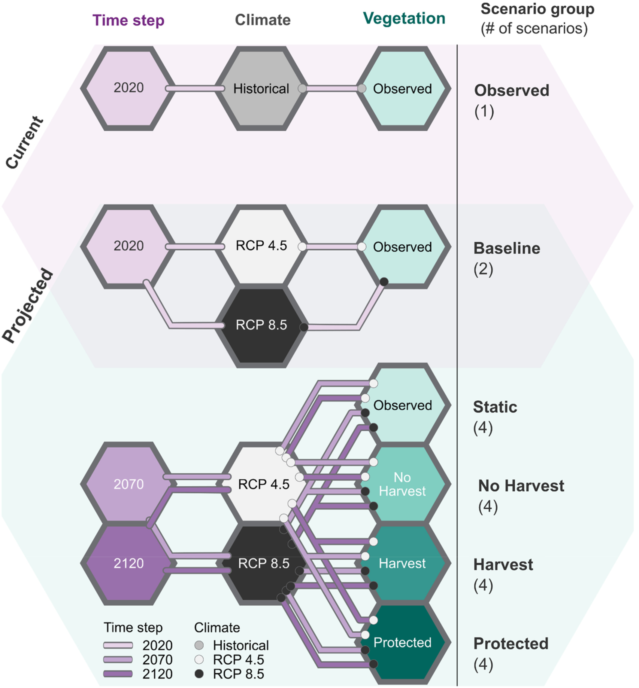

## Summary Description
Vegetation management (VM) incorporates many activities that provide safe and effective operations of power lines and other energy utilities. Examples of activities can range from tree pruning, removal of unwanted plants or fragile trees, selective clearing or pest control. The North American Electric Reliability Corporation (NERC) requires vegetation trimming around transmission lines. VM prevents contact between vegetation and equipment (which can cause fires and outages), maintaining clearances, but must also respect environment protection such as pesticide-free zones, protection of wildlife, control of invasive species and fire risk management.  VM also incorporates monitoring activities and coordination with local stakeholders for land use management. Hydro-Quebec undertook 270,000 actions linked to vegetation management on its distribution network and clear their lines every 6 years. For its transmission grid, VM clearance occurs every 3 to 13 years. (@HydroQuebec2022)

Climate change directly impacts VM. Increasing temperatures in Canada are extending the growing season for vegetation, which might increase the need for tree pruning. Fragile and weakened vegetation might be more present due to increase in extreme heat events and decrease in rainfall frequency (@OntarioMinistryEnergy2024). Many other climate events can impact VMs such as wind, lightning, freezing rain and storm. There is no clear signal for wind increase or decrease across Canada due to low model agreements (@IPCCatlas). Lightning frequency has increased in some areas of Canada with medium confidence (@IPCC2022_Ch14). Studies have shown that freezing rain might increase in colder regions which are less prone to this phenomenon currently, and decrease in the southern region due to increase in temperatures (@IPCCatlas, @Ouranos2024Verglacante). Species migration might also occur due to rising temperatures (e.g., a decrease in conifer biomass in the North and an increase of broadleaf species). 

Many [attributions](https://www.canada.ca/en/environment-climate-change/services/climate-change/science-research-data/extreme-weather-event-attribution.html) studies have shown that climate change made recent wildfires more likely, with Canadian events from [2023](https://www.worldweatherattribution.org/climate-change-more-than-doubled-the-likelihood-of-extreme-fire-weather-conditions-in-eastern-canada/) being two times more likely to occur. Many factors influence forest fires as shown in the figure below; climate conditions that are hot, dry and windy (which will be more extreme and frequent due to climate change), ignitions (human activity or lightning) and fuel (vegetation types). Fire season is also starting earlier in spring and lasting longer in autumn with some zombies fire going through winter in British Columbia (rare occurrences).

In the triangle, weather has the most influence on flame behaviour since wind can increase fire temperature by feeding it in oxygen as well as propagate the flames and embers in unburned areas. Precipitation can stop a fire, and temperature can dry out fuel which can increase fire spread. There are four types of fuels : ground (beneath the surface and generally burn slowly), surface (e.g., pine needles or grass), ladder (e.g., tall shrubs or small trees; bring the fire up) and crown (treetops and canopy) (@CanadaWildfire2025). 

The section below describes the role of VM in the electricity system, methods and models used linked to forest fires, a detailed discussion, gaps & recommendations. 

## Role in the Electricity System
:::{#id1 .callout collapse="true"} 
### Additional Information
VM is crucial for the electricity system has vegetation is one of the most common causes for power outages. A vulnerability assessment made for Ontario's distribution system showed that tree contacts are the greatest contributor to customer outages. It is particularly damaging (major outages) when combined with wind which damages trees in the vicinity of overhead conductors. Combined events of lower wind gusts (under 80 km/h) with heavy wet snow or ice accretion on tree branches (@OntarioMinistryEnergy2024) created major outages in 4 occurrences in the studied period. Even by itself, heavy wet snow and ice accumulation weighting down tree branches can  lead to tree contact with cables and create outages. Ontario organizations have also observed an increase in trees contact with overhead cables with wind speed higher than 70km/h. 

Forest fires have major impacts on the power grid has shown in the figure below. Forest fires cause permanent damage to infrastructure which can lead to blackouts, e.g., in Quebec 2023 forest fires cause power outages for 500,000 customers when three transmission lines were impacted. Furthermore, the impacts are not limited to power lines, although they are numerous (reduce thermal ratings, cause sag, burns on wooden poles, etc.), solar panels can be affected by wildfire smoke reducing their power output, wind turbine blades can be damaged by the ash and soot, dams can also be damaged by debris found in rivers after forest fire as well as soot, among many others. In California, 10% of wildfires are ignited by powerlines due to component failures, downed lines or conductor slaps. Distribution lines are more at risk than transmission lines when it comes to igniting fires (@Vahedi2025). 

[")](https://www.osti.gov/servlets/purl/2565134 "Wildfire and power grid nexus in a changing climate")

:::

## Methods and Models
The methods presented below are linked to forest fires risk.

:::{#id1 .callout collapse="true"}
## Fire Weather Index 
The Fire Weather Index (FWI) is used to estimate forest fire risk (potential numeric rating) in Canada. It considers daily observations of temperature, relative humidity, wind speed and 24-hour precipitation. From these observations the field, moisture codes (FMCs) are developed has shown in the figure below. From these the fire behaviour indices: initial spread index and buildup index are estimated to evaluate the FWI.  

FMC are ratings of moisture content of the forest floor as well as the dead organic content of pine forests. A higher FMC represents low moisture, hence drier conditions. 
 - Fine Fuel Moisture Code represents the moisture content of the litter, it also indicates the potential for human caused ignition.
 - Duff Moisture Code represents the moisture just below the litter which is loosely compacted and indicates lightning caused ignition.
 - Drought Code represents the moisture of the deep contact and densely compacted which indicates the potential depth of burn. 

There are four fire behaviour indices:
 - Initial Spread Index is the expected rate of fire spread based on wind and Fine Fuel Moisture Code, higher values indicate faster spread.
 - Buildup Index represents the total amount of fuel available for combustion. It relies on Duff moisture Code as well as the drought code and higher values indicates dyer fuel.
 - Fire Weather Index represented the intensity associated with a fire that spreads in a pine forest. It's based on the Buildup Index and the Initial Spread Index. It indicates the fire danger in Canada.
 - Daily Severity Rating represents the difficulty to control fires and it’s based on the FWI.

:::{#id1 .callout collapse="true"}
### Characteristics
[ECCC offers daily maps of FWI](https://cwfis.cfs.nrcan.gc.ca/maps/fm3?type=fwih) which are estimated with elevation (USGS at 1 km v.GTOPO30), weather data from Canadian and USA stations as well as ECCC forecasted weather. The methodology behind each calculation is presented in the report [Weather Guide for the Canadian Forest Fire Danger Rating System](https://ostrnrcan-dostrncan.canada.ca/entities/publication/a07c4db5-6fd5-42e8-b45d-71c23cda22c9). Usually weather records should be taken at noon at location and not corrected, the choice for noon was motivated since it is late enough in the day to indicate conditions of peak fire activity in the afternoon but early enough to have accessible codes, indices and forecasts available for planning. Calculations are made starting the moment three consecutive days have had a temperature above 12°C and are continued until snow covers the ground. Approximations are also used to convert wind observed at airports to forest due to surface roughness. 

ECCC also offers an [application](https://climatedata.ca/app/fire-weather-projections/) that project FWI and other related indexes with future projections. The presented indexes have a 50 km resolution and comes from the CanLEAD climate projection dataset which is a daily large ensemble (temperature, precipitation, relative humidity and wind speed) of the CanRCM4 regional climate model bias-corrected with a multivariate quantile-mapping algorithm (@Cannon2022_CanLEADv1). Using a large ensemble allows quantifying natural variability, however, using only one RCM driven by one GCM is an important limit of the dataset. The application offers the scenario RCP4.5 and 8.5 that project important increase in severity and frequency of high fire weather conditions and longer fire season almost across the whole country (@Vanvliet2024). Ouranos is currently working on a FWI version for Quebec made with [RCMs](../../datasets/climate_projection_data/CORDEX.ipynb) and SSPs.

:::

:::{#id1 .callout collapse="true"}
### Key Climate Inputs
- Temperature at noon
- Relative humidity; can be estimated from dry-bulb and wet-bulb temperatures
- Wind
- Precipitation 

:::

:::{#id1 .callout collapse="true"}
### Non-Climate Inputs
- N/A 

:::

:::{#id1 .callout collapse="true"}
### Model Outputs
- FWI related indexes and codes

:::

:::{#id1 .callout collapse="true"}
### Temporal Resolution
FWI is usually calculated at a daily timestep and ideally with measurements taken at noon. 

:::

:::{#id1 .callout collapse="true"}
### Spatial Resolution
FWI is usually calculated at local stations (finer resolution), but can also be computed from [reanalysis](../../datasets/reanalysis_data/Reanalysis_Datasets.ipynb) or [climate projections](../../datasets/climate_projection_data/Climate_Projection_Datasets.ipynb). ECCC application of projected FWI has a 50 km resolution. 

:::

:::{#id1 .callout collapse="true"}
### Frequency of Analysis
At present, FWI is calculated and updated daily and monthly by ECCC for Canada.  

:::
:::

:::{#id1 .callout collapse="true"}
## Burn-P3 (Fire model)
[Burn-P3](https://www.canadawildfire.org/burn-p3-english) is a fire model commonly used in academics and practice to simulate forest fires. It is based on the [SyncroSim](https://syncrosim.com/) package and maintained by the [Canadian Forest Service](https://natural-resources.canada.ca/corporate/corporate-overview/about-canadian-forest-service). It evaluates the likelihood of fire or burn probability over large landscapes. 

:::{#id1 .callout collapse="true"}
### Characteristics
****
[Burn-P3](https://www.canadawildfire.org/_files/ugd/90df79_82314306bd42448bbd0df7aaffe4b043.pdf) is based on the [Prometheus](https://firegrowthmodel.ca/#/prometheus_overview) fire growth model. Prometheus is a deterministic model based on the FWI and the Fire Behaviour Prediction which simulates ignition and spread of large numbers of fires. A new version of BurnP3, [BurnP3+](https://burnp3.github.io/BurnP3Plus/) offers the option to use three fire growth models; Prometheus but also [Cell2Fire](https://www.frontiersin.org/journals/forests-and-global-change/articles/10.3389/ffgc.2021.692706/full) and [FireStarr](https://github.com/CWFMF/FireSTARR). Other fire growth models can also be incorporated in BurnP3+. The newest version also offers features such as scenario comparison, flexibility to use Python or R scripts, support for multi-processing and the ability to dynamically connect to landscape change models such as [ST-Sim](https://apexrms.com/landscape-change/) or [LANDIS-II](https://apexrms.com/landscape-change/). 

Fires and ignitions are simulated in each grid cell. Therefore, Burn-P3 runs multiple model iterations to estimate fire probabilities which allows estimating the burn probability of each cell. These iterations are stochastically sampling ignition locations and other inputs, and then tallying up the results of these Monte Carlo simulations. 

Many studies used Burn-P3 with climate change projections to predict future fire activity in Canada. @erni2024 used Burn-P3 to map wildfire hazards, vulnerability and risk to Canadian communities and found that over 39% of land is considered at high or very high risk of fire. For its estimates, observations from ECCC where combined with provincial meteorological stations as well as gridded observations when stations were missing or the NCEP reanalysis for missing variables such as wind. @gabariau2023 made a similar analysis for the boreal forest in Northwest Canada using a dynamic global vegetation model, [LPJ-LMfire model](https://gmd.copernicus.org/articles/6/643/2013/) to project annual burns and attributes of the boreal trees. Future simulations were run with two GCMs and RCMs as well as with RCPs 4.5 and 8.5. The study showed a decrease of the burn rate in the 21st century due to a decrease of biomass in needle leaf tree species and an increase in broadleaf species. However, some grids in the South East of the studied area showed an increase in fire linked to the increase in needle tree species. 

@Dawe2022 used future climate projections from CanESM2, a [GCM](../../datasets/climate_projection_data/Climate_Projection_Datasets.ipynb), in Burn-LP3. Gridded climate projections were downscaled with [NrCanMET](../../datasets/observed_data/NRCanMET_Gridded_Data.ipynb). Since daily fire weather conditions, which is required as an input to Burn-P3, are inferred at stations, the projections were matched to weather stations with [BioSim11](https://cfs.nrcan.gc.ca/projets/133). Monthly normals were calculated at 29 stations and for three time periods (2020, 2070, 20120) and fed in [LANDIS-II](https://www.landis-ii.org/), a forest landscape model, to project vegetation (fuel).  Landis-II outputs were directly translated into the Fire Behaviour Prediction System fuel types to incorporate in Burn-P3. The study was done for Saguenay, Quebec and showed an important increase in wildfire risk. The figure below present the methodology of the research. 

The Burn-P3 model is often calibrated and validated with historical fire activity such as the [Canadian National Fire Dataset ](https://cwfis.cfs.nrcan.gc.ca/ha/nfdb). Burn-P3 is also used to evaluate adaptation strategies, such as the best locations to invest in caribou conservation (@Dawe2022, @stockdale2018wildfire) or mesh on poles in Manitoba (@Huang2024_WildfireRisk). 

@Vahedi2025 also proposes multiple other fire models, e.g., FireSim or FlamMap, in his paper and highlights the benefits and drawbacks of each. 

@mulverhill2025 used machine learning models to project future forest fires with 8 GCMs downscaled with the [ClimateNA](https://climatena.ca/) software (30m spatial resolution) with four SSPs (1-2.6, 2-4.5, 3-7.0 and 5-8.5). Overall, ecozones showed an increase (except for the Hudson Plains under SSP1-2.6) in burned areas for all 4 SSPs by the end of the century ranging from 4% to 60% relative increase depending on the scenario and ecozone. In terms of communities, Sept-Îles was the most at risk with all 4 scenarios showing an increase over 60% of burn probability. However, @mulverhill2025 kept his biotic fixed in the fire model.  

:::

:::{#id1 .callout collapse="true"}
### Key Climate Inputs
- local noon temperature: used in @erni2024
- relative humidity: used in @erni2024
- wind speed and direction: used in @erni2024
- precipitation: used in @erni2024
- Climate inputs represent daily fire weather conditions and refer to the [FWI](#fire-weather-index) 

:::

:::{#id1 .callout collapse="true"}
### Non-Climate Inputs
- Topography: @erni2024 used [EarthENV-DEM90](https://www.earthenv.org/DEM) digital elevation model 
- Fuels: [Canadian Forest Fire Behaviour Prediction System fuel type classification](https://cwfis.cfs.nrcan.gc.ca/background/fueltypes/c1) (@stockdale2018wildfire)
- Fires zones: based on mean annual ignition density (stratify by season fire causes)
- Seasons: start and stop date of fire weather which can be obtained from the [Canadian National Fire Database](https://cwfis.cfs.nrcan.gc.ca/ha/nfdb)  
- Fire duration and ignitions: Drawn from distributions of observed datasets
:::

:::{#id1 .callout collapse="true"}
### Model Outputs
- Ignition locations
- Individual fire perimeters (stored in geographic polygons)
- Burn likelihood : result obtained by resuming outputs in summary map
- Fire intensity
- Fuel consumption
- The [PostBP python package](https://github.com/nliu-cfs/postbp) (@liu2024postbp) offers code to simplify and visualize outputs from fire models e.g., hexagonal patch network, fire spread analysis, burn & ignition probabilities or source-sink analysis. 

:::

:::{#id1 .callout collapse="true"}
### Temporal Resolution
Daily or monthly

:::

:::{#id1 .callout collapse="true"}
### Spatial Resolution
Fire model works by cells; all inputs must have the same resolution. Buffers should be added around the study area (to allow spread of burning). @Dawe2022 used a resolution of 0.5 km. 

:::

:::{#id1 .callout collapse="true"}
### Frequency of Analysis
For specific projects. 

:::
:::

## Detailed Discussion
:::{#id1 .callout collapse="true"} 
### Additional Information
Participants in the [workshops](../../workshops/intro_workshops.ipynb) noted the growing potential of Artificial Intelligence (AI) to enhance VM. For example, predictive models of vegetation growth or tree health—incorporating climate forecasts—could help prioritize interventions in high-risk areas. @Savva2025 reviewed AI-driven remote sensing approaches for VM near power lines, highlighting the integration of AI with LiDAR data and the use of weather variables (such as temperature and wind speed) as model inputs (@wu2022, @Taylor2022VegetationMgmtOutages).

Some use of climate information in VM practice is also resumed in the figure below. There is an interest in climate variables that can break trees such as wind or freezing rain which can cause power outages. 

<iframe width="768" height="640" data-external="1" src="https://miro.com/app/live-embed/uXjVJqigpIU=/?focusWidget=3458764648311918983&embedMode=view_only_without_ui&embedId=866452356677" frameborder="0" scrolling="no" allow="fullscreen; clipboard-read; clipboard-write" allowfullscreen></iframe>

:::

## Gaps and Recommendations
:::{#id1 .callout collapse="true"} 
### Additional Information
As climate information becomes increasingly integrated into VM—especially with the adoption of AI for predictive management—participants in the [workshops](../../workshops/intro_workshops.ipynb) emphasized the need for practical tools to preprocess and manage climate data within existing field operations and equipment.

Another participant highlighted the opportunity to use spatial analogs to improve resiliency against forest fires. By examining regions that have already adapted or enhanced their vegetation management (VM) practices in response to climate change or forest fires, organizations can identify adaptation and resilience strategies that may soon be necessary in their own areas. For example, California has shifted its wildfire mitigation strategy for powerline ignitions: instead of relying solely on tree trimming, utilities now proactively shut down power lines when a branch comes into contact. This approach is feasible due to the redundancy built into California’s grid (@CastroRootJohnson2023).

Climate change adaptation might require an increase in inspections, to adapt clearing cycles to new weather patterns and to revise VM standards (@HydroQuebec2022).

:::

## Interactions with Other Sector Activities
:::{#id1 .callout collapse="true"} 
### Additional Information
<mark> Link with transmission and distribution <mark>
:::

<strong>References (click to expand)</strong>

::: {#refs}
:::

