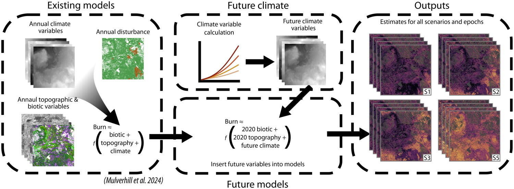

## Summary Description
Vegetation management (VM) incorporates many activities that provide safe and effective operation of power lines and other energy utilities. Exemples of activities can range from tree pruning, removal of unwanted plants or fragile trees, selective clearing or pest control. The North American Electric Reliability Corporation (NERC) requires vegetation trimming around transmission lines. Some goals of VM is preventing contact between vegetation and equipment (which can cause fires and outages), maintening clearances, but must also respect environement protection such as pesticide-free zones, protection of wildlifre, control of invasive speciaies and fire risk management.  VM also incorporates monitoring activites, coordination with local stakeholders for land use management

Climate change directly impacts VM. Increasing temperatures in Canada are extending the growing season for vegetation, which might increase the need for tree pruning. Fragile and weakened vegetation might be more present due to increase in extreme heat events and decrease in rainfall frequency (@OntarioMinistryEnergy2024). Many other climate events can impact VMs such as wind, lightning, freezing rain and storm. There is no clear signal for wind increase or decrease across Canada due to low model agreements (@IPCCatlas). Lightning frequency has increased in some areas of Canada with medium confidence (@IPCC2022_Ch14). Studies have shown that freezing rain might increase in colder regions which have less of this phenomenon currently, and decrease in southern region due to increase in temperatures (@IPCCatlas, @Ouranos2024Verglacante). Species migration might also occur due to rising temperatures (for exemple a decrease in conifer biomass in the North and an increase of broadleaf species). 

Many [attributions](https://www.canada.ca/en/environment-climate-change/services/climate-change/science-research-data/extreme-weather-event-attribution.html) studies have showed that climate change made recent wildfires more likely, with Canadian events from [2023](https://www.worldweatherattribution.org/climate-change-more-than-doubled-the-likelihood-of-extreme-fire-weather-conditions-in-eastern-canada/) being two times more likely to occur. Many factors influence forest fires as shown in the figure below; climate conditions that are hot, dry and windy (which will be more extreme and frequent due to climate change), ignotions (humans activity or lightning) and fuel (vegetation type). Fire are also starting earlier in the season (sprint) and lasting longer in autumn with some zombie fire eveng going through in British Columbia (rare occurences that was observed in British Columbia).

In the triangle, weather has the most influence on flames behavior has wind can increase fire temperature by feeding it in oxygen as well as propagate the flames and embers in urbunred areas, precipitation can stop a fire, and temperature can dry out fuel which increase spread. There is four types of fuels : ground (beneath the surface and generally burn slowly), surface (e.g, pine needles or grass), ladder (e.g, tall shrumbs or small trees; bring the fire up) and crown (treetops and canopy) (@CanadaWildfire2025). 

The below section describes the role of VM in the electricity system 

## Role in the Electricity System
:::{#id1 .callout collapse="true"} 
### Additional Information
VM is crucial for the electricity system has vegetation is one of the most common cause for power outages. A vulnerability assessment made for Ontario's distrbution system showed that tree contacts are the greatest contributor to customer outages. It is particularly damanging (major outages) when combined with wind which damages trees in vicinity of overhead conductors. Combined events of lower wind gusts (under 80 km/h) with heavy wet snow or ice accretion on tree branches (@OntarioMinistryEnergy2024) created major outages in 4 occurences. Even by itself, heavy wet snow and ice accumulation weighting down on tree branches can  lead to tree contact with cables and create outages. Ontario organisations have also observed an increase in trees contact with overhead cables with wind speed of more than 70km/h. 

Forest fires have major impacts on the power grid has show by the figure below. Forest fires cause permant damanga to infrastructure which can lead to blackouts, e.g. in 2023 forest fires cause power outages for 500 000 customers when tree transmissions lines became out of comissions. The impacts are not limited to power lines, altough they are numerous (reduce thermal rating, cause sag, burns on wooden poles, etc.). For example, solar panels can be affected by wildfire smoke reducing their power output, wind turbines blades can be damaged by the ash and soot, among many others. In California, 10% of wildfires are ignited by powerlines due to component failures, downed lines or conductor slaps. Distribution lines are more at risk than transmission lines when it comes to igniting fires (@Vahedi2025). 

[")](https://www.osti.gov/servlets/purl/2565134 "Wildfire and power grid nexus in a changing climate")

:::

## Methods and Models

Summary of the methods and models used goes here. Repeat the below template if there are multiple types of models

:::{#id1 .callout collapse="true"}
## Fire Weather Index 
The Fire Weather Index (FWI) is used to estimate forest fire risk (potential numeric rating) in Canada. It considers daily obesrvations of temperature, relative humidity, wind speed and 24 hour precipitation. From these observations the fueld moistures codes (FMCs) are developed has showed in the figure below. From these the fire behavior indices: inital spread index and buildup index are estimated to evaluate the FWI.  

FMC are ratings of moisture ocntent of forest floor as well as the dead organic content of pine forests. An higher FMC represents low moisture, hence drier conditions. 
 - Fine Fuel Moisture Code represents the moisture content of the litter, it also indicates the potential for human caused ignition.
 - Duff Moisture Code represents the moisture just below the litter which are loosely compacted and indicates lightning caused ignition.
 - Drought Code represents the moisture of the deep ocntact and densily compacted which indicates the potential depth of burn. 

There are four fire behaviours indices:
 - Initial Spread Index is the expected rate of fire spread based on wind and Fine Fuel Moisture Code, higher values indicaders faster spread.
 - Buildup Index represents the total amount of fuel available for combustion. It relies on Duff moisture Code as well as the drought code and higher values indicates dyer fuel.
 - Fire Weather Index represented the intensity associated with a fire that spreads in a pine forest. It's based on the Buildup Index and the Initial Spread Index. It indicates the fire danger in Canada.
 - Daily Secrity Rating represents the difficulty to control fires and its based on the FWI.

[ECCC offers daily maps of FWI](https://cwfis.cfs.nrcan.gc.ca/maps/fm3?type=fwih) which are estimated with elevation (USGS at 1 km v.GTOPO30), weather data from Canadian and USA stations and ECCC forecasted weather. The methodology behind each calculation is presented in the report [Weather Guyide for the Canadian Forest Fire Danger Rating System](https://ostrnrcan-dostrncan.canada.ca/entities/publication/a07c4db5-6fd5-42e8-b45d-71c23cda22c9). 

ECCC also offers an [application](https://climatedata.ca/app/fire-weather-projections/) that project FWI and other related indexes with future projections. The presented indexes have a 50km resolution and comes from the CanLEAD climate projection dataset which is a daily large-ensemble (temperature, precipitation, relative humidity and wind speed) of the CanRCM4 regional climate model bias-corrected with a multivariate quantile-mapping algorithm (@Cannon2022_CanLEADv1). Using a large-ensemble allows to quantify natural variability, however using only one RCM driven by one GCM is a big limit of the dataset. The application offers the scenario RCP4.5 and 8.5 that project important increase in severity and frequency of high fire weather consditions and longer fire season almost across the whole country (@Vanvliet2024). Work is currently being done to incorporate the new SSPs in the application. 

:::{#id1 .callout collapse="true"}
### Characteristics
**Deterministic, Optimization, Econometric, empirical etc**

:::

:::{#id1 .callout collapse="true"}
### Key Climate Inputs
Usually weather records should be taken at noon at location and not corrected, the choice for noon was motivated since it is late enough in the day to incade conditions of peak fire activity in the afternoon but enough early to have accessible codes, indices and foracasts available for planning. 
- Temperature at noon
- Relative humidity; can be estimated from dry-bulb and wet-bulb temperatures
- Wind
- Precipitation 

:::

:::{#id1 .callout collapse="true"}
### Non-Climate Inputs
- Input A - Description (add links)
- Input B - Description 

:::

:::{#id1 .callout collapse="true"}
### Model Outputs
- Output A - Description [Link_activities]

:::

:::{#id1 .callout collapse="true"}
### Temporal Resolution
Description 

:::

:::{#id1 .callout collapse="true"}
### Spatial Resolution
Description 

:::

:::{#id1 .callout collapse="true"}
### Frequency of Analysis
Description 

:::
:::

:::{#id1 .callout collapse="true"}
## Burn-P3 (Fire model)
[Burn-P3](https://www.canadawildfire.org/burn-p3-english) is a fire mdoel commonly used in academics and practice to simulate fores fires. It is based on the [SyncroSim](https://syncrosim.com/) package and maintened by the [Canadian Forest Service](https://natural-resources.canada.ca/corporate/corporate-overview/about-canadian-forest-service). It evaluates the likelihood of fire or burn probability over large landascapes. 

:::{#id1 .callout collapse="true"}
### Characteristics
**Deterministic, Optimization, Econometric, empirical etc**
[Burn-P3](https://www.canadawildfire.org/_files/ugd/90df79_82314306bd42448bbd0df7aaffe4b043.pdf) is based on the [Prometheus](https://firegrowthmodel.ca/#/prometheus_overview) fire growth model. Prometheus is a deterministic model based on the FWI and the Fire Behaviour Prediction which simulation ignition and spread of large numbers of fires. A new verion of BurnP3, [BurnP3+](https://burnp3.github.io/BurnP3Plus/) offers the option to use thre fire growth models; Prometheuse but also [Cell2Fire](https://www.frontiersin.org/journals/forests-and-global-change/articles/10.3389/ffgc.2021.692706/full) and [FireStarr](https://github.com/CWFMF/FireSTARR). Other fire growth models can also be incorporated in BurnP3+. The newest version also offers features such as scenario comparison, flexibility to use Python or R scripts, support for multi-processing and the ability to dynamiclaly connect to landscape change models su as [ST-Sim](https://apexrms.com/landscape-change/) or [LANDIS-II](https://apexrms.com/landscape-change/). 

Fires and ignitions are simulated in each grid cell. Therefore, Burn-P3 allows for multiple model iterations to estimate fire progabilities which allows to estimate the burn probability of each cell. These iterations are stochastically sampling ignition locations and other inputs, and then tallying up the results of these Monte Carlo simulations. 

Many studies used Burn-P3 with climate change projections to predict future fire activity in Canada. @erni2024 used Burn-P3 to map wildfire hazard, vulnerability and risk to Canadian communities and found that over 39% of land is considered at high or very high risk of fire. For its estimates, observations from ECCC where combined with provincial meteorological stations as well as gridded observations when stations where missing or the NCEP reanalysis for missing variables such as wind. @mulverhill2025 used Burn-P3 to project future forest fires with 8 GCMs downscaled with the [ClimateNA](https://climatena.ca/) software (30m spatial resolution) with four SSPs (1-2.6, 2-4.5, 3-7.0 and 5-8.5). OVerall, ecozones showed an increase (except for the Hudson Plains under SSP1-2.6) in burned areas for all 4 SSPs by the end of the century raning from 4% to 60% relative increase depending on the scenario and ecozone. In terms of communities, Sept-Îles was the most at risk with all 4 scenarios showing an increase over 60% of burn probability. However, @mulverhill2025 kept his biotic fixed in the fire model as shown in the figure below.  

@gabariau2023 made a similar analysis for the boreal forest in Northwest Canada using a dynamic global vegetation model, [LPJ-LMfire model](https://gmd.copernicus.org/articles/6/643/2013/) to project annual burns and attributes of the boreal trees. Future simulations were run with two GCMs and RCMs as well as with RCPs 4.5 and 8.5. The study showed a decrease of burn rate in the 21st century due to a decrease of biomass in needleleaf tree speacies and an increase in broadleaf species. Hoever, some grids in the South East of the studied area showed an increase in fire linked to the increase in needle tree species. 

The Burn-P3 model is often calibrated and validated with historical fire activity such as the [Canadian National Fire Dataset ](https://cwfis.cfs.nrcan.gc.ca/ha/nfdb). Burn-P3 is also used to evaluate adaptation stragegies, such as the use of mesh on 

@Vahedi2025 also proposes multiple other fire models, e.g. FireSim or FlamMap, in his paper and highlights the benefits and drawbacks of each. 

:::

:::{#id1 .callout collapse="true"}
### Key Climate Inputs
- local noon temperature: used in @erni2024
- temperature difference: used in @mulverhill2025
- maximum temperature: for spring used in @mulverhill2025
- relative humidity: used in @erni2024
- wind speed and direction: used in @erni2024
- precipitation: used in @erni2024, @mulverhill2025 used spring precipitation 
- climate moisture deficit: used in @mulverhill2025
- degree-days below 0degC : used in @mulverhill2025
- Input B - Description [Sample links](#data-access)
- link to [climate projections](../datasets/Climate_Datasets_Overview.ipynb)

:::

:::{#id1 .callout collapse="true"}
### Non-Climate Inputs
- Topography: @erni2024 used [EarthENV-DEM90](https://www.earthenv.org/DEM) digital elevation model 
- Input B - Description 

:::

:::{#id1 .callout collapse="true"}
### Model Outputs
- Output A - Description [Link_activities]

:::

:::{#id1 .callout collapse="true"}
### Temporal Resolution
Description 

:::

:::{#id1 .callout collapse="true"}
### Spatial Resolution
Description 

:::

:::{#id1 .callout collapse="true"}
### Frequency of Analysis
Description 

:::
:::

## Detailed Discussion
:::{#id1 .callout collapse="true"} 
### Additional Information
lorem ipsum bla bla
:::

## Gaps and Recommendations
:::{#id1 .callout collapse="true"} 
### Additional Information
lorem ipsum bla bla
:::

## Interactions with Other Sector Activities
:::{#id1 .callout collapse="true"} 
### Additional Information
** to consider...this may be part of inputs and outputs** 
:::

<strong>References (click to expand)</strong>

::: {#refs}
:::

