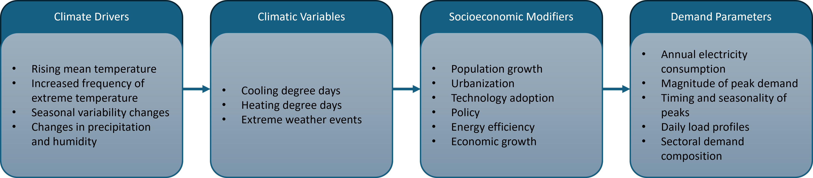

## Summary Description

Electricity demand is a vital component in the planning, operation, and resilience of power systems. Climate change is expected to alter electricity demand patterns by affecting not only temperature characteristics, such as mean temperature, frequency of temperature extremes, and seasonal variability, but also consumption behaviours across various sectors. 

Numerous studies project increased cooling demand during hotter summers and reduced heating demand during milder winters as this pattern has been consistently observed across multiple global regions (@Amonkar2023, @Auffhammer2011, @Pilli-Sihvola2010, @Trotter2016, @Wood2015). However, the magnitude and direction of these changes are strongly dependent on region, latitude, and socioeconomic conditions. For example, countries in warmer climates are expected to experience higher overall demand growth due to increased cooling loads (@Bonkaney2023, @Emodi2018, @Zachariadis2014). Climate change also influences electricity consumption by sector and alters temporal demand profiles, including daily and seasonal variations. The residential, commercial, and industrial sectors respond differently to climate drivers (@Dirks2015, @Shaik2024, @Taseska2012). Furthermore, the timing of electricity demand is shifting, with studies projecting changes in peak load hours and seasonal peaks due to rising temperatures and more frequent extreme heat events (@Amonkar2023, @Fonseca2019, @Romitti2022). 

To assess the impacts of climate change on electricity demand, various approaches have been employed. These include the use of climate projections from [General Circulation Models](../../datasets/climate_projection_data/Climate_Projection_Datasets.qmd) (or Global Climate Models, GCMs) and [Regional Climate Models](../../datasets/climate_projection_data/CORDEX.ipynb) (RCMs), often combined with downscaling techniques to capture local climatic variability (@Auffhammer2017, @Auffhammer2011, @Fonseca2019, @Lipson2019, @Trotter2016). Empirical models, such as regression-based analyses, have also been used to estimate historical relationships between temperature and electricity use (@Bonkaney2023, @Emodi2018, @Pilli-Sihvola2010). Additionally, simulation tools and integrated energy-climate models are applied to explore future scenarios under varying socio-economic and climatic conditions (@Dirks2015, @Lipson2019, @Taseska2012).

## Role in the Electricity System

Electricity demand is a primary determinant of system adequacy and infrastructure investment. The main demand parameters influenced by climate change include total annual consumption, peak demand, daily and seasonal load profiles, spatial distribution, and sectoral responses. Total annual consumption informs generation capacity expansion and long-term planning, magnitude and timing of peak demand drives reserve margins, operational flexibility, and system reliability, and daily and seasonal load profiles shape the operational requirements and the scheduling of generation resources. Spatial distribution of affects determines transmission and distribution planning, and sectoral responses determine how quickly end-users adapt to changing climate conditions through technology adoptions (e.g., heat pumps, air conditioning, insulation) and behavioural change.

## Methods and Models

:::{#id1 .callout collapse="true"}
### Characteristics
Climate data such as [GCMs and RCMs](../../datasets/climate_projection_data/Climate_Projection_Datasets.qmd) prepared for the appropriate spatial and temporal resolution are integrated into models that simulate or estimate electricity demand responses to climatic variables. The literature broadly categorizes these models into two groups: empirical models, which are typically data-driven, and simulation-based models, which are process-oriented or scenario-based. These approaches differ in their methodological structure and are selected based on the availability of data, the spatial and temporal scale of analysis, and the objective of the study or project.

**Empirical models** typically use regression-based methods to quantify the historical relationship between electricity demand and weather variables, mostly temperature. @Auffhammer2011 used a simple log-linear regression models to estimate residential demand sensitivity and climate change impacts estimation in California. @Fonseca2019 developed empirical load models based on hourly utility data and downscaled weather variables to simulate load variability under future climate scenarios. @Shaik2024 extended this approach across multiple sectors and climate variables to evaluate sectoral demand elasticity and response behavior in the United States. While empirical models are statistically robust and adequate for retrospective analysis, they are inherently constrained by the historical range of observed conditions and may not fully capture adaptive or nonlinear responses to future extremes. Ontario practitioners use this method for medium term (11 days to 2 years) with 31 years of historical data incorporating many climate inputs such as dry bulb temperature, cloud cover, wind speed, dewpoint and irradiance. 

**Simulation-based models**, on the other hand, allow to explore prospective scenarios by embedding climate variables within energy system or physics models. These include tools like EnergyPlus for building-level simulations (as used by @Berardi2020) and energy system optimization models such as MARKAL (as applied in @Taseska2012). Simulation models offer the advantage of flexibility in exploring technological, behavioral and policy adaptations under different emissions and socioeconomic pathways. @Lipson2019 incorporated building-urban-atmosphere interaction models to simulate energy demand responses under urban heat island effects, demonstrating how climate-urban feedbacks can influence spatial energy use patterns. @Parkinson2015 modeled electricity system planning under hydro-climatic uncertainty using robust optimization techniques, highlighting the importance of integrating demand and supply-side climate risks. Ontario practitioners have developed simulation-based models to address long term horizon of 2 to 20 years; at the moment it does not incorporate climate inputs, but regression of heating and cooling degree-days will soon be added in models (historical only). 

In practice, demand forecasting is often conducted using end-use approaches (@IESO2025), which can be implemented within either an empirical or a simulation-based framework. Empirical end-use models estimate electricity demand by disaggregated categories such as end-use type, sector, or region based on historical consumption patterns and weather variables. In contrast, simulation-based end-use models, which are more common, simulate the behaviour of appliances, buildings, or sectors using physical parameters.

The figure below briefly resumes decision-making challenges faced by professionals in the demand sector of the electricity system in Canada. These challenges were shared during the [workshops](../../workshops/intro_workshops.ipynb) held in 2025. These examples linked together the methods and models as well as characteristics presented in the following section such as [ key climate inputs](#key-climate-inputs).

<iframe width="768" height="640" data-external="1" src="https://miro.com/app/live-embed/uXjVJqigpIU=/?focusWidget=3458764648311837438&embedMode=view_only_without_ui&embedId=914879544290" frameborder="0" scrolling="no" allow="fullscreen; clipboard-read; clipboard-write" allowfullscreen></iframe>

The workshop examples highlighted how demand forecasting is shaped by the [North American Electric Reliability Corporation (NERC)](https://www.nerc.com/Pages/default.aspx) requirement to maintain a five-year planning reserve margin. As a result, two forecasting horizons are considered: medium-term (11 days to 2 years) and long-term (2 to 20 years). The medium-term is statistically based on historical data (31 years) while the long-term planning is physically based, as described above. The load forecasting model incorporates historical hourly normals for dry bulb temperature, cloud cover, wind speed, dew point and global horizontal irradiance across ten geographic zones in the province. There is a plan to incorporate relative humidity and temperature (heating degree days and cooling degree days) in the forecast. The main sources for these datasets are Environment Canada and external consultants (wind speed and global horizontal irradiance). Climate data is validated by comparing the model's outputs with historical load data, ensuring that the forecasts align with observed patterns.

:::

:::{#id1 .callout collapse="true"}
### Key Climate Inputs
Electricity demand is governed by a set of interconnected parameters that respond to both climatic and non-climatic factors. Under climate change, demand parameters, such as annual electricity consumption, peak demand magnitude and its timing, and daily load profiles, are increasingly influenced by variations in climate variables. Among them, temperature is the most important, but humidity, extreme weather events, and socioeconomic variables are also influencing factors. 

- **Temperature**: Among all climatic variables, air temperature exerts the strongest impacts on electricity demand. The non-linear V-shaped (or U-shaped) relationship, where demand rises both at high and low temperatures due to cooling and heating needs, respectively, is well presented by using Cooling Degree Days (CDD) and Heating Degree Days (HDD) (@Hu2024, @Fonseca2019, @Schaeffer2012, @Garrido-Perez2021, @Hiruta2022, @Auffhammer2011, @Pilli-Sihvola2010). The CDD quantifies the accumulated temperature above a comfort threshold (commonly 18degC or 65degF), which are mainly correlated with air conditioning demand. The HDD reflects the accumulated temperature below the comfort threshold to estimate electric heating requirements. For instance, @Amonkar2023 found that climate change has affected most of the contiguous US after identifying that annual mean CDDs are increasing, leading to significant growth in both average and peak cooling demand, while HDDs are declining, resulting in reduced heating demand. Similarly, @Taseska2012 used national-scale adjustments to CDD and HDD to determine how climate-induced changes in the degree days would shift electricity consumption and peak capacity needs in Macedonia. In Canada, @Chidiac2022 applied CDD and HDD projections from multiple downscaled climate models to estimate future changes in space heating and cooling loads across Ontario's climate zones. Their results showed a consistent increase in CDD and decline in HDD, with implications for building retrofits and peak load planning. In practice, temperature is often acquired from observed stations of [Environment and Climate Change Canada](https://climate.weather.gc.ca/historical_data/search_historic_data_e.html).

- **Humidity**: Humidity also plays a critical role in shaping cooling demand. At identical air temperatures, high humidity significantly increases discomfort, which can lead to additional cooling load. Some studies emphasize that inclusion of humidity in demand forecasting or humidity-adjusted CDDs may better represent residential and commercial demand than temperature alone (@DeCian2019, @Maia-Silva2020, @Hiruta2022). In practice, temperature is often acquired from observed stations of [Environment and Climate Change Canada](https://climate.weather.gc.ca/historical_data/search_historic_data_e.html).

- **Cloud Cover**: Cloud cover is used in practice in Ontario for demand forecasting, again observations used are provided by [Environment and Climate Change Canada](https://climate.weather.gc.ca/historical_data/search_historic_data_e.html). 

- **Wind Speed** : Historical wind speed is also used to estimate demand forecasting, however in practice this variable is often produced by consulting firm. 

- **Irradiance**: Historical irradiance is also used to estimate demand forecasting, however in practice this variable is often produced by consulting firm. 

- **Extreme weather events**: Climate change intensifies the frequency, duration, and severity of extremes such as heatwaves and cold snaps, which reshape demand profiles. Heatwaves extend afternoon peaks and increase peak magnitude, resulting in stressed infrastructure, while cold snaps drive significant winter demand.

:::

:::{#id1 .callout collapse="true"}
### Non-Climate Inputs
Although climatic variables are the direct determinants of electricity demand, non-climate variables like socioeconomic conditions and policy choices strongly influence how these climatic factors are expressed in demand profiles. They act as mediators that either amplify or dampen the physical impacts of climate change.

- **Population growth and urbanization**: Larger populations increase the baseline level of electricity consumption, especially in residential and commercial sectors. Rapid urbanization concentrates demand geographically, often in regions already experiencing climatic stresses such as heatwaves or urban heat island effects. For example, @Auffhammer2011 demonstrated that population growth had a stronger effect on projected residential electricity demand with consumption potentially increasing nearly fivefold by the end of the century in California under high-growth scenarios. Using a stochastic modelling framework, @Trotter2016 found that population growth along with economic growth were the most influential factors affecting electricity demand in Brazil. @Burillo2019 and @Allen2016 similarly analyzed that population growth due to urbanization or migration can reshape electricity demand patterns and stress local infrastructure, especially when combined with rising temperatures.

- **Economic growth and income levels**: Rising income enables greater ownership and use of climate-sensitive appliances such as air conditioners, refrigerators, and electric heaters. @DeCian2019 analyzed income level as a demand parameter and found significant increases in total energy consumption in most developing countries. @Shaik2024 found that climate change increases the elasticity of demand to both price and weather variables, particularly in the residential and commercial sectors. @Taseska2012 further emphasized the role of adaptive capacity and policy. Adaptation measures, such as investment in more efficient cooling technologies or demand side management, can mitigate the projected demand increases.

- **Technology adoption and efficiency**: Air conditioning and heat pumps significantly modifies both cooling and heating demand. For instance, @Berardi2020 emphasized that while heating energy use intensity may decline by 18-33%, cooling energy user intensity could rise by as much as 126% by 2070 in Canadian buildings. The commercial sector is also highly climate-sensitive, primarily due to its dependence on heating, ventilating, and air conditioning (HVAC) systems. @Taseska2012 projected that under a warmer climate scenario, commercial electricity demand for cooling would increase, especially during peak summer periods, while the reduction in heating demand would be relatively minor. Efficiency measures (e.g., better insulation, smart thermostats, efficient HVAC systems) can offset part of the climate-driven increases, but uptake depends on consumer choices and policy incentives.

:::

:::{#id1 .callout collapse="true"}
### Model Outputs
Demand forecasting models yield output variables that support planning, operations, and policy decision. These outputs can be grouped into several key categories. In practice, model outputs are also used to validate climate inputs (if an outlier is found).

- **Total annual demand** is one of the most common outputs. It represents the aggregate amount of electricity consumed in a year and provides the basis for long-term generation capacity planning. Climate change is expected to alter total annual demand by simultaneously reducing winter heating needs and increasing summer cooling requirements.

- **Peak demand magnitude and timing** are also important outputs from demand forecasting since peaks drive the sizing of generation, transmission, and distribution infrastructure. The magnitude of peak demand reflects the highest load observed in a given period, while the timing of peak demand determines when these stresses occur on the system. Climate change is projected to shift many power systems typically to summer peaking regimes.

- **Daily load profiles** illustrate how electricity demand varies on an hourly basis across a day. Climate change can reshape these profiles by intensifying late afternoon cooling peaks and flattening winter peaks. 

- **Seasonal load shifts** capture how climate change alters the balance of demand between seasons. In most regions, demand is becoming more sensitive to summer conditions than winter conditions, as cooling loads rise more steeply than heating loads decline.

- **Sectoral demand outputs** provide disaggregated projections of demand across residential, commercial, industrial, and transportation sectors. These outputs reveal sector-specific sensitivities. For example, residential demand is highly responsive to temperature extremes and humidity due to widespread heating and cooling appliance use, while commercial sector demand is strongly influenced by HVAC system and building floor space. Industrial demand is generally less directly weather-sensitive but can change indirectly through shifts in labour conditions, process requirements, or regulatory standards. Transportation demand is expected to rise significantly with the electrification of vehicles and transit systems.

- **Spatial distribution** of demand is another important model output, as climate change impacts differ by geography. The spatial heterogeneity highlights the importance of regionally disaggregated demand forecasting models for effective electricity system planning.

:::

:::{#id1 .callout collapse="true"}
### Temporal Resolution
- **Hourly**: captures short-term load dynamics and peak shifts. In practice, hourly seemed to be the most common temporal resolution. 
- **Daily/Seasonal**: reflects climate sensitivity of intraday and seasonal load profiles (e.g., @Trotter2016, @Bonkaney2023, @Lee2022)
- **Annual/Decadal**: used in long-term planning documents (e.g., @Zachariadis2014, @DeCian2019, @Shaik2024)

Across the literature, electricity demand models are generally estimated a fine temporal resolutions, such as hourly, daily, or monthly, while seasonal, annual or longer results are mostly derived by aggregation. A number of studies employ hourly models, particularly for building-level energy simulations (e.g., @Dirks2015, @Reyna2017, @Lipson2019, @Berardi2020) and economic analyses of load responses to temperature (@Fonseca2019, @Auffhammer2017, @Romitti2022, @Hu2024). Other studies focus on daily models, such as those examining demand in Brazil (@Trotter2016), Niger (@Bonkaney2023), and Texas (@Lee2022). Monthly econometric frameworks are less common but have been applied in European and Australian contexts (@Pilli-Sihvola2010, @Emodi2018). At the broader scale, annual models have been used for energy system studies where demand is linked to climate exposures and socioeconomic drivers (@Zachariadis2014, @DeCian2019, @Shaik2024). 

:::

:::{#id1 .callout collapse="true"}
### Spatial Resolution
- **Sectoral**: sector-specific demand is modelled respectively 
- **Provincial/Zonal**: jurisdictional boundary. In practice, energy groups use zones that represent population aggregation (for example, 10 zones are used in Ontario). 
- **National/Regional**: found in many international studies 

The spatial scale of analysis varies widely across studies, reflecting both data availability and research objectives. At the city or urban scale, studies have focused on individual locations (@Bonkaney2023, @Lipson2019, @Reyna2017, @Romitti2022). Regional and utility-level analyses capture grid operations (@Fonseca2019, @Lee2022, @Dirks2015), and provincial planning (@Parkinson2015, @Emodi2018, @Chidiac2022, @Shaik2024). National-level assessments are also common in many studies such as (@Taseska2012, @Trotter2016, @Zachariadis2014, @Berardi2020, @Wood2015). Lastly, continental and global perspectives are provided by Europe-wide analyses (@Hu2024), CONUS-wide studies (@Amonkar2023), national balancing authorities across the US (@Steinberg2020), and global energy demand panels (@DeCian2019).

:::

:::{#id1 .callout collapse="true"}
### Frequency of Analysis
- Demand forecasts are updated annually or every planning cycle, depending on jurisdiction. 
- The literature shows that forecasting is conducted at a variety of intervals (annual, multi-year steps, or decades) with horizons extending from near-term (seasonal or annual forecast) to end-of-century projections, depending on whether the goal is operational planning, infrastructure design, or long-term climate impact assessment.

:::

## Detailed Discussion
:::{#id1 .callout collapse="true"} 
### (click to expand)
- **Seasonal variations**: 

Rising temperatures due to climate change have led to a significant shift in seasonal electricity demand, particularly by increasing cooling demand during summer and reducing heating needs during winter. This shifting trend has been widely documented across regional and global studies. For example, @Auffhammer2017 showed that electricity demand in the United States exhibits a strong nonlinear response to high temperatures, especially above 25-30 degC, driven mainly by demand for air conditioning. Similarly, @DeCian2019 also confirmed this global trend that there are steep increases in demand where air conditioning adoption is rising due to climate change. Regional case studies, such as @Garrido-Perez2021 and @Bonkaney2023, have demonstrated that peak demand coincides more frequently with extreme heat days, stressing both power generation and distribution infrastructure. The anticipated rise in the frequency, intensity, and duration of heatwaves further amplifies these concerns, requiring investments in peak capacity, demand-side management, and adaptation strategies. @Taseska2012 projected increased summer cooling demand across European regions due to higher temperatures, while @Zachariadis2014 confirmed a similar rise in cooling demand in Cyprus. @Dirks2015 also found that seasonal peaks are shifting in the United States, with summer peaks becoming more dominant due to climate-induced changes in building energy use.

However, while winters are projected to be warmer, the demand responses are more variable. @Romitti2022 introduced a classification of demand response profiles: a "V"-shaped response which is common in mid-latitude temperate cities such as those in North America and Europe, where demand increases at both high and low temperatures; an increasing response, where demand rises steadily with temperature, which can be typically shown in tropical cities; and an unresponsive profile, where minimal or no correlation exists between temperature and electricity demand. @Pilli-Sihvola2010 used multivariate regression in Europe to estimate electricity consumption changes and found that Northern and Central Europe will experience reduced heating demand in winter, while Southern Europe will face increased cooling demand and higher costs in summer. This results in increased annual electricity demand in Spain, while it will decrease in Finland, Germany, and France. Although warmer winters are generally expected to reduce heating loads, the widespread adoption of heat pumps and other climate mitigation technologies may lead to increased winter electricity demand due to fuel switching from fossil-based systems to electric heating. @Wood2015 analyzed how climate change could flatten winter peaks while enhancing summer peaks in the United Kingdom, suggesting that infrastructure planning should shift from winter-dominant to summer-dominant strategies.

- **Regional variations**:

The impacts of climate change on electricity demand show considerable regional heterogeneity, influenced by geographic location, climatic baseline, economic development, and infrastructure characteristics. A clear latitudinal pattern exists: countries at lower latitudes are projected to have higher increases in electricity demand for cooling, while higher latitude regions may observe mixed outcomes due to the opposing effects of warmer winters and hotter summers. Similar to the @Romitti2022's classification, @Hu2024 analyzed Temperature Response Functions (TRFs) across Europe by fitting the relationship between electricity demand and temperature to three types of curves: a linear decreasing curve for Northern European countries, a linear curve with a horizontal segment for cold and intermediate climate countries, and a V-shaped curve with a comfort zone for intermediate or warm countries, where both heating and cooling demands are affected.

Regional variations in electricity demand due to climate change across Japan show a clear dependency on latitude (@Hiruta2022) Northern regions, such as Hokkaido and Tohoku, will experience decreased annual electricity demand owing to reduced heating needs, whereas southern regions from Tokyo to Okinawa will see increased consumption due to extended cooling requirements. Transition zones near the boundary of the northern and southern regions present a balance between reduced heading and increased cooling demands, while these transition zones are shifting northward as climate warming continues. @McFarland2015 also confirmed a decrease in HDD in the northern US, while the increase of CDD is significant in the southern US.

In tropical regions, where average temperatures are already high, even modest increases in temperature can trigger substantial rises in electricity use. @Bonkaney2023 found that rising temperatures will affect electricity demand across all warming levels due to increasing air conditioning needs, with low adaptive capacity exacerbating system stress in Niger. @DeCian2019 projected larger increases in energy consumption, primarily driven by higher frequency of extreme temperatures and the resulting increased cooling demand. However, in temperate regions, impacts on demand are mixed, varying based on local climate and socioeconomic conditions, as demand can either increase or decrease depending on local climate and geographic incidence of climate change (@DeCian2019).

- **Sectoral variations**:

Climate change impacts electricity demand across sectors in different ways due to sector-specific end-use patterns, varying weather sensitivities, and adaptive capacities. Therefore, understanding differences in electricity demand patterns across sectors is essential for ensuring grid resilience under changing climate conditions. 

In the residential sector, electricity demand is particularly sensitive to temperature fluctuations, primarily due to the use of heating and cooling appliances to meet residents' comfort expectations, which increase faster than the climate is changing (@Wood2015). @DeCian2019 found that temperate regions, warming reduces heating needs, resulting in lower electricity consumption, especially in households using electricity-based heating systems, such as heat pumps. However, in tropical and warmer temperate zones, the demand for space cooling increases substantially with rising temperatures and humidity levels, leading to a net increase in electricity use in residential buildings. @Berardi2020 emphasized that while heating energy use intensity may decline by 18-33%, cooling energy user intensity could rise by as much as 126% by 2070 in Canadian buildings.

The commercial sector is also highly climate-sensitive, primarily due to its dependence on heating, ventilating, and air conditioning (HVAC) systems. @Taseska2012 projected that under a warmer climate scenario, commercial electricity demand for cooling would increase, especially during peak summer periods, while the reduction in heating demand would be relatively minor. @Veliz2017 showed that commercial electricity demands would increase, driven not only by higher consumption but also by rising electricity prices. This suggests that the commercial sector faces both quantity- and price-based vulnerabilities under climate change.

The industrial sector shows more heterogeneous responses. Its demand is generally less directly related to air temperature, but certain processes, particularly those requiring climate-controlled environments, are affected by heat. @Shaik2024 showed that electricity demand in the industrial sector remains relatively price-inelastic and shows modest temperature sensitivity compared to other sectors. However, long-term changes in the demand may emerge through indirect pathways, such as workforce comfort requirements, advances in technology, or regulatory standards.

In the transportation sector, electricity demand is currently limited as the sector remains largely dependent on petroleum. However, with increasing electrification of transport systems, future electricity demand is expected to rise significantly (@DeCian2019). @Shaik2024 also noted that while the sector's electricity use is still low, it is highly responsive to economic and price signals, suggesting future variability under combined climate and market pressures.

:::

## Gaps and Recommendations
:::{#id1 .callout collapse="true"} 
### (click to expand)
Despite the growing recognition that climate change will reshape electricity demand, significant gaps remain in current research and utility practice. Most demand forecasting and planning framework continue to rely on historical weather normalization rather than direct incorporation of projected climate conditions from GCM or RCM. In practice, climate change is more often treated as a policy driver through electrification scenarios and decarbonization strategies than as a physical driver through altered temperature, humidity, and extreme weather patterns.

By progressively adapting climate-adjusted data and extreme events into electricity demand forecasting models, utilities and system planners will be better positioned to ensure that future infrastructure investments remain robust under a changing climate.

:::

## Interactions with Other Sector Activities
:::{#id1 .callout collapse="true"} 
### (click to expand)
- Generation Forecasting(./generation_forecasting.qmd)
:::

## References

<strong>(click to expand)</strong>

::: {#refs}
:::

