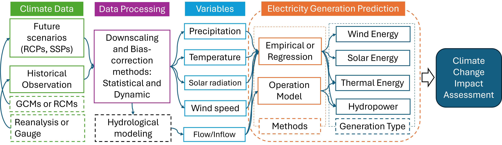

<!--- This is the template for the structure of all sector activity description pages. This is a comment not shown in the quarto website --->

## Summary Description
### Overview
Electricity generation forecasting under climate change is essential for maintaining a sustainable and reliable power supply. It is required to incorporate climate information in electricity generation and capacity planning. However, a gap remains between advancements in climate data products, models, and analytical methods, and their application in industry practices for planning and implementing generation forecasts. This section bridges that gap by presenting tools and techniques used in both academic research and industry.

The first sub-section outlines the role of climate data and the importance of accounting for its future variations in electricity systems and generation forecasting. The second sub-section describes the climate data products and variables used, along with the methods applied for their analysis, such as downscaling and bias correction before integrating them into generation forecasting models. And then, predictive models or methods tailored to specific generation types is discussed. Additionally, this section summarizes the current status of electricity generation entities in Canada, based primarily on insights gathered during workshops with industry stakeholders. The following section examines projected changes in electricity generation for future periods under various emission scenarios from a Canadian perspective. Finally, gaps and recommendations are presented regarding the use of climate variables, models, and methods for generation forecasting, as well as their interactions with other sectors.

## Role in the Electricity System
:::{#id1 .callout collapse="true"} 
### Additional Information
Electricity systems are highly sensitive to climate variability and change, as temperature, precipitation, wind patterns, and extreme weather events directly influence both electricity demand and generation capacity. Accurate forecasting, supported by robust climate data and models, plays a critical role in ensuring the reliability, resilience, and efficiency of these systems. Understanding climate impacts helps operators anticipate changes in resource availability, such as hydropower inflows, wind speeds, or solar radiation, while also preparing for shifts in demand patterns driven by heating and cooling needs. Integrating climate information into electricity system planning and operation supports proactive decision-making, reduces the risk of supply disruptions, and enhances the system’s ability to adapt to future climate conditions.

The purpose of this document is to provide practitioners with guidance on selecting and preparing climate data, as well as applying appropriate methods and models, to support accurate and reliable electricity generation forecasting.

:::

## Methods and Models

:::{#id1 .callout collapse="true"}
### Climate data processing methods
The analysis of climate change (CC) impacts on electricity generation systems (EGSs) is not straightforward. It follows several steps (see Figure 1), including the acquisition, emission scenarios selection, preparation of appropriate climate data, and model investigations for CC impact analysis on the EGS. Climate data can be collected from many sources, including the most common platform, the Coupled Model Intercomparison Project (CMIP) (@plaga_methods_2023). The [climate projections](../../datasets/climate_projection_data/Climate_Projection_Datasets.ipynb) vary according to the greenhouse gas (GHG) emission scenario, which depicts the influence of anthropogenic climate change. Depending on the purpose of the analysis, various scenario projections are used for evaluating climate change.

Climate data are obtained from global circulation models (GCMs). These models provide climate projections with a coarse spatial resolution (e.g., 100 km x 100 km), which is impractical for CC impact analysis on EGSs at the regional to local scale. Therefore, it is required to [downscale the GCMs' projections](../../datasets/climate_projection_data/Climate_Projection_Datasets.ipynb) to at least the regional scale. Statistical and dynamic downscaling are the two most common methods for spatially downscaling the projections of GCMs. 

The figure below briefly resumes decision-making challenges faced by professionals in the generation forecasting sector of the electricity system in Canada. These challenges were shared during the [workshops](../../workshops/intro_workshops.ipynb) held in 2025. These examples linked together the methods and models as well as characteristics presented in the following section such as [ key climate inputs](#key-climate-inputs).

<iframe width="768" height="640"  data-external="1" src="https://miro.com/app/live-embed/uXjVINO7YDw=/?focusWidget=3458764634255773971&embedMode=view_only_without_ui&embedId=688029417831" frameborder="0" scrolling="no" allow="fullscreen; clipboard-read; clipboard-write" allowfullscreen></iframe>

As showed in the figure, hydrologic model (e.g., WATFLOOD) calibration relies on bias-corrected reanalysis datasets such as [ESPO-G6](../../datasets/climate_projection_data/ESPO-G6.ipynb), which requires corrected precipitation and temperature data. Validation of these datasets is typically performed against observations from Environment and Climate Change Canada (ECCC) stations, internal networks, or the Water Survey of Canada. Validation is important, for example some internally interpolated datasets have been noted to produce less reliable results when compared to inflows. For future climate projections, GCM/RCM ensembles are commonly used along with multiple scenarios to capture a range of possible outcomes. Some of these dataset are accessed via [Pavics](https://pavics.ouranos.ca/). Short-term forecasts (up to 4 hours), hourly zonal climate variables, and bias-corrected wind speed and solar irradiance are emphasized for wind and solar forecasting. Care is taken to avoid overestimating renewable supply, and model compatibility across different climate data sources is verified to ensure reliable integration into operational planning.

Some electricity generation entities do not use climate change information at all or do not consider potential future climate impacts. Others integrate climate data to quantify projected changes in inflows to generating stations over the next 100 years. Electricity generation entities rely on temperature data (hourly, daily min/max, seasonal averages), wind speed and gusts, solar irradiance, humidity, and cloud cover, often by specific zones. Precipitation data include rainfall, wet snow, freezing rain, snowpack, and extreme storm events (e.g., 100-year floods), with evaporation, lake water temperature, and atmospheric moisture also considered for hydropower planning. These data feed into generation profiles for wind and solar, hydro inflow forecasts, and hydraulic models, alongside watershed-scale precipitation and river flow patterns.

:::

:::{#id1 .callout collapse="true"}
### Electricity generation prediction methods
As shown in Figure 1, the prediction of electricity generation varies depending on the system types and the variables incorporated into the prediction models. The following section outlines the approach used to project electricity generation under future climate scenarios for different energy types.

- **Hydropower**

In general, downscaled and bias-corrected climate variables (e.g., precipitation and temperatures) from different scenarios are forced into hydrologic models to investigate the hydrologic regime and to generate future flow conditions. These flows are then used as input to hydropower potential estimation models. The distribution of the estimated electricity is compared with the historical observation to analyze the impact of climate change on generation. In literature, a quite good range of hydropower potential station models or methods, including empirical formula (@parkinson_robust_2015), reservoir optimization algorithm-Sampling Stochastic Dynamic Programming (SSDP) (@haguma_optimal_2014), WEAP (@boehlert_climate_2016) and MODSIM (@kim_climate_2022), have been used. One representative example of an empirical method is represented by equation 1.

$$
E=ρghQ
$$ {#eq-1}

In equation 1, $E$ is the hydropower potential with projected streamflow $Q$ at a hydraulic head $h$, $p$ and $g$ are the density of water and gravitational acceleration.

Reservoir optimization algorithms (ROAs) are used to determine operation rules or policies that include an average release from hydropower dams and energy production. The projected inflow simulations from the hydrologic model are fed to the ROA to determine operating policies under future climatic conditions obtained from different emission scenarios. Then they are compared with the baseline period policy in order to determine the impact of climate change on hydropower generation.

Unlike the ROA, MODSIM, a complex surface water network system, can also be used to estimate hydropower generation. This model has an internal optimization operator that can allocate water based on physical and operational constraints. The inflow projection from hydrologic models is used as forcing for this MODSIM model to determine the hydropower generation potential for the future period and compared with the historical baseline period to identify the changes due to climate variability.

- **Wind Energy**

The impact of climate change on future wind energy generation is generally estimated based on the operational wind speed at hub height. Under different emission scenarios (e.g., RCP8.5), future projections for wind speed at 10 m height from surface level are obtained from climate models (e.g., GCMs and RCMs) (@yao_climate_2012, @zhang_assessment_2022, @li_impact_2023). For wind turbine design, cut-in and cut-out wind speeds at hub height play a crucial role, and they typically range from 4 m/s to 25 m/s. Based on the design criteria, hub height varies from 50 m to 120 m, however, the average hub height in Canada is 83 m (@cwtd_canadian_2022). The wind speed at hub height is estimated using the following power-law relation (Equation 2) (@yao_climate_2012, @zhang_assessment_2022, @plaga_methods_2023, @li_impact_2023).

$$
frac{V_H}{V_{10}} =(\\frac{Z_H}{Z_{10}})^α
$$ {#eq-2}

In equation 2, $V_H$ is the wind speed at hub height $H$ ($Z_H$), and $V_10$ is the wind speed at 10 m height ($Z_10$). The exponent $α$ varies with the topographic terrain conditions, codes, and standards. For a natural, stable terrain profile, the $α$ value is 0.14 (@yao_climate_2012, @plaga_methods_2023, @li_impact_2023). The wind speed at hub height is then converted to wind energy by multiplying it by the wind energy density (@li_impact_2023).

$$
W_E = \\frac{1}{2} \\rho A V_H^3 C_p
$$ {#eq-3}

In equation 3, $W_E$ is the wind energy, ρ is the air density at hub height that varies with the temperature and wind profile, A is the cross-sectional area, and $C_p$ is the power coefficient. For climate change impact analysis, $W_E$ is simulated at each grid point or station, and then trend analysis is conducted. The t-test or the Mann-Kendell approach can be used for trend detection.  In their study, Li (@li_impact_2023) utilized a t-test using a linear regression for trend detection. Another study (@yao_climate_2012) used the Weibull distribution for comparing wind production in the future period under different scenarios with reference to the period.

- **Solar Energy**

Generally, photovoltaic (PV) solar cells are used for electricity (energy) generation. The generation capacity of PV can be expressed with the empirical formula (equation 4), consisting of solar radiation and temperature as independent variables (@zhang_assessment_2022). Therefore, two key climate variables, such as surface shortwave radiation (SSWR) and near-surface air temperature (NSAT), are used for the impact analysis of solar energy. The radiation impinging on each solar station is predicted to use SSWR, and the solar station’s ambient temperature is predicted from NSAT. Using historical data of these two variables, solar energy generation curves are produced by applying equations 4 and 5. Similar curves are developed for future projections and compared with the reference one developed with historical period data for impact analysis due to climate change.

$$
C_F=(\\frac{S_1}{S_2} )[1+λ_T (T_1-T_2)]
$$ {#eq-4}

$$
S_E=I_C.C_F.∆_τ
$$ {#eq-5}

In equations 4 and 5, $C_F$ is the hourly capacity factor of the solar station, $S_1$ and $S_2$ are the solar radiation at the location of the solar station and under standard test conditions (ideal 1000 $W/m^2$), respectively. $T_1$ and $T_2$ are the temperatures at the location of the solar station and under standard test conditions, respectively, and $λ_T$ is the temperature coefficient (ideally negative). $S_E$ represents solar energy, $I_C$ is the installed capacity of the station, and $Δτ$ is the hours of period $τ$.

- **Thermal Energy (Nuclear, Natural Gas, Coal, and Biofuel)**

Thermal energy encompasses the production of electricity by converting heat into power using nuclear, natural gas, coal, and biofuel sources. The impact of climate change on thermal energy production depends on the cooling systems used by each generation type. Typically, water and air flow (dry cooling) are used to cool down the generator. Therefore, water availability, water temperature, humidity, air pressure, and air temperature play a key role in the thermal power plant's efficiency, which ultimately affects energy generation (@lagace_assessing_2021). Usually, two types of investigation are conducted to determine the impact of climate change on thermal energy systems: 1) regression analysis assuming linear dependency between air and water temperature, and 2) hydrologic modeling to calculate available water for cooling systems (@plaga_methods_2023).

In a study, Lagace (@lagace_assessing_2021) applied regression models to estimate climate impacts on thermal energy systems in Ontario. The models estimate the derated capacity of thermal systems, including those with recirculating cooling, dry cooling, once-through cooling, and combustion. These models are based on the air temperature, wet bulb air temperature, relative humidity, and air pressure, and were proposed by Bartos et al. (@bartos_impacts_2016), Henry and Pratson (@henry_differentiating_2019), and Craig et al. (@craig_compounding_2020). Like hydropower generation, hydrologic models are forced with future climate scenarios to simulate water flow. Then, the water management model (WMM) is applied to estimate the availability of cooling water under changing climatic conditions. To apply the WMM, a linear relationship is assumed between the available water and the water requirement for the plant’s cooling (@plaga_methods_2023).
:::

:::{#id1 .callout collapse="true"}
### Key Climate Inputs
- **Temperature**

Air temperature is one of the most critical climate variables influencing nearly all electricity generation systems (EGSs). In hydropower, rising temperatures accelerate snowmelt in cold regions, increasing inflows to reservoirs and temporarily boosting generation capacity, for example, in British Columbia @parkinson_robust_2015, and Quebec @haguma_optimal_2014. Conversely, higher temperatures also enhance evaporation, reducing water availability for hydropower production as well as for cooling in nuclear and thermal power plants. This can lead to declines in electricity generation, as projected for southern European countries under warming scenarios @behrens_climate_2017. Air temperature is also a fundamental input in hydrological modeling for estimating water availability. In addition, it is used in solar power forecasting when combined with solar radiation data @zhang_assessment_2022. For long-term climate impact assessments, mean seasonal and monthly air temperatures are typically analyzed to detect trends @kim_climate_2022.

- **Precipitation**

Precipitation is one of the most influential climate variables affecting both electricity generation and related infrastructure. Its variability in space and time directly governs runoff generation and its seasonal timing, which are critical for hydropower operations and water-dependent energy systems. Under climate change, the intensity and frequency of precipitation events are shifting worldwide. For example, projections indicate that liquid precipitation will increase across Canadian catchments, with the most significant rise occurring in spring @kim_climate_2022. To assess climate change impacts on electricity generation systems (EGSs), precipitation is commonly considered alongside other variables such as temperature and evapotranspiration (@kim_climate_2022; @zhang_assessment_2022). Depending on the modeling framework, precipitation inputs may be paired with temperature @kim_climate_2022 or evapotranspiration @zhang_assessment_2022. It is typically used as an input to hydrological or empirical regression models to estimate water availability for hydropower production or thermal plant cooling. The required temporal and spatial resolution of precipitation data depends on the model structure and study objectives. Hydrologic models are often calibrated using daily-scale precipitation, while long-term runoff projections and trend analyses are frequently based on mean monthly data. In distributed or semi-distributed hydrologic modeling, gridded precipitation products are used to capture spatial variability.

- **Evapotranpiration**

Evapotranspiration is often used interchangeably with temperature as a climate forcing variable in hydrological modeling. To assess climate change impacts on streamflow generation, future scenarios of evapotranspiration can be incorporated into empirical machine learning models @zhang_assessment_2022 or process-based hydrological models such as H-HYPE @kim_climate_2022. However, due to the limited availability of long-term local evaporation records, hydrologic simulations of runoff often rely on precipitation and temperature data as proxies @haguma_optimal_2014.

- **Wind Speed**

Wind speed is the primary climate variable used to evaluate wind energy potential and its future variability (@yao_climate_2012; @li_impact_2023). Typically, hourly mean wind speed at a reference height of 10 m is extracted from global or regional climate model (GCM/RCM) projections for assessment. These values are then scaled to turbine hub height using standard wind profile equations. As shown in Equation 3, wind energy potential depends on both the vertical wind profile and air density, the latter being influenced by air temperature. Consequently, projected increases in temperature are expected to reduce wind energy potential in several parts of Canada, including Southern Ontario and British Columbia (@yao_climate_2012;@li_impact_2023). For wind resource assessment and turbine design, long-term wind speed records, commonly spanning 20 years, are typically used to represent variability over the service life of a turbine. In Canada, however, the average service life of wind turbines is generally considered to be 10.7 years @li_impact_2023.

- **Solar radiation**

Surface shortwave radiation, typically extracted from global climate models (GCMs), is the key climate variable used to estimate solar energy potential at power stations. In addition, near-surface air temperature is considered to account for the ambient operating conditions of solar panels. These two variables are commonly applied in empirical formulations (Equations 4 and 5) to quantify the potential solar energy generation at a given location @zhang_assessment_2022. By comparing projected solar energy outputs under future climate scenarios with historical baselines, the potential impacts of climate change on solar power generation can be evaluated.

:::

:::{#id1 .callout collapse="true"}
### Non-Climate Inputs
#### Common Inputs
- **Installed and available capacity** refers to the rated power output that a generating unit can deliver under standard conditions. It defines the upper boundary of possible generation and serves as the baseline for estimating how climate-induced degradings may affect system adequacy. 
- **Efficiency and performance characteristics** describe the technical conversion efficiency of turbines or generators from the relationship between available energy resources and electricity output.
- **Operational constraints** affect real-time generation availability due to maintenance schedule and forced outages. It also includes equipment unavailability or partial operation due to mechanical failure or ambient stress. These are often expressed as equivalent foreced-outage rates.

#### Hydropower
- **Dam specifications** includes elevation-area-volume relationships, spillway and turbine capacities, and head-discharge characteristics.
- **Operation rule** describes reservoir water release schedules, flood control requirements, minimum ecological flows, and water allocations to other sectors.

#### Wind Energy
- **Wind turbine** configuration parameters determines the power curve that maps wind velocity to electricity generation.

#### Solar Energy
- **Module and inverter specifications**

#### Thermal Energy
- **Cooling system** is related to thermal efficiency.
- **Fuel prices and supply conditions** drives dispatch decisions for thermal plants.
:::

:::{#id1 .callout collapse="true"}
### Model Outputs
- **Electricity generation (MWh or GWh)** represents the amount of electrical energy produced over a defined period (e.g., sub-hourly, hourly, daily, monthly, or annual scales)
- **Capacity factor** is the ratio of actual electricity generated to the theoretical maximum if the plant operated at full capacity continuously.
- **Firm capacity** measures the portion of installed capacity that can reliably produce power.
- **Derated capacity** indicates the maximum output after accounting for forced outages, maintenance, and environmental deratings.

:::

:::{#id1 .callout collapse="true"}
### Temporal Resolution
- **Hydropower** models typically operate at daily to monthly time steps. Daily or sub-daily resolution captures hydrologic variability, while monthly or seasonal resolution is used for strategic reservoir operation and water resources allocation (@Parkinson2015, @kim_climate_2022, @Wasti2022).
- **Wind and solar generation** forecasting models require hourly or sub-hourly time steps because of rapid variation in meteorological conditions (@yao_climate_2012, @Zhang2022).
- **Thermal** power models generally use hourly data for dispatch and derating calculations (@Craig2018, @Wang2020).

:::

:::{#id1 .callout collapse="true"}
### Spatial Resolution
- **Hydropower** typically use basin or sub-basin scales corresponding to hydrologic catchments.
- **Wind** projections use global or regional climate data, but further downscaled to turbine-site scales (e.g., 250 m in @Jung2022, 0.44° in @li_impact_2023).
- **Solar** energy studies often use gridded satellite or RCM radiation datasets at 1–10 km resolution (@zhang_assessment_2022).
- **Thermal** power and cooling assessments are conducted at plant site and river reach scales.

:::

:::{#id1 .callout collapse="true"}
### Frequency of Analysis
The frequency of analysis describes how often generation forecasts are produced, updated, or validated. It depends on the model's time horizon, planning objectives, and new data availability. In practice, short-term forecasts support daily operations, annual assessments guide reservoir and maintenance planning, and multi-year analyses inform investment and policy decisions.

:::
:::

## Detailed Discussion
:::{#id1 .callout collapse="true"} 
### Additional Information
:::

## Gaps and Recommendations
:::{#id1 .callout collapse="true"} 
### Additional Information
Workshop discussions with professional practitioners revealed that climate projection data is not currently used by electricity generation entities. Most organizations continue to rely on historical trends for generation forecasting. While convenient, this approach fails to account for the non-linear impacts of climate change, thereby limiting its reliability for future projections. To improve forecasting, it is recommended that future climate projections from global and regional climate models (GCMs and RCMs) be incorporated into practice. Some entities have adopted short-term numerical weather prediction products, such as RDRS and ECMWF, for generation forecasting. However, the use of longer-term climate projections remains largely confined to academic studies. Over the past two decades, successive generations of climate models have been released under projects such as CMIP3, CMIP5, and now CMIP6, which provides improved simulations under RCP and SSP scenarios. Despite this progress, uptake of these updated datasets in the electricity sector has been limited. Reanalysis datasets, particularly ERA5, are often used for model calibration and validation. While ERA5 provides valuable global-scale information, studies in the Canadian context suggest that regional products such as CaPA may offer more accurate representation of local climate. Therefore, practitioners are encouraged to adopt updated and regionally relevant datasets for electricity generation forecasting. Finally, current assessments of climate change impacts are typically conducted in isolation for individual power sources. To better capture the collective response of electricity generation systems (EGSs) under future climate conditions, it is recommended that coordinated prediction and operation models be developed. Such models should integrate multiple generation types and explicitly account for hydro-climate variables as inputs.
:::

## Interactions with Other Sector Activities
:::{#id1 .callout collapse="true"} 
### Additional Information
Electricity generation forecasting plays a vital role in demand management, capacity planning, and infrastructure development. Projections of key climate variables are essential for assessing climate extremes, which inform the design of resilient infrastructure such as dams. These projections also support flood hazard mitigation planning, helping to protect communities while ensuring a reliable and uninterrupted electricity supply.
:::

## References
